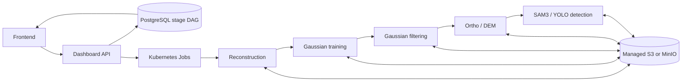

# DroneAI Cloud Deployment Guide

> [!IMPORTANT]
> This self-managed K3s guide is retained as a generic alternative. The
> current OVHcloud target uses managed MKS and is documented in
> [`docs/OVHCLOUD_PREPROD.md`](docs/OVHCLOUD_PREPROD.md). Use immutable
> Git-SHA/digest service images and the bounded five-Job execution map below;
> do not copy deployment values from dated benchmark reports.

Deploy the DroneAI pipeline on a cloud K3s cluster with GPU support.

The entire stack is packaged as a single Helm chart (`charts/drone-ai/`) that works both locally and in the cloud. Local mode uses `hostPath` PVs and Docker-imported images. Cloud mode uses a `storageClass` for dynamic provisioning and a container registry for images. The same chart serves both — you override values with a `values-cloud.yaml` file.

> [!WARNING]
> This remains a provider-oriented installation guide, not a public
> multi-tenant SaaS runbook. Use
> `charts/drone-ai/values-production.example.yaml` as the security baseline:
> external Secrets, explicit CORS, API-key sessions, managed S3/PostgreSQL and
> TLS ingress. Public multi-tenancy additionally requires OIDC and ownership
> isolation. The chart applies versioned Alembic migrations and should be
> deployed with Helm `--wait` in production.

## Target setup

- Provider: OVHcloud (or any provider with GPU instances)
- Region: `GRA` (Gravelines) or `SBG` (Strasbourg) — or any region with GPU flavors
- Kubernetes: self-managed K3s
- GPU: one or more nodes for bounded reconstruction, Gaussian, rasterization
  and detection Jobs
- Storage: cloud block volumes with dynamic provisioning via `storageClass`
- Object storage: MinIO in-cluster (default), or managed S3
- Database: PostGIS in-cluster (default), or managed PostgreSQL

## Architecture overview

### Services

| Service | Image | GPU | Memory | Role |
|---------|-------|-----|--------|------|
| Stage Jobs 1–4 | `drone-colmap:<git-sha>` | 1 when required | resource class; initially 16 Gi request / 32 Gi limit | Reconstruction, Gaussian training/filtering and Ortho/DEM rasterization |
| Stage Job 5 | `drone-ia:<git-sha>` | 1 | `gpu-high-memory` class | SAM3/YOLO streaming inference and GeoJSON publication |
| Compatibility processing worker | `drone-processing:<git-sha>` | — | 4–16 Gi | Used only by the fused Kafka compatibility path |
| `dashboard-api` | `drone-dashboard-api` | — | 512 Mi–2 Gi | FastAPI control plane, WebSocket status |
| `dashboard-frontend` | `drone-dashboard-frontend` | — | 128–512 Mi | Next.js web UI |

### Infrastructure (deployed by Helm)

| Component | Default | Cloud alternative |
|-----------|---------|-------------------|
| Kafka | `apache/kafka:3.7.0` in-cluster (KRaft) | Managed Kafka / keep in-cluster |
| MinIO | Chart-selected local image | Managed S3 (set `minio.enabled: false`) |
| PostgreSQL | `postgis/postgis:16-3.5` in-cluster | Managed PostgreSQL (set `postgres.enabled: false`) |

### Communication



PostgreSQL persists append-only attempts and immutable artifact edges. S3
manifests carry large inter-stage state. Kafka remains deployed for platform
events and the explicitly selected fused-worker compatibility path.

## Recommended node layout

| Node | Role | vCPU | RAM | Disk | Runs |
|------|------|------|-----|------|------|
| `cp-1` | control-plane + CPU | 8–16 | 16–32 Gi | 100+ Gi SSD | K3s server, Kafka, object/database services, dashboard and ingress |
| `gpu-1` | bounded GPU Jobs | 16+ | 32–64 Gi | fast SSD | sequential reconstruction, Gaussian, raster and detection Jobs |
| `gpu-2` | optional scale-out | 8+ | 32–64 Gi | SSD | reviewed concurrent Jobs only when quota/cost permit |

Start with one GPU node and the qualified 16 GiB request / 32 GiB limit. Raise
that envelope only from measured dataset evidence. Per-mission and GPU resource
concurrency default to one, so stages do not require separate GPUs.

### Cost-aware variant

Collapse to one control-plane plus one autoscaled GPU node. The stage scheduler
already serializes one mission and does not require manual worker scaling.

## Step 1: Provision infrastructure

### 1.1 Create instances

On OVHcloud Public Cloud (or equivalent):

- `cp-1`: general-purpose instance (Ubuntu 24.04 LTS)
- `gpu-colmap-1`: GPU instance with NVIDIA GPU (Ubuntu 24.04 LTS)
- `gpu-ia-1`: GPU instance with NVIDIA GPU (Ubuntu 24.04 LTS)

### 1.2 Networking

Allow:

- SSH from admin IP
- TCP 6443 between nodes (K3s API)
- Flannel/CNI inter-node traffic
- TCP 80 + 443 from Internet to `cp-1` (ingress)

### 1.3 DNS

Point to `cp-1` public IP (or a load balancer):

- `droneai.example.fr` → frontend
- `api.droneai.example.fr` → dashboard API

## Step 2: Prepare all nodes

### 2.1 System packages (all nodes)

```bash
sudo apt-get update && sudo apt-get install -y \
  curl wget git jq ca-certificates software-properties-common nfs-common
```

### 2.2 Docker (all nodes)

```bash
curl -fsSL https://get.docker.com | sh
sudo usermod -aG docker "$USER"
```

### 2.3 NVIDIA drivers + toolkit (GPU nodes only)

```bash
# Install NVIDIA driver appropriate for your GPU flavor, then:
curl -fsSL https://nvidia.github.io/libnvidia-container/gpgkey | \
  sudo gpg --dearmor -o /usr/share/keyrings/nvidia-container-toolkit-keyring.gpg
curl -s -L https://nvidia.github.io/libnvidia-container/stable/deb/nvidia-container-toolkit.list | \
  sed 's#deb https://#deb [signed-by=/usr/share/keyrings/nvidia-container-toolkit-keyring.gpg] https://#g' | \
  sudo tee /etc/apt/sources.list.d/nvidia-container-toolkit.list
sudo apt-get update && sudo apt-get install -y nvidia-container-toolkit
sudo nvidia-ctk runtime configure --runtime=docker
sudo systemctl restart docker

# Validate
nvidia-smi
sudo docker run --rm --gpus all nvidia/cuda:12.8.1-runtime-ubuntu24.04 nvidia-smi
```

Use a host driver that is compatible with the CUDA 12.8.1 container images and
validate it with the container command above.

## Step 3: Install K3s cluster

### 3.1 Control-plane (`cp-1`)

```bash
curl -sfL https://get.k3s.io | sh -s - --write-kubeconfig-mode 644
export KUBECONFIG=/etc/rancher/k3s/k3s.yaml

# Get join token
sudo cat /var/lib/rancher/k3s/server/node-token
```

### 3.2 Join GPU workers

```bash
curl -sfL https://get.k3s.io | \
  K3S_URL=https://<CP_IP>:6443 K3S_TOKEN=<TOKEN> sh -
```

### 3.3 Label and taint nodes

```bash
kubectl label node gpu-colmap-1 workload=colmap gpu=true
kubectl label node gpu-ia-1 workload=ia gpu=true
kubectl label node cp-1 workload=cpu

# Optional: keep GPU nodes exclusive
kubectl taint node gpu-colmap-1 gpu=colmap:NoSchedule
kubectl taint node gpu-ia-1 gpu=ia:NoSchedule
```

## Step 4: Install cluster add-ons

### 4.1 Helm

```bash
curl https://raw.githubusercontent.com/helm/helm/main/scripts/get-helm-3 | bash
```

### 4.2 NVIDIA device plugin

```bash
helm repo add nvdp https://nvidia.github.io/k8s-device-plugin
helm repo update
helm upgrade --install nvidia-device-plugin nvdp/nvidia-device-plugin \
  --namespace nvidia-device-plugin --create-namespace
```

Validate:

```bash
kubectl describe node gpu-colmap-1 | grep -A2 nvidia.com/gpu
kubectl describe node gpu-ia-1    | grep -A2 nvidia.com/gpu
```

### 4.3 Ingress controller

```bash
kubectl apply -f https://raw.githubusercontent.com/kubernetes/ingress-nginx/main/deploy/static/provider/cloud/deploy.yaml
```

### 4.4 cert-manager

```bash
helm repo add jetstack https://charts.jetstack.io
helm repo update
helm upgrade --install cert-manager jetstack/cert-manager \
  --namespace cert-manager --create-namespace \
  --set crds.enabled=true
```

Create a ClusterIssuer:

```yaml
apiVersion: cert-manager.io/v1
kind: ClusterIssuer
metadata:
  name: letsencrypt-prod
spec:
  acme:
    email: you@example.fr
    server: https://acme-v02.api.letsencrypt.org/directory
    privateKeySecretRef:
      name: letsencrypt-prod
    solvers:
    - http01:
        ingress:
          class: nginx
```

## Step 5: Build and push images

From your development machine, build all images and push to a container registry.

```bash
REGISTRY="ghcr.io/<your-org>"
IMAGE_TAG="$(git rev-parse --short=12 HEAD)"
docker login ghcr.io

# Base image (COLMAP + Ceres + portable DroneGS — heavy, build only when its
# inputs change). The local :latest alias is a Dockerfile build dependency;
# only the immutable Git tag is published.
docker build \
  -t drone-colmap-base:latest \
  -t "$REGISTRY/drone-colmap-base:$IMAGE_TAG" \
  -f app1-colmap/Dockerfile.base .
docker push "$REGISTRY/drone-colmap-base:$IMAGE_TAG"

# Application images
docker build -t "$REGISTRY/drone-colmap:$IMAGE_TAG" -f app1-colmap/Dockerfile .
docker build -t "$REGISTRY/drone-ia:$IMAGE_TAG" -f app2-ia/Dockerfile .
docker build -t "$REGISTRY/drone-processing:$IMAGE_TAG" -f app3-processing/Dockerfile .
docker build -t "$REGISTRY/drone-dashboard-api:$IMAGE_TAG" -f app4-dashboard/api/Dockerfile .
docker build -t "$REGISTRY/drone-dashboard-frontend:$IMAGE_TAG" -f app4-dashboard/frontend/Dockerfile .

for img in drone-colmap drone-ia drone-processing drone-dashboard-api drone-dashboard-frontend; do
  docker push "$REGISTRY/$img:$IMAGE_TAG"
done
```

If the registry is private, create an image pull secret:

```bash
kubectl -n drone-ai create secret docker-registry regcred \
  --docker-server=ghcr.io \
  --docker-username=<user> \
  --docker-password=<token>
```

Create the persistent COLMAP workspace referenced by the cloud values:

```yaml
apiVersion: v1
kind: PersistentVolumeClaim
metadata:
  name: drone-ai-colmap-work
  namespace: drone-ai
spec:
  accessModes: [ReadWriteOnce]
  storageClassName: csi-cinder-high-speed
  resources:
    requests:
      storage: 500Gi
```

Apply this manifest before Helm. The CSI driver binds the claim to real cloud
block storage; a missing or unbound claim prevents the COLMAP pod from becoming
ready instead of advertising an unusable workspace.

## Step 6: Create `values-cloud.yaml`

This overrides `charts/drone-ai/values.yaml` for cloud deployment. Only set what changes.

```yaml
# ==========================================================================
# DroneAI Helm values — Cloud override
# Deploy with: helm upgrade --install drone-ai charts/drone-ai/ \
#   -n drone-ai --create-namespace -f charts/drone-ai/values-cloud.yaml
# ==========================================================================

global:
  imageRegistry: "ghcr.io/<your-org>/"   # trailing slash required
  imagePullPolicy: Always
  requireImmutableImages: true
  imagePullSecrets:
    - name: regcred                       # omit if registry is public

# --- Storage: use dynamic provisioning instead of hostPath ---
kafka:
  persistence:
    hostPath: ""                          # empty = no static PV
    storageClass: "csi-cinder-high-speed" # OVH block storage (adapt per provider)
    size: 50Gi

minio:
  # Set enabled: false if using managed S3 (OVH Object Storage, AWS S3, etc.)
  enabled: true
  persistence:
    hostPath: ""
    storageClass: "csi-cinder-high-speed"
    size: 500Gi

postgres:
  # Set enabled: false if using managed PostgreSQL
  enabled: true
  persistence:
    hostPath: ""
    storageClass: "csi-cinder-high-speed"
    size: 50Gi
  # For production: use strong credentials
  password: "<generate-a-strong-password>"

# --- IA model cache ---
iaWorker:
  enabled: false
  tag: "REPLACE_GIT_SHA"
  modelCache:
    hostPath: ""
    storageClass: "csi-cinder-high-speed"
    size: 50Gi

# --- COLMAP scratch volume ---
colmapWorker:
  enabled: false
  tag: "REPLACE_GIT_SHA"
  workVolume:
    sizeLimit: 200Gi
    drives:
      - name: cloud-workspace
        existingClaim: drone-ai-colmap-work
        label: "Cloud persistent workspace"
    default: cloud-workspace

processingWorker:
  tag: "REPLACE_GIT_SHA"
  replicaCount: 0

# --- Qualified bounded stage DAG ---
stageJobs:
  enabled: true
  executors:
    reconstruction:
      image: "ghcr.io/<your-org>/drone-colmap:REPLACE_GIT_SHA"
      command: ["python3", "app1-colmap/stage_executor.py", "reconstruction"]
      gpu_architecture: "ampere"
      node_selector: {gpu: "true"}
    gaussian_training:
      image: "ghcr.io/<your-org>/drone-colmap:REPLACE_GIT_SHA"
      command: ["python3", "app1-colmap/stage_executor.py", "gaussian_training"]
      gpu_architecture: "ampere"
      node_selector: {gpu: "true"}
    gaussian_filtering:
      image: "ghcr.io/<your-org>/drone-colmap:REPLACE_GIT_SHA"
      command: ["python3", "app1-colmap/stage_executor.py", "gaussian_filtering"]
      gpu_architecture: "ampere"
      node_selector: {gpu: "true"}
    rasterization:
      image: "ghcr.io/<your-org>/drone-colmap:REPLACE_GIT_SHA"
      command: ["python3", "app1-colmap/stage_executor.py", "rasterization"]
      gpu_architecture: "ampere"
      node_selector: {gpu: "true"}
    detection:
      image: "ghcr.io/<your-org>/drone-ia:REPLACE_GIT_SHA"
      command: ["python3", "app2-ia/stage_executor.py"]
      gpu_architecture: "ampere"
      node_selector: {gpu: "true"}

# --- Storage connection strings ---
# If using managed S3, override these:
# storage:
#   s3Endpoint: "https://s3.gra.cloud.ovh.net"
#   s3Bucket: "drone-ai"
#   s3AccessKey: "<key>"
#   s3SecretKey: "<secret>"
#   s3Region: "gra"
#   s3PublicEndpoint: "https://s3.gra.cloud.ovh.net"

# If using managed PostgreSQL, override:
# storage:
#   databaseUrl: "postgresql://droneai:<pwd>@<host>:5432/droneai"

# --- Services: ClusterIP + Ingress instead of NodePort ---
dashboardApi:
  tag: "REPLACE_GIT_SHA"
  environment: production
  service:
    type: ClusterIP
    nodePort: null
  cors:
    origins: "https://droneai.example.fr"
  auth:
    disabled: false
    existingSecret: drone-ai-api-auth
    secretKey: api-keys.json
    sessionSecretKey: session-secret
    sessionMaxAgeSeconds: 28800

dashboardFrontend:
  tag: "REPLACE_GIT_SHA"
  apiUrl: "https://api.droneai.example.fr"
  service:
    type: ClusterIP
    nodePort: null

# --- Ingress ---
ingress:
  enabled: true
  className: nginx
  annotations:
    cert-manager.io/cluster-issuer: letsencrypt-prod
  hosts:
    - host: droneai.example.fr
      paths:
        - path: /
          service: dashboard-frontend
    - host: api.droneai.example.fr
      paths:
        - path: /
          service: dashboard-api
  tls:
    - secretName: droneai-tls
      hosts:
        - droneai.example.fr
        - api.droneai.example.fr

# --- GPU scheduling: pin to labeled nodes ---
gpu:
  runtimeClassName: nvidia
  # This selector is retained for compatibility worker Deployments. Bounded
  # Jobs use each executor's node_selector above.
  nodeSelector: {gpu: "true"}
```

Do not taint a stage-Job-only GPU node in this configuration: the current
dynamic Job contract accepts an executor node selector but not per-executor
tolerations. Adding toleration support requires a reviewed renderer/schema
change and tests before the taint is applied.

### Using managed S3 instead of MinIO

Set `minio.enabled: false` and override the storage block:

```yaml
minio:
  enabled: false

storage:
  s3Endpoint: "https://s3.gra.cloud.ovh.net"
  s3PublicEndpoint: "https://s3.gra.cloud.ovh.net"
  s3Bucket: "drone-ai"
  s3AccessKey: "<access-key>"
  s3SecretKey: "<secret-key>"
  s3Region: "gra"
```

All services use `shared/storage.py` (a `boto3` wrapper), so any S3-compatible backend works transparently.

When MinIO remains in-cluster, expose a browser-reachable S3 endpoint and set
`storage.s3PublicEndpoint`; otherwise presigned download URLs contain the
cluster-internal MinIO hostname.

### Using managed PostgreSQL instead of in-cluster

Set `postgres.enabled: false` and override the database URL:

```yaml
postgres:
  enabled: false

storage:
  databaseUrl: "postgresql://droneai:<password>@<managed-db-host>:5432/droneai"
```

Ensure the managed instance has PostGIS enabled. The revisioned `db-migrate`
job runs `alembic upgrade head`. The database role needs permission to create the
PostGIS extension during the initial migration, or an administrator must
install the extension beforehand.

## Step 7: Create secrets

```bash
kubectl create namespace drone-ai

# Hugging Face token (required for the gated SAM3 detection executor)
kubectl -n drone-ai create secret generic hf-token \
  --from-literal=HF_TOKEN="hf_..."

# Dashboard/API authentication. Generate both files outside the repository:
# - api-keys.json follows docs/PRODUCTION_READINESS.md;
# - session-secret contains at least 32 random bytes.
kubectl -n drone-ai create secret generic drone-ai-api-auth \
  --from-file=api-keys.json=./api-keys.json \
  --from-file=session-secret=./session-secret

# Image pull secret (if private registry — already done in step 5)
```

The `drone-ai-storage` secret (S3 keys + database URL) is created automatically by the Helm chart from values.
Do not commit `api-keys.json` or `session-secret`; Mission Studio exchanges the
operator key for a signed HttpOnly browser session.

## Step 8: Deploy

```bash
helm upgrade --install drone-ai charts/drone-ai/ \
  --namespace drone-ai --create-namespace \
  -f charts/drone-ai/values-cloud.yaml \
  --timeout 10m --wait
```

Watch rollout:

```bash
kubectl get pods -n drone-ai -w
```

Expected steady-state pods (stage Jobs appear only while a mission runs):

```
NAME                                  READY   STATUS
dashboard-api-xxx                     1/1     Running
dashboard-frontend-xxx                1/1     Running
kafka-broker-xxx                      1/1     Running
minio-xxx                             1/1     Running   # if enabled
postgres-xxx                          1/1     Running   # if enabled
```

The revisioned `db-migrate` job applies `alembic upgrade head`; init containers
keep database-dependent pods unready until that target revision is active.

## Step 9: Validate

### Cluster health

```bash
kubectl get nodes
kubectl get pods -n drone-ai -o wide
kubectl get pvc -n drone-ai
kubectl get ingress -n drone-ai
```

### GPU scheduling

```bash
kubectl describe pod -n drone-ai -l app=colmap | grep -A3 "nvidia.com/gpu"
kubectl describe pod -n drone-ai -l app=ia     | grep -A3 "nvidia.com/gpu"
```

### Services

```bash
# Kafka
kubectl logs deployment/kafka-broker -n drone-ai --tail=20

# Schema hook definition (successful hook jobs are deleted)
helm get hooks drone-ai -n drone-ai

# API
curl https://api.droneai.example.fr/
curl https://api.droneai.example.fr/pods

# Frontend
open https://droneai.example.fr
```

### First mission test

1. Upload images to a mission directory via the dashboard UI
2. Submit the mission
3. Watch progress via WebSocket in the frontend
4. Verify the COG `orthomosaic.tif`, its `.cog.json`/WebP preview and
   `detections.geojson` appear in S3
5. Check the exact durable mission through `/missions/{vol_id}` and use its
   stage runs, products, checksums and logs; `/status/summary` is retained only
   for compatibility missions

## How the Helm chart works (local vs cloud)

The same Helm chart handles both environments through conditional templates:

### Storage strategy

Each persistent volume (Kafka, MinIO, PostgreSQL, model-cache) follows this dual-mode pattern:

- **If `hostPath` is set** → creates a static PersistentVolume bound to that host path + a PVC referencing it by name. Used locally.
- **If `hostPath` is empty and `storageClass` is set** → creates only a PVC with dynamic provisioning. The cloud storage driver creates the volume automatically.

```yaml
# Local (generated by ./deploy.sh distributed)
kafka:
  persistence:
    hostPath: /home/operator/.local/share/droneai/distributed/kafka-data
    storageClass: ""
    size: 10Gi

# Cloud (values-cloud.yaml override)
kafka:
  persistence:
    hostPath: ""
    storageClass: "csi-cinder-high-speed"
    size: 50Gi
```

### Image references

The `drone-ai.image` helper prepends `global.imageRegistry` to application
Deployments. Dynamic executor Jobs use the complete immutable image stored in
`stageJobs.executors`:

- Local: `drone-colmap:<git-sha>` imported into K3s with `docker save | k3s ctr import`
- Cloud: `ghcr.io/<org>/drone-colmap:<git-sha>` or an OCI digest

### Services

- Local: `NodePort` (30080 for API, 30000 for frontend, 30090 for MinIO console, 30091 for MinIO API — used by presigned URLs)
- Cloud: `ClusterIP` + `Ingress` with TLS via cert-manager

### GPU scheduling

- Local: no `nodeSelector` (single-node, GPU time-slicing via NVIDIA device plugin)
- Cloud: `gpu.nodeSelector` pins GPU workloads to labeled nodes

## Secrets reference

| Secret | Created by | Contains |
|--------|-----------|----------|
| `drone-ai-storage` | Helm chart (auto) | `s3-access-key`, `s3-secret-key`, `database-url` |
| `hf-token` | `deploy.sh` locally; manual/cloud secret manager in production | Optional `HF_TOKEN` for Hugging Face gated models |
| `regcred` | Manual (if private registry) | Docker registry credentials |

## Local development workflow

For local K3s (WSL2/Ubuntu), use the unified entry point:

```bash
# First clone, build and deployment
export STAGE_JOBS_IMAGE_TAG="$(git rev-parse --short=7 HEAD)"
./deploy.sh distributed

# Fast idempotent redeployment
./deploy.sh distributed --no-build

# Complete no-cache rebuild
./deploy.sh distributed --base
```

See [`DEPLOYMENT.md`](DEPLOYMENT.md) for the maintained deployment workflow.

## Post-deployment improvements

After the first cloud deployment works:

1. **CI/CD**: automate image builds and `helm upgrade` on push (GitHub Actions)
2. **Managed services**: replace in-cluster MinIO/PostgreSQL with managed S3 + RDS
3. **Monitoring**: Prometheus + Grafana for pod metrics and GPU utilization
4. **Logging**: centralized log aggregation (Loki, CloudWatch)
5. **Backups**: automated PostgreSQL dumps, S3 lifecycle policies
6. **Autoscaling**: resource-class queue metrics and reviewed GPU-node bounds;
   do not autoscale from an unbounded raw Job count
7. **Secrets management**: external secrets operator or cloud vault
