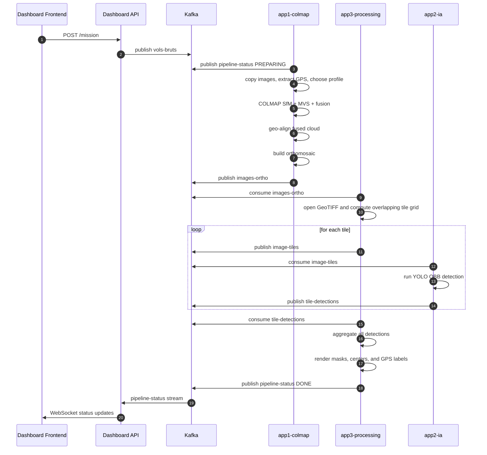
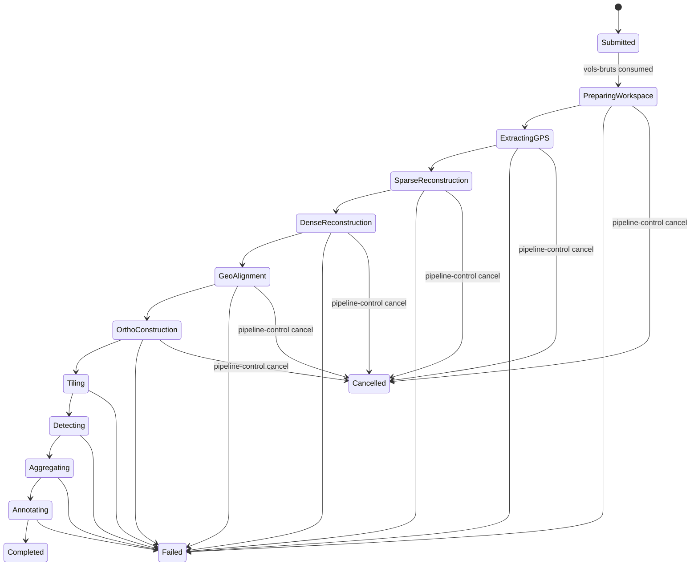
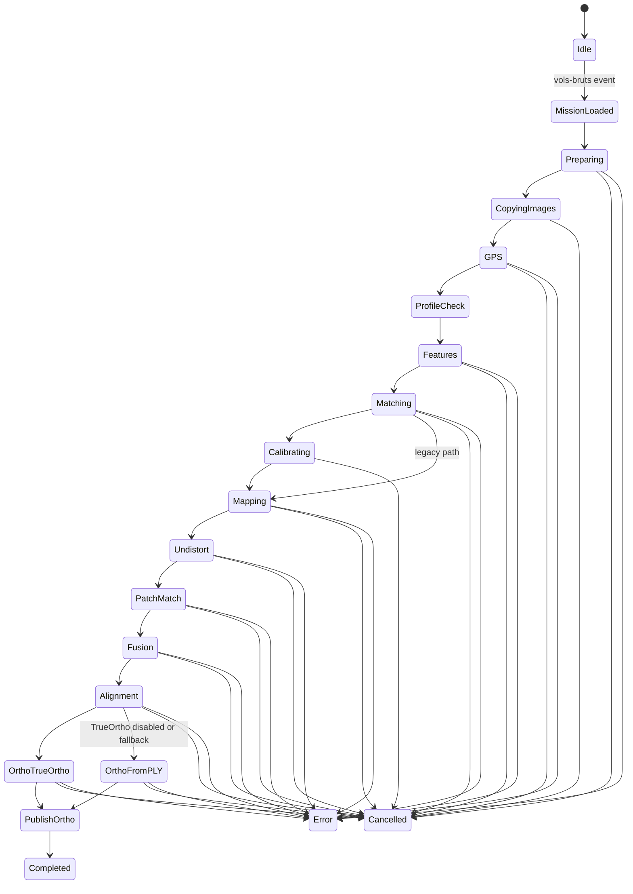
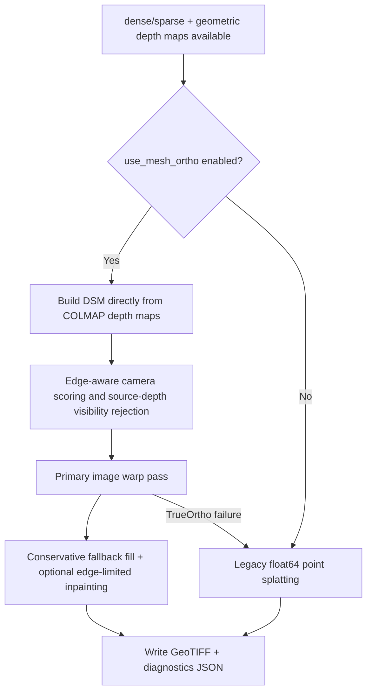
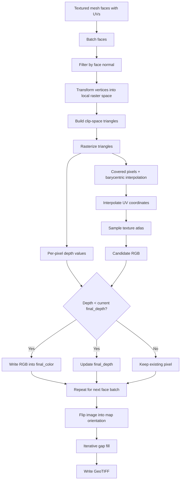
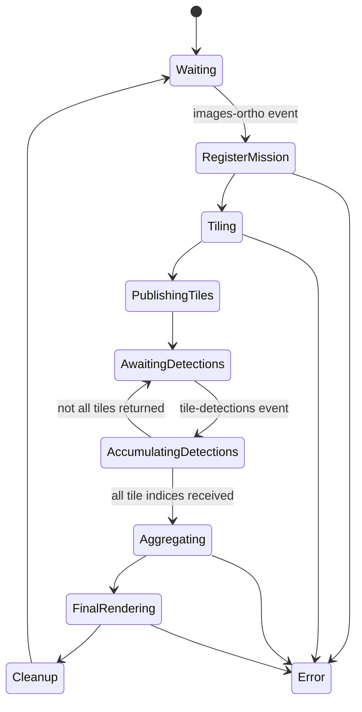
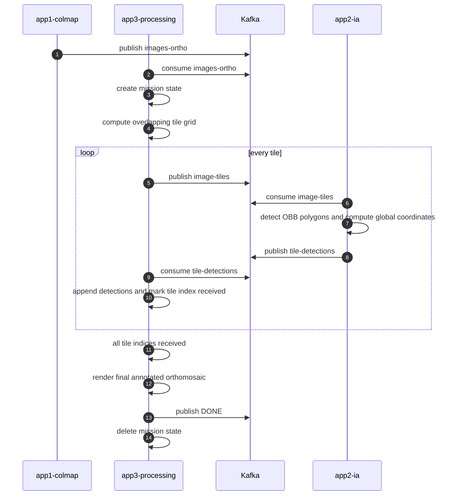

# DroneAI Pipeline Documentation

## Purpose

This document explains the runtime architecture, event flow, state machines, file layout, and algorithmic behavior of the DroneAI pipeline as it is implemented in this repository.

It is intentionally more detailed than the installation guide. The goal is to document how the system behaves once deployed, how missions move through Kafka and Kubernetes, and how the orthomosaic and final annotated outputs are produced.

For upstream COLMAP theory, command semantics, and reconstruction internals, refer to the official COLMAP documentation:

- https://colmap.github.io/
- https://github.com/colmap/colmap

This repository adds orchestration, event transport, mission state handling, geo-referencing, orthomosaic generation, tiling, oriented-object detection, aggregation, and dashboard control on top of COLMAP.

## System overview

The pipeline is a local event-driven photogrammetry and detection system composed of five services:

1. `app4-dashboard/frontend`
2. `app4-dashboard/api`
3. `app1-colmap`
4. `app3-processing`
5. `app2-ia`

The runtime data path is:

1. A mission is created from the dashboard.
2. The API publishes the mission to Kafka topic `vols-bruts`.
3. The COLMAP worker consumes the mission, reconstructs the scene, and writes `orthomosaic.tif`.
4. The COLMAP worker publishes an orthomosaic event to Kafka topic `images-ortho`.
5. The processing worker consumes the orthomosaic event, slices the image into overlapping tiles, and publishes one Kafka event per tile to `image-tiles`.
6. The IA worker consumes tiles, runs either YOLO OBB or SAM 3 prompt-based detection, and publishes detections to `tile-detections`.
7. The processing worker consumes all tile detections, merges overlap duplicates, reprojects them back into orthomosaic pixel coordinates, and writes the final annotated orthomosaic.
8. All workers emit progress events to `pipeline-status` and the dashboard API forwards them over WebSocket to the frontend.

The control path is:

1. The dashboard asks the API to cancel a mission.
2. The API publishes a control event to `pipeline-control`.
3. The COLMAP worker's dedicated control thread marks cancellation in shared state.
4. Long-running subprocess loops periodically check that state and abort the mission.

## Deployment topology

The deployed runtime is driven by two manifests:

- `kafka-local.yaml`: namespace, broker, services, deployments, volumes, ports, and resource requests
- `dashboard-api-rbac.yaml`: the dashboard API service account and pod-reader RBAC in namespace `kafka`

Main runtime objects:

- namespace: `kafka`
- Kafka broker service: `my-kafka.kafka.svc.cluster.local:9092`
- COLMAP worker deployment: `colmap-worker`
- IA worker deployment: `ia-worker`
- processing worker deployment: `processing-worker`
- dashboard API deployment: `dashboard-api`
- dashboard frontend deployment: `dashboard-frontend`

Operational notes:

- The host root `/` is mounted into the worker pods at `/host`.
- The logical workspace root used by the pipeline is `/mnt/j/workspace`.
- Inside containers, the same host files are accessed through `/host/mnt/j/workspace`.
- The COLMAP worker and IA worker both request one NVIDIA GPU.
- The IA worker reads `HF_TOKEN` from the Kubernetes secret `hf-token` for approved access to the gated Hugging Face `facebook/sam3` model distribution.
- The IA worker mounts a persistent Hugging Face cache at `/cache/huggingface`, backed by `/var/lib/drone-ai/huggingface-cache` on the host.
- The processing worker receives explicit overlap-deduplication env vars from `kafka-local.yaml`.
- Kafka is deployed in-cluster. There is no separate host Kafka service.
- The dashboard API deployment runs as service account `dashboard-api-sa`.
- `dashboard-api-sa` is granted `get`, `list`, and `watch` on pods in namespace `kafka` so the API can serve `/pods`.
- `build_and_deploy.sh` applies both manifests for a full stack rollout.
- The incremental deploy scripts also reapply the relevant manifest before restart so env, mounts, and RBAC changes are not skipped.

## Shared Python package

The repository contains a shared Python package under `shared/` that is imported by multiple services.

Current files:

- `shared/config.py`
- `shared/pipeline_params.py`

Current responsibilities:

- define the Kafka broker and topic names used across services
- define the default workspace root (`/mnt/j/workspace` unless overridden by `WORKSPACE_DIR`)
- define the service completion order used by the dashboard API (`COLMAP`, `TILER`, `IA`)
- define the `modern` and `legacy` COLMAP parameter presets exposed to the dashboard
- define parameter metadata used by the frontend to render editable controls
- provide helper functions that merge mission overrides with the selected pipeline preset

As implemented today:

- `app1-colmap` imports shared topic names, the default workspace root, and parameter-merge helpers
- `app2-ia` imports shared topic names
- `app3-processing` imports shared topic names
- `app4-dashboard/api` imports shared topic names, workspace defaults, service order, pipeline defaults, parameter metadata, and fusion-planning constants

## Services and responsibilities

### Dashboard frontend

The frontend is the operator interface. Its responsibilities are:

- browse datasets
- submit missions
- display streaming mission status
- allow cancellation
- guide the user toward the workspace path used by the deployed pipeline

The frontend does not perform any heavy computation. It depends on the API for mission submission and on the WebSocket stream for live status.

### Dashboard API

The API is the control plane for the pipeline.

Primary endpoints:

- `POST /mission`
- `POST /mission/cancel`
- `GET /browse`
- `GET /datasets`
- `GET /status/summary`
- `GET /pods`
- `GET /system/resources`
- `GET /mission/parameters`
- `POST /mission/estimate`
- `GET /`
- `WS /ws/status`

Primary responsibilities:

- validate and serialize mission requests
- publish mission events to `vols-bruts`
- publish cancellation commands to `pipeline-control`
- consume `pipeline-status`
- buffer recent raw status messages in memory
- aggregate per-mission in-memory state keyed by `vol_id`
- compute an `overall_status` from the shared service order `COLMAP -> TILER -> IA`
- replay buffered history to newly connected WebSocket clients
- expose a summary view of known missions through `GET /status/summary`
- expose pod health and restart information through `GET /pods`
- fall back to a static pod list when Kubernetes service-account credentials are unavailable
- expose host memory totals from `/proc/meminfo` through `GET /system/resources`
- expose shared pipeline presets and parameter metadata through `GET /mission/parameters`
- estimate fusion memory pressure, cache sizing, and recommended maximum image size for an input directory through `POST /mission/estimate`

The API still does not persist mission state to disk or a database. Its mission model is in-memory only and is rebuilt from new Kafka traffic after restart.

### COLMAP worker (`app1-colmap`)

The COLMAP worker is the photogrammetry and orthomosaic service.

Its responsibilities are:

- receive raw mission metadata from `vols-bruts`
- materialize the mission workspace under the mounted host filesystem
- extract GPS from EXIF and determine a projected UTM CRS
- select the photogrammetry profile: `modern` or `legacy`
- run COLMAP feature extraction, matching, mapping, undistortion, PatchMatch stereo, and stereo fusion
- geo-align the reconstructed model after dense fusion
- generate an orthomosaic primarily from COLMAP geometric depth maps, with legacy point-cloud projection as fallback
- publish the orthomosaic event to `images-ortho`
- publish detailed progress and log events to `pipeline-status`
- honor cancellation commands from `pipeline-control`

This is the most stateful and operationally complex service in the pipeline.

### Processing worker (`app3-processing`)

The processing worker combines two runtime roles:

1. orthomosaic tiler
2. detection aggregator and final-image renderer

It consumes two topics simultaneously:

- `images-ortho`
- `tile-detections`

In practice it does the following:

- open the produced orthomosaic GeoTIFF
- slice it into overlapping JPEG tiles
- publish tile jobs to `image-tiles`
- track per-mission state in memory
- collect detections from all returned tiles
- merge overlap duplicates before final rendering
- resolve GPS labels from either direct detection coordinates or orthomosaic CRS/affine metadata
- render masks, contours, center points, and GPS labels onto the orthomosaic
- save the final annotated GeoTIFF

This service owns the transition from one georeferenced orthomosaic to many detector tiles, then back to one annotated orthomosaic.

### IA worker (`app2-ia`)

The IA worker is a tile-level dual-backend detection service. It supports Ultralytics YOLO OBB and Meta SAM 3 prompt-based segmentation. For SAM 3, treat the upstream source repository and the gated Hugging Face model distribution as separate license/compliance items.

Its runtime responsibilities are:

- consume tile jobs from `image-tiles`
- load a local aerial OBB checkpoint, currently `yolo26l-obb.pt` by default, with UI-selectable YOLO11/YOLO26 `l`/`m`/`s`/`n` variants per mission
- lazily load the gated Hugging Face `facebook/sam3` model when the mission requests the SAM 3 backend and the supplied token has model access
- run the selected detector on each tile
- run prompt-based instance segmentation for SAM 3 tile jobs
- convert tile-local detections into orthomosaic-global pixel coordinates
- preserve each oriented detection polygon in the `segment` field expected by app3
- optionally transform projected coordinates into latitude and longitude
- publish per-tile detection results to `tile-detections`
- publish status and throughput updates to `pipeline-status`

## Kafka topics and event contracts

### `vols-bruts`

Produced by:

- dashboard API

Consumed by:

- COLMAP worker

Semantic meaning:

- mission submission event

Expected payload shape:

```json
{
  "vol_id": "mission_001",
  "input_dir": "/host/mnt/j/workspace/mission_001",
  "workspace_dir": "/mnt/j/workspace",
  "epsg": "EPSG:4326",
  "camera_model": "PINHOLE",
  "pipeline": "modern",
  "tile_size": 1024,
  "ai_confidence": 0.5,
  "ai_backend": "sam3",
  "sam_prompt": "car",
  "classes": ["car"]
}
```

Notes:

- `workspace_dir` is the base root, not necessarily the mission directory itself.
- The COLMAP worker normalizes it and appends `vol_id` when required.
- `pipeline` selects the parameter profile.

### `pipeline-control`

Produced by:

- dashboard API

Consumed by:

- COLMAP worker control thread

Semantic meaning:

- mission control command

Expected payload shape:

```json
{
  "vol_id": "mission_001",
  "command": "cancel"
}
```

Notes:

- Cancellation only interrupts the COLMAP worker directly.
- The rest of the pipeline reacts indirectly because the orthomosaic event is never published when the mission is cancelled early.

### `pipeline-status`

Produced by:

- COLMAP worker
- processing worker
- IA worker

Consumed by:

- dashboard API

Semantic meaning:

- live mission progress and logs

Canonical payload shape:

```json
{
  "vol_id": "mission_001",
  "step": "STEREO_MVS",
  "progress": 75,
  "status": "processing",
  "service": "COLMAP",
  "log": "Running Multi-View Stereo"
}
```

Important details:

- `service` can be `COLMAP`, `TILER`, or `IA`.
- `step` is service-defined and reused by the dashboard as the public progress vocabulary.
- The API stores only a bounded in-memory history of recent status messages.

### `images-ortho`

Produced by:

- COLMAP worker

Consumed by:

- processing worker

Semantic meaning:

- orthomosaic ready for tiling

Payload shape:

```json
{
  "vol_id": "mission_001",
  "ortho_path": "/host/mnt/j/workspace/mission_001/orthomosaic.tif",
  "classes": ["car"],
  "ai_confidence": 0.3
}
```

Notes:

- `ortho_path` points to the GeoTIFF emitted by app1.
- The processing worker normalizes the path to ensure container access through `/host`.

### `image-tiles`

Produced by:

- processing worker

Consumed by:

- IA worker

Semantic meaning:

- tile job for detection

Payload shape:

```json
{
  "vol_id": "mission_001",
  "tile_index": 12,
  "tile_path": "/mnt/j/workspace/mission_001/tiles/mission_001/tile_12.jpg",
  "offset_x": 2048,
  "offset_y": 1024,
  "ai_backend": "sam3",
  "sam_prompt": "car",
  "classes": ["car"],
  "ai_confidence": 0.3,
  "total_tiles": 180,
  "ortho_transform": [c, a, b, f, d, e],
  "ortho_crs": "EPSG:32631"
}
```

Important details:

- `tile_path` is published without the `/host` prefix so downstream services can remap it as needed.
- the default tile output is mission-scoped under `tiles/<vol_id>/` to avoid cross-mission collisions.
- `offset_x` and `offset_y` anchor the tile within the full orthomosaic.
- `ai_backend` selects the detector backend in app2.
- `sam_prompt` carries the text concept for SAM 3 missions.
- `total_tiles` is set before publication to avoid a race where detections arrive before the aggregator knows the mission tile count.
- `ortho_transform` and `ortho_crs` are carried forward so the IA worker can compute geographic coordinates directly.

### `tile-detections`

Produced by:

- IA worker

Consumed by:

- processing worker

Semantic meaning:

- detection results for one tile

Payload shape:

```json
{
  "vol_id": "mission_001",
  "tile_index": 12,
  "detections": [
    {
      "vol_id": "mission_001",
      "global_pixel_x": 2121.4,
      "global_pixel_y": 1170.8,
      "geo_lon": 3.129123,
      "geo_lat": 42.481234,
      "confidence": 0.88,
      "class_id": 2,
      "segment": [[2110.0, 1162.0], [2132.0, 1164.0], [2140.0, 1182.0]]
    }
  ]
}
```

Important details:

- `global_pixel_x` and `global_pixel_y` are already offset back into orthomosaic coordinates by app2.
- `segment` points are also returned in global orthomosaic coordinates.
- `geo_lat` and `geo_lon` may be present directly, but app3 can recompute them from the orthomosaic transform if needed.

## Mission workspace layout

For a mission with `vol_id=mission_001`, the COLMAP worker typically uses:

```text
/host/mnt/j/workspace/mission_001/
  clean_images/
  database.db
  geo_data.txt
  geo_data.txt.crs
  sparse/
    0/
  sparse_geo/
  dense/
    images/
    stereo/
    fused.ply
    fused_geo.ply
    meshed-poisson.ply
    textured/
      mesh.ply
      texture.png
  alignment_transform.json
  orthomosaic.tif
  orthomosaic_annotated.tif
  tiles/
    mission_001/
      tile_0.jpg
      tile_1.jpg
      ...
```

Important mission artifacts:

- `geo_data.txt`: image-to-projected-coordinate reference file used for alignment
- `geo_data.txt.crs`: persisted projected CRS selected during GPS extraction
- `database.db`: COLMAP feature and match database
- `dense/fused.ply`: dense point cloud in COLMAP coordinates
- `alignment_transform.json`: Sim3 transform from COLMAP coordinates to projected coordinates
- `orthomosaic.tif`: georeferenced orthomosaic
- `orthomosaic_annotated.tif`: final annotated orthomosaic produced by app3

## End-to-end event sequence



## Global mission state model

This is the operational state machine across services, not a single-process implementation detail.



## COLMAP worker detailed behavior

### Input normalization

When a mission is received, the worker:

1. reads the JSON mission event
2. stores `current_mission_id`
3. clears the mission cancellation flag
4. normalizes the workspace path so it points inside the container-visible `/host` mount
5. normalizes the input dataset path the same way

This matters because the API and frontend speak in host paths, but the worker process runs inside Kubernetes and accesses the mounted host filesystem through `/host`.

### Cancellation model

Cancellation is handled by a dedicated Kafka control consumer thread.

Mechanism:

- the control thread subscribes to `pipeline-control`
- on `{"command": "cancel", "vol_id": ...}` it sets `cancel_requested=True` only if the current worker mission matches
- long-running subprocess loops use non-blocking reads from child stdout and poll the shared flag frequently
- if cancellation is requested, the subprocess is killed and the worker raises `PipelineCancelledError`

This design avoids waiting indefinitely on silent subprocesses.

### Pipeline profiles

The worker supports two profile families.

#### Modern profile

Characteristics:

- feature type: `ALIKED_N16ROT`
- matcher type: `ALIKED_LIGHTGLUE`
- mapper command: `global_mapper`
- view graph calibration enabled
- orientation reading enabled
- depth-map TrueOrtho enabled

This is the default and the main intended runtime path.

#### Legacy profile

Characteristics:

- feature type: SIFT
- matcher type: SIFT-compatible spatial matching
- mapper command: `mapper`
- no view graph calibration
- depth-map TrueOrtho still enabled

This exists for compatibility and fallback scenarios. The legacy profile changes SfM defaults, not the primary orthomosaic mode.

### Smart resume and compatibility checks

Before reconstruction, the worker checks whether an existing `database.db` is compatible with the requested pipeline profile.

The logic infers descriptor type by inspecting descriptor blob size:

- 128 bytes per feature means SIFT
- 512 bytes per feature means ALIKED float descriptors

If the persisted database was created by the opposite profile, it is deleted so the worker can re-extract features cleanly.

This is important because reusing a database with the wrong feature representation would corrupt the remainder of the pipeline.

### TrueOrtho rerun readiness

For `use_mesh_ortho: true`, app1 does not treat the dense workspace as reusable unless all of these are true:

- `dense/sparse/cameras.bin` exists
- `dense/sparse/images.bin` exists
- `dense/sparse/points3D.bin` exists
- at least three `dense/stereo/depth_maps/*.geometric.bin` files exist

This readiness is checked at startup, refreshed again after `image_undistorter`, refreshed after `patch_match_stereo`, and checked one last time immediately before the TrueOrtho stage. That prevents reruns from failing because the worker cached a stale `dense_sparse_ready` value before the dense workspace was rebuilt.

### GPU index normalization

The worker runs COLMAP inside a container, so CUDA device indices are relative to the devices exposed through `CUDA_VISIBLE_DEVICES`, not the host's global GPU numbering.

Consequences:

- if one GPU is visible inside the pod, the only valid COLMAP GPU index is `0`
- mission payloads that pass `mvs_gpu_index: -1` are normalized to `0`
- feature extraction, matching, and bundle-adjustment GPU indices also default to `0`

This avoids the common COLMAP abort `selected_gpu_index < num_cuda_devices ... Invalid CUDA GPU selected` when the host GPU is labeled differently from the container-local device list.

### GPS extraction and CRS persistence

GPS extraction does more than read latitude and longitude.

The worker:

1. scans source images for EXIF GPS tags
2. converts DMS coordinates to decimal degrees
3. determines the UTM zone dynamically from longitude and hemisphere from latitude
4. creates a transformer from `EPSG:4326` to the chosen UTM CRS
5. writes projected coordinates into `geo_data.txt`
6. stores the selected CRS in `geo_data.txt.crs`

Why the CRS sidecar exists:

- the orthomosaic must keep the real projected CRS across reruns
- re-inferring the CRS incorrectly would break the mapping from orthomosaic pixels back to real-world coordinates
- app3 and app2 depend on correct orthomosaic CRS metadata for GPS label reconstruction

If GPS extraction has already been done, the worker attempts to reuse the persisted CRS from `geo_data.txt.crs`.

## COLMAP worker state diagram



## Why dense reconstruction is not geo-aligned before PatchMatch

This implementation makes an important numeric stability choice.

MVS is run on the non-geo-aligned sparse model under `sparse/0`, not on a UTM-shifted reconstruction.

Reason:

- UTM coordinates can be on the order of millions of meters
- PatchMatch and related CUDA code paths operate with float32 precision constraints
- if large world-coordinate translations are injected too early, geometric consistency can collapse and dense reconstruction may reject almost everything

So the pipeline does this instead:

1. run SfM and dense stereo in compact COLMAP-local coordinates
2. run stereo fusion in those same local coordinates
3. estimate a Sim3 alignment from sparse-local to sparse-geo
4. apply that transform only after fusion
5. use the alignment transform during orthomosaic rasterization

Additional precision guards now exist in the orthomosaic code:

- the depth-map TrueOrtho path keeps projected-coordinate transforms and camera reprojection math in float64 where large CRS values matter
- mesh and point-cloud rasterizers shift X, Y, and Z into local scene coordinates before float32 upload or rasterization
- when app1 writes `fused_geo.ply` for the legacy point-cloud fallback, transformed `x/y/z/nx/ny/nz` fields are preserved as float64 so large projected coordinates are not quantized away

This is a core implementation detail and directly affects output quality.

## Orthomosaic construction

This section describes the repository-specific orthomosaic logic in detail.

### Overview

The orthomosaic builder defaults to a **depth-map True Orthophoto GPU pipeline**, with a fallback to legacy direct point-cloud projection.
The current app1 runtime no longer dispatches the textured-mesh orthomosaic path from `main.py`; instead it uses COLMAP geometric depth maps plus the aligned sparse model to build a DSM directly in `ortho_dsm.py`.

Primary path (True Orthophoto, requires `use_mesh_ortho: True` within pipeline parameter payload):

1. Read `dense/sparse` plus COLMAP `dense/stereo/depth_maps/*.geometric.bin` and optional normal maps
2. Reproject depth samples directly into a 2.5D DSM, keeping projected-coordinate transforms in float64 where large CRS values matter
3. Track raw support, gap-fill distance, and reject DSM cells that were expanded too far from real depth support
4. Build raw-edge, edge-sensitive, and edge-assignment masks from local DSM depth discontinuities
5. Score per-pixel primary and fallback cameras using nadir angle, surface incidence, optical-axis alignment, and source-depth visibility tests against the originating COLMAP depth maps
6. Warp one source image at a time onto the DSM with PyTorch `grid_sample`, then fill fallback pixels conservatively with edge fallback disabled by default
7. Optionally run edge-limited inpainting and write both `orthomosaic.tif` and `orthomosaic.tif.diagnostics.json`

Fallback path (Direct Point Cloud Projection):

1. Applied automatically if True Ortho fails, or if explicitly requested (`use_mesh_ortho: False`)
2. Uses iterative top-down point splatting

### Orthomosaic construction flow



### Step 1: dense source selection

The primary TrueOrtho stage does not start from `fused.ply`.

It requires:

- the undistorted sparse model under `dense/sparse`
- geometric depth maps under `dense/stereo/depth_maps`
- at least three usable geometric depth maps for the current mission

`fused.ply` remains relevant for the legacy point-cloud fallback and for the optional post-fusion geo-aligned export path.

If those depth-map artifacts already exist, the worker can skip recomputing SfM, undistortion, PatchMatch, and fusion and rebuild the orthomosaic only.

This is an intentional fast path for reruns after orthomosaic logic changes.

### Step 2: DSM construction, support tracking, and camera assignment

Instead of meshing the dense output first, the TrueOrtho builder constructs a DSM directly from COLMAP geometric depth maps.

- Each source depth map is projected into the ortho grid at the desired output resolution.
- Optional normal maps reject unstable depth samples before they reach the DSM.
- Gap filling tracks how far each cell expanded away from real support, and cells beyond `ORTHO_DSM_MAX_SUPPORT_DISTANCE_PX` are rejected.
- Local depth discontinuities create a `raw_edge_mask`, an `edge_sensitive_mask`, and a wider `edge_assignment_mask` used for stricter camera assignment.
- Per-pixel camera selection uses nadirness, incidence, optical-axis alignment, and source-depth visibility tests against the originating depth map.

### Step 3: GPU warp, fallback fill, and diagnostics

- Each selected source image is warped one at a time with `torch.nn.functional.grid_sample`, so VRAM stays roughly constant with respect to image count.
- Pass 1 paints pixels from the best primary camera assignment.
- Pass 2 can paint remaining pixels from fallback cameras, but edge-neighborhood fallback fill is disabled by default via `ORTHO_DSM_ENABLE_EDGE_FALLBACK_FILL=0`.
- Source-depth visibility checks use a conservative neighborhood minimum from the COLMAP depth map to reject edge pixels that are occluded by nearer surfaces.
- Optional inpainting can be limited to edge neighborhoods to reduce black seams without reintroducing roof or facade bleed.
- The stage writes a diagnostics JSON file that includes fill percentages, edge mask sizes, source-visibility rejection counts, and edge vs non-edge fallback paint counts.

### Step 4: geo-alignment handling

If `alignment_transform.json` exists, the worker applies the saved Sim3 transform to the orthorectification geometry before rasterization.

This is crucial:

- the dense model remains in local COLMAP coordinates until after dense fusion
- the rasterizer needs real projected coordinates to write a georeferenced GeoTIFF
- the transform is applied in float64 to avoid precision loss at UTM scale

The transform file contains:

- `R`: 3x3 rotation matrix
- `scale`: scalar scale factor
- `t`: translation vector

### TrueOrtho diagnostics and tunables

`orthomosaic.tif.diagnostics.json` is the main artifact for debugging orthomosaic quality regressions.

The diagnostics currently include:

- raw, gap-filled, and support-limited DSM coverage counts
- edge mask sizes and edge rejection counts
- source-depth visibility check and rejection counts
- primary and fallback threshold values
- final fill ratios and remaining hole counts
- whether edge fallback fill was enabled, plus how many fallback-painted pixels came from edge vs non-edge regions

The most important environment knobs for this path are:

- `ORTHO_DSM_MAX_SUPPORT_DISTANCE_PX`
- `ORTHO_DSM_EDGE_DEPTH_RANGE_M`
- `ORTHO_DSM_EDGE_MIN_RAW_SUPPORT`
- `ORTHO_DSM_EDGE_DILATION_PX`
- `ORTHO_DSM_EDGE_ASSIGNMENT_DILATION_PX`
- `ORTHO_DSM_EDGE_SOURCE_DEPTH_TOLERANCE_M`
- `ORTHO_DSM_EDGE_SOURCE_DEPTH_NEIGHBORHOOD_PX`
- `ORTHO_DSM_ENABLE_EDGE_FALLBACK_FILL`
- `ORTHO_DSM_ENABLE_INPAINT`
- `ORTHO_DSM_INPAINT_EDGE_ONLY`

### Legacy mesh rasterization helper

The repository still contains mesh rasterization helpers in `ortho_support.py`, but the current app1 runtime path does not dispatch them directly from `main.py`. The following subsections document those helpers because they remain available for experimentation and share the same alignment and GeoTIFF-writing constraints.

### Orthomosaic coordinate transform diagram

This diagram shows the exact coordinate-space transitions used by the orthomosaic builder and later reused by app2 and app3.

```mermaid
flowchart LR
  A[Image EXIF GPS<br/>lat lon alt] --> B[GPS extraction]
  B --> C[Projected control points<br/>geo_data.txt in UTM CRS]

  D[Sparse local COLMAP reconstruction] --> E[model_aligner]
  C --> E
  E --> F[Sparse geo reconstruction]

  D --> G[Shared image projection centers]
  F --> G
  G --> H[Estimate Sim3<br/>R scale t]
  H --> I[alignment_transform.json]

  J[Dense stereo depth maps<br/>and fallback fused point cloud in local COLMAP coordinates] --> K[Apply Sim3 in float64]
  I --> K
  K --> L[Projected UTM geometry]
  L --> M[Top-down raster bounds<br/>min_x max_x min_y max_y]
  M --> N[Pixel grid at chosen resolution]
  N --> O[GeoTIFF affine transform<br/>from_origin min_x max_y res]
  O --> P[orthomosaic.tif with projected CRS]

  P --> Q[app2/app3 use affine + CRS]
  Q --> R[projected coordinates from global pixels]
  R --> S[EPSG:4326 lat lon labels]
```



Read it in this order:

1. GPS extraction produces projected control points in the chosen UTM CRS.
2. `model_aligner` creates a geo-referenced sparse reconstruction.
3. Shared camera centers between local and geo sparse models are used to estimate a Sim3 transform.
4. That transform is applied to dense geometry only after stereo fusion.
5. Rasterization then happens in projected coordinates.
6. The final GeoTIFF affine transform and CRS let downstream services convert orthomosaic pixels back into latitude and longitude.

### Step 5: raster bounds and resolution

The mesh rasterizer computes:

- `min_x`, `max_x`, `min_y`, `max_y`, `min_z`, `max_z`
- physical width and height in projected units
- target raster resolution
- raster width and height in pixels

The configured requested resolution comes from:

- environment variables, if set
- otherwise the chosen pipeline profile defaults

The code also clamps the raster size by increasing the resolution when necessary so the output dimensions stay below the configured maximum raster dimension.

### Step 6: face filtering

Before rasterization, the mesh path filters triangles by surface normal.

Parameters:

- `ortho_mesh_min_normal_cos`
- `ortho_mesh_require_upward`

Behavior:

- if upward-only mode is enabled, triangles must have sufficiently positive `n_z`
- otherwise, absolute verticality can be used

Purpose:

- suppress vertical walls, underside faces, and unstable grazing geometry
- retain mostly horizontal or near-horizontal surfaces that contribute to a top-down orthomosaic

This filter was tuned to avoid over-pruning valid surface geometry while still removing obviously unsuitable faces.

### Step 7: CUDA rasterization path

Preferred rasterizer:

- `nvdiffrast` through `nvdiffrast.torch`

High-level steps:

1. initialize a CUDA rasterization context
2. load the texture atlas into GPU memory
3. optionally prefilter or resize the texture atlas when full mip construction is not safe
4. process mesh faces in batches
5. interpolate UV coordinates for covered pixels
6. sample the texture atlas
7. use a depth buffer so the nearest visible surface wins
8. flip the output vertically into map orientation
9. run iterative gap filling
10. write the GeoTIFF with a projected affine transform

Important implementation details:

- vertices are shifted into local raster coordinates before GPU upload
- the depth buffer is initialized to a far value and updated per pixel
- the code tracks how many candidate faces were kept after normal filtering
- if the filled ratio is nearly empty, the CUDA rasterization is treated as failed and the worker falls back

### Mesh rasterization and z-buffer diagram

This diagram focuses only on the textured-mesh rasterization path and shows how visibility is resolved.



Interpretation:

1. Every retained triangle proposes color and depth for the pixels it covers.
2. UV interpolation determines where each covered pixel samples the texture atlas.
3. The z-buffer test keeps only the nearest visible surface at each pixel.
4. Later batches can still overwrite earlier pixels if they are closer.
5. The result is then gap-filled before writing the final orthomosaic.

### Step 8: CPU rasterization fallback

If CUDA rasterization is unavailable or fails, the worker uses a CPU surface sampling fallback.

This path:

1. loads the texture atlas on CPU
2. samples triangle interiors using a fixed set of barycentric sample points
3. projects sampled points to raster pixels
4. performs a z-buffer test using sampled surface heights
5. writes RGB values into the output raster
6. runs iterative gap filling
7. writes the GeoTIFF

This is less elegant and typically less dense than the CUDA path, but it preserves functionality in environments where EGL or GPU rasterization is not available.

### Step 9: iterative gap filling

Both mesh and point-cloud paths run `apply_iterative_gap_fill`.

The gap-fill routine:

1. derives a binary occupancy mask from non-zero RGB pixels
2. dilates the occupied mask
3. identifies newly fillable pixels
4. estimates missing RGB values by local neighborhood averaging
5. repeats the process for a fixed number of passes

Why this is necessary:

- even a good dense reconstruction leaves sub-pixel holes after projection
- the YOLO stage performs better on contiguous image regions than on sparse or stippled orthomosaics

This step is not cosmetic only. It improves downstream detection stability.

### Step 10: GeoTIFF writing

The final orthomosaic is written with:

- 3 RGB bands
- a projected affine transform built from `from_origin(min_x, max_y, resolution, resolution)`
- the mission UTM CRS when known

This metadata is essential because both app2 and app3 depend on it to map detections back to geographic coordinates.

### PLY fallback path

If TrueOrtho is disabled or unavailable, the worker falls back to direct point-cloud projection.

That path:

1. reads the point cloud from `fused.ply`
2. optionally applies the saved Sim3 alignment transform in float64, or uses `fused_geo.ply` when a geo-aligned export already exists
3. derives raster extents and resolution
4. converts projected coordinates to pixel indices
5. sorts points by z so higher points overwrite lower ones
6. writes the RGB values of the highest visible point per pixel
7. fills holes iteratively
8. writes the GeoTIFF

To preserve large projected coordinates, the geo-aligned fallback export keeps transformed position and normal fields in float64 instead of truncating them back to float32.

This path is simpler and more robust, but visually less complete than a successful depth-map TrueOrtho run.

## Processing worker detailed behavior

The processing worker is the most important post-COLMAP service, so this section is deliberately precise.

### Dual-topic design

The service subscribes to both:

- `images-ortho`
- `tile-detections`

This allows one process to own both halves of the post-processing lifecycle:

1. initial orthomosaic slicing
2. final detection aggregation and annotation

The in-memory `missions` dictionary is the bridge between those two halves.

### Per-mission state structure

When an orthomosaic arrives, the worker stores a mission record like:

```json
{
  "ortho_path": ".../orthomosaic.tif",
  "transform": [c, a, b, f, d, e],
  "crs": "EPSG:32631",
  "tiles_count": 0,
  "detections": [],
  "received_tiles": [],
  "total_tiles": 180
}
```

Operationally, that state contains:

- the source orthomosaic path
- the orthomosaic affine transform serialized for later use
- the CRS string
- the list of accumulated detections
- the set of tile indices already received
- the expected total number of tiles

The mission state is deleted once the final annotated image is produced.

### Tile generation algorithm

The tiler uses overlapping windows, not a simple butt-jointed grid.

Key helper:

- `build_tile_starts(full_size, tile_size, overlap)`

Behavior:

- when the image is smaller than one tile, start at `0`
- otherwise, advance with stride `tile_size - overlap`
- always append the final start position so the last tile reaches the image boundary exactly

Implications:

- the rightmost and bottommost image regions are always covered
- tile coverage is stable even when image dimensions are not multiples of tile size
- overlap mitigates border truncation for detectors

### Path normalization and tile location

When the processing worker receives an orthomosaic path, it rewrites it to `/host/...` if needed so the container can access the host file.

Tile files are then written into either:

- a configured `TILES_BASE_DIR`, or
- a mission-scoped `tiles/<vol_id>/` subdirectory next to the orthomosaic

Before new tiles are written, stale `tile_*.jpg` files are removed only from that mission directory.

### GeoTIFF metadata capture

When slicing begins, app3 opens the orthomosaic with Rasterio and records:

- image width
- image height
- the affine transform in GDAL tuple order
- the CRS string

This metadata is stored in mission state and copied into each tile job so app2 can geolocate detections without reopening the full orthomosaic.

### Tiling output format

Tiles are written as JPEG with simple band normalization:

- if the orthomosaic has more than 3 bands, only the first 3 are kept
- if the orthomosaic has 1 band, it is replicated into 3 bands for JPEG compatibility

Each tile preserves its own local Rasterio window transform, but the tile event also carries the full orthomosaic transform because app2 computes global projected coordinates using full-image pixel coordinates.

### Race-condition prevention

Before producing any tile messages, app3 stores `total_tiles` in mission state.

This avoids a race where detections come back before the aggregator knows how many tiles belong to the mission.


### Processing worker state diagram



### Detection aggregation model

When a `tile-detections` message arrives:

1. app3 finds the corresponding mission state
2. appends the message detections into the mission-level `detections` list
3. records the returned `tile_index` in the `received_tiles` set
4. compares `len(received_tiles)` against `total_tiles`
5. if all tiles are present, it triggers final rendering

Before final rendering, app3 deduplicates overlapping detections from adjacent tiles. The current merge rule sorts by polygon area first, then merges a smaller candidate when any of the following is true:

- the candidate polygon centroid falls inside a larger kept polygon
- any candidate polygon vertex falls inside a larger kept polygon
- the detections are still near each other and their bounding boxes overlap above the configured IoU threshold

The processing deployment currently sets:

- `UNTILER_DEDUPE_CENTER_THRESHOLD=40`
- `UNTILER_DEDUPE_IOU_THRESHOLD=0.05`

Completion is keyed on returned tile identities, not on detection counts. An empty detection result still counts as a completed tile because the tile index is recorded either way.

### GPS resolution logic

The processing worker supports two ways to produce GPS labels.

Preferred path:

- use `geo_lat` and `geo_lon` already provided by app2

Fallback path:

1. read the global pixel center from the detection
2. apply the orthomosaic affine transform to convert the pixel center into projected coordinates
3. reproject from the orthomosaic CRS to `EPSG:4326`

This fallback is what allows labels to remain correct even when app2 does not populate valid geographic coordinates.

The correctness of this fallback depends completely on the orthomosaic carrying the right projected CRS metadata.

### Final orthomosaic annotation

The final rendering path is straightforward:

1. opens the orthomosaic GeoTIFF
2. converts the first three bands to OpenCV RGB layout
3. iterates over deduplicated detections
4. draws the polygon fill, contour, center point, and GPS label
5. writes the result to `*_annotated.tif`

Rendering characteristics:

- masks are rendered in RGB red
- center points are rendered in green
- text is cyan with a dark outline for readability
- labels prefer positions that stay within image bounds

### Processing event sequence



## IA worker detailed behavior

Although the user-facing focus of this document is on app3 and orthomosaic construction, app2 is part of that chain and its behavior affects both.

### Model loading

At startup, app2 resolves a local aerial OBB checkpoint from `AERIAL_MODEL_DIR`.

Default runtime behavior:

- variant `best` resolves to `yolo26l-obb.pt`
- mission requests can override the default with `ai_model_variant` such as `yolo26m`, `yolo11s`, or `yolo11n`
- the worker downloads the checkpoint from `ultralytics/assets` if it is not already present
- `AERIAL_MODEL_FILE` can override the checkpoint path entirely

It chooses device:

- `cuda:0` when available
- otherwise CPU

### Inference sizing

The runtime IA worker uses a fixed OBB inference image size controlled by `AERIAL_MODEL_IMGSZ`.

Default:

- `1024`

Purpose:

- keep runtime latency predictable across tiles
- match the aerial detector checkpoint expectation
- simplify GPU memory planning in the deployed pod

### Two-pass detection strategy

The detector uses an ordered attempt list on the same raw prediction result.

Primary pass:

- requested confidence
- fixed OBB image size

Fallback pass:

- lower confidence threshold, floored at `0.10`
- same image size

The worker keeps the best result seen so far and stops early if a pass yields detections.

### Coordinate lifting

For each detection, app2 converts tile-local coordinates to orthomosaic-global coordinates by adding:

- `offset_x`
- `offset_y`

This is done for:

- detection center
- every vertex of the oriented polygon carried in `segment`

### Geographic coordinate lifting

If the tile event carries an orthomosaic transform and CRS, app2 also computes:

1. projected coordinates from global pixels using the affine tuple
2. geographic longitude and latitude by transforming to `EPSG:4326`

These optional values reduce work for app3, but app3 can recompute them if necessary.

## Failure modes and fallbacks

### Input directory missing

If the mission input path does not exist inside the container-visible host mount, app1 emits an `ERROR` status and the mission stops before reconstruction.

### Incompatible reconstruction database

If an existing `database.db` belongs to the wrong feature profile, app1 deletes it and rebuilds the feature database.

### Invalid fused point cloud

If `dense/fused.ply` exists but is suspiciously small, app1 deletes the entire `dense/` tree and rebuilds dense products. This protects against resuming from a corrupted or coordinate-mismatched dense stage.

### Insufficient alignment data

If too few common image centers exist between sparse-local and sparse-geo reconstructions, app1 cannot estimate the Sim3 transform robustly and falls back to using the raw fused cloud.

### TrueOrtho fallback

If the depth-map TrueOrtho path is disabled, lacks the required dense artifacts, or raises an orthomosaic-stage exception, app1 can still fall back to direct PLY top-down projection on the legacy branch.

### No dense output at all

If `use_mesh_ortho: true`, the worker requires a usable `dense/sparse` model plus geometric depth maps before it will enter the TrueOrtho stage. If `use_mesh_ortho: false`, it still requires a valid fused point cloud for the legacy projection path.

The worker only falls back to a dummy GeoTIFF after an ortho-construction exception on the legacy point-cloud branch; it does not silently invent dense artifacts that were never produced.

### Processing worker missing orthomosaic

If app3 cannot open the orthomosaic file, it emits an error status and stops processing that mission.

### Partial tile-return problem

The processing worker waits for all tile indices. If the IA worker never returns one or more tiles, final aggregation never fires. There is currently no timeout-based reconciliation or dead-letter handling in app3.

## Important invariants

These are the assumptions that must remain true for the current implementation to behave correctly.

1. The host dataset must exist under `/mnt/j/workspace`.
2. Worker containers must see the host filesystem through `/host`.
3. The orthomosaic must keep its projected CRS metadata intact.
4. Dense stereo must run before geo-alignment to avoid float32 precision problems.
5. TrueOrtho reruns require both `dense/sparse/{cameras,images,points3D}.bin` and geometric depth maps; one without the other is not considered a reusable dense workspace.
6. Inside worker containers, COLMAP GPU indices are relative to visible devices, so a single visible GPU always means index `0`.
7. Tile events must carry the original orthomosaic transform and CRS.
8. App3 must set `total_tiles` before tile events begin returning.
9. `tile_index` uniqueness is the aggregator's completion key.
10. The final annotated GeoTIFF is written by app3, not app1.

## Operator-oriented stage map

These are the major progress stages you will typically see on the dashboard.

From app1:

- `PREPARING`
- `COPYING_IMAGES`
- `GPS_EXTRACTION`
- `FEATURES`
- `MATCHING`
- `CALIBRATING`
- `MAPPING`
- `UNDISTORT`
- `STEREO_MVS`
- `FUSION`
- `ALIGNING`
- `MESHING`
- `TEXTURING`
- `ORTHO`
- `DONE`
- `ERROR`
- `CANCELLED`

From app3:

- `TILING_START`
- `TILING_IN_PROGRESS`
- `TILING_DONE`
- `AGGREGATING_DETECTIONS`
- `FINAL_IMAGE`
- `DONE`
- `ERROR`

From app2:

- `DETECTING`
- `DONE` through the final success message path
- `ERROR`

## Recommended reading order for developers

If you are changing the pipeline, read the implementation in this order:

1. `app4-dashboard/api/main.py`
2. `app1-colmap/main.py`
3. `app3-processing/main.py`
4. `app2-ia/main.py`
5. `kafka-local.yaml`

Reason:

- the API defines the mission contract
- app1 defines the workspace and orthomosaic contract
- app3 defines the tile and final annotated-image contract
- app2 fills the detection contract
- the manifest defines the runtime filesystem and broker topology those contracts rely on

## Scope boundaries

This document is intentionally precise about repository-specific behavior and deliberately does not duplicate the entire upstream COLMAP manual.

Use the upstream COLMAP docs for:

- camera model theory
- feature extractor details
- mapper internals
- PatchMatch algorithm theory
- mesh texturing theory

Use this document for:

- this repository's service boundaries
- mission and topic contracts
- file layout
- geo-alignment strategy
- orthomosaic generation logic
- processing worker behavior
- failure handling and invariants