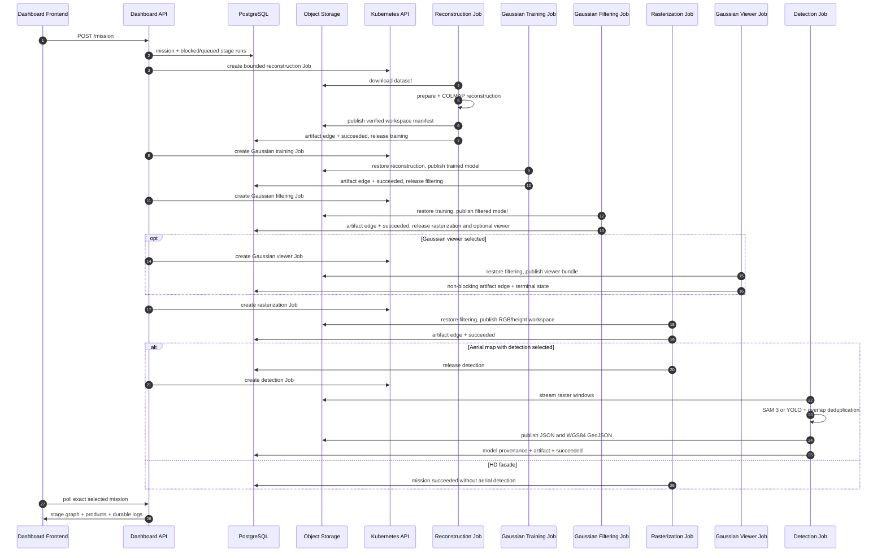
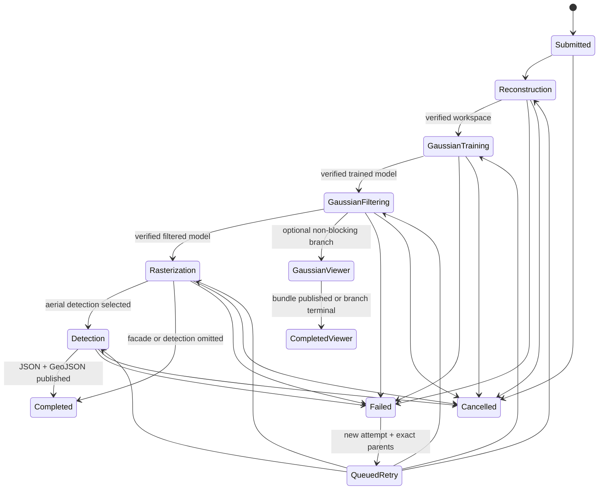
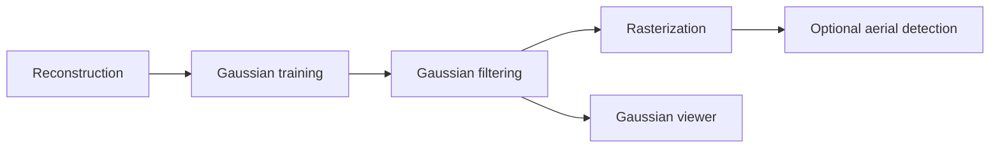
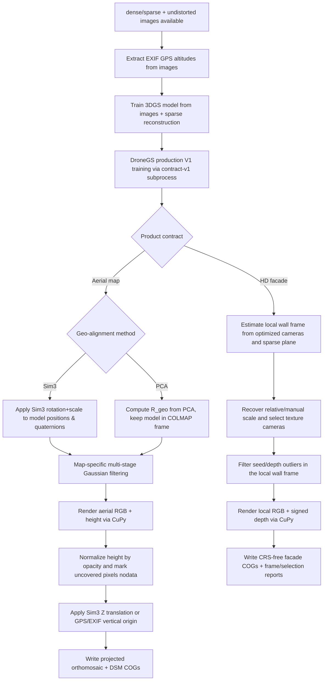

# DroneAI Pipeline Documentation

## Purpose

This document explains the runtime architecture, event flow, state machines, file layout, and algorithmic behavior of the DroneAI pipeline as it is implemented in this repository.

It is intentionally more detailed than the installation guide. The goal is to document how the system behaves once deployed, how missions move through PostgreSQL and Kubernetes, and how the orthomosaic and final annotated outputs are produced.

For upstream COLMAP theory, command semantics, and reconstruction internals, refer to the official COLMAP documentation:

- https://colmap.github.io/
- https://github.com/colmap/colmap

This repository adds orchestration, event transport, mission state handling, geo-referencing, orthomosaic generation, tiling, oriented-object detection, aggregation, and dashboard control on top of COLMAP.

HD facade orthophotos are a separate local-coordinate product. They do
not use a projected CRS, absolute RTK/GCP alignment, terrain height semantics,
Web Mercator tiling or the aerial detection stages. The image-selection,
optimized-camera frame, relative/manual scale and artifact contract are
detailed in [`docs/FACADE_ORTHOPHOTO.md`](docs/FACADE_ORTHOPHOTO.md). The first
Mavic 3E field validation is recorded in
[`docs/benchmarks/cahors-facade-2026-08-01.md`](docs/benchmarks/cahors-facade-2026-08-01.md).

## System overview

The pipeline is a local event-driven photogrammetry and detection system with four application components:

1. `app4-dashboard/frontend`
2. `app4-dashboard/api`
3. `app1-colmap`
4. `app2-ia`

The qualified Kubernetes data path is:

1. Images are uploaded below an organization-scoped dataset prefix.
2. The API persists the owned mission and dependency-closed stage rows in
   PostgreSQL.
3. The bounded scheduler reserves the oldest eligible run and creates one
   deterministic Kubernetes Job from its persisted resource class.
4. Reconstruction downloads the dataset, runs preparation/COLMAP and publishes
   a checksum-addressed workspace manifest to S3.
5. Gaussian training restores that exact workspace and publishes its own
   immutable result; filtering repeats the pattern without mutating its parent.
6. Rasterization restores the filtered model, applies the shared coverage and
   GeoTIFF finalizer, then publishes the RGB/height workspace.
7. For aerial maps, detection streams bounded raster tiles through SAM 3 or
   YOLO, deduplicates them and publishes JSON plus WGS84 GeoJSON with exact
   model provenance. Facade missions stop before this aerial stage.
8. Gaussian-viewer preparation may run as an optional non-blocking branch
   after filtering; its failure does not invalidate the scientific map product.
9. Each successful artifact atomically marks its run succeeded and releases
   only direct dependants. The frontend polls the exact selected mission and
   renders the selected DAG, attempts, products and durable lifecycle logs.

The qualified control path is database-first. Cancellation marks the mission
terminal and deletes its active Job; executor heartbeats, deadlines and the
reconciler converge the durable state if a Job disappears. A retry is a new
attempt bound to exact parent artifact UUIDs, never a replay or overwrite of a
successful ancestor.

The current deployment uses only bounded Stage Jobs. Independent map analyses
also use detection Jobs with exact raster-artifact bindings. All Kafka compute
workers and global mission replay have been removed. The supported aerial
profiles are `fast-v2`, `normal-v3` and `high-quality-v4`. Facade products use
`FACADE_HD_V4` with the `DRONEGS_FACADE_HD_V3` training identity. Opacity SH
remains available through training, publication and rendering.

## Deployment topology

See [Deployment](DEPLOYMENT.md) for the supported K3s entrypoint and protected
Helm overlays. Compose is retained only as `compose.test.yaml` for isolated
integration dependencies. All three Kafka compute Deployments are absent.
The control worker schedules bounded Jobs, and the API serves requests using
its separate RLS database role.

## Shared Python package

The repository contains a shared Python package under `shared/` that is imported by multiple services.

Key responsibilities are grouped rather than duplicated in workers:

- configuration, storage and persistence: `config.py`, `storage.py`,
  `database.py`;
- reliable events: `event_schemas.py`, `event_contracts.py`, `inbox_outbox.py`,
  `kafka_reliability.py`;
- product configuration: `pipeline_params.py`, `dronegs_profile.py`,
  `facade_process.py`, `validation.py`;
- geometry and controls: `geo_alignment.py`, `projected_crs.py`,
  `rtk_refinement.py`, `gcp_control.py`, `facade_selection.py`;
- published assets and provenance: `geospatial_assets.py`,
  `product_manifest.py`.

Current responsibilities:

- define the Kafka broker and topic names used across services
- define the default COLMAP worker workspace used when a mission does not
  select an explicitly mounted work drive
- define the version-two stage DAG, its direct dependencies, canonical
  artifact kinds and portable resource classes
- define the current `modern` COLMAP preset and qualified quality profiles
- define parameter metadata used by the frontend to render editable controls
- provide helper functions that merge mission overrides with the selected pipeline preset
- persist missions, logs, and detections through SQLAlchemy
- enforce durable workflow state vocabularies in both SQLAlchemy metadata and
  PostgreSQL rather than relying only on Python transitions
- expose S3-compatible storage helpers used with MinIO
- reconcile prefix deletions after every S3 `DeleteObjects` call and retry
  per-object failures up to `S3_DELETE_MAX_ATTEMPTS` (default: `3`), raising
  an error instead of reporting a partial deletion as successful
- validate mission identifiers and contained filesystem paths
- compute and serialize the Sim3 transform between raw and aligned COLMAP models
- validate and enrich versioned Kafka events
- provide broker-independent retry, dead-letter, and manual-commit primitives
- provide transactional inbox claims, durable outbox enqueueing and the API
  dispatcher
- normalize the selected IA backend through one shared policy

Bounded executors share storage, validation, geometry and stage-execution
helpers. The dashboard control plane owns event validation, inbox/outbox and
Kafka delivery. Compute does not depend on Kafka messages.

DJI metadata, projected-CRS selection, RTK pose-prior injection, the immutable
DroneGS production profile and the qualified facade process are centralized in
`shared/dji_metadata.py`, `shared/projected_crs.py`,
`shared/rtk_refinement.py`, `shared/dronegs_profile.py` and
`shared/facade_process.py` respectively.

The worker-specific `app2-ia/detection_core.py` and
`shared/detection_products.py` modules contain reusable detection,
tiling, deduplication, rendering, and GIS-export logic. The bounded executors and the
infrastructure-free local runner share these core functions.

Bounded CLI entry points import scientific executors only after parsing their
explicit stage selection. Imports do not start consumers or compute.

## Services and responsibilities

### Dashboard frontend

The frontend is the operator interface. Its responsibilities are:

- browse datasets
- establish an HttpOnly API session from an operator-provided credential
- submit missions
- display streaming mission status
- allow cancellation
- select an uploaded S3 dataset prefix and an advertised COLMAP work drive

The frontend does not perform heavy computation. It submits through the API
and polls `GET /missions` plus the exact selected `GET /missions/{vol_id}`
record every three seconds. WebSocket snapshots are accepted only for legacy
missions without stage runs, so an older event cannot replace durable Job
state or leak another mission's logs into the monitor.

### Dashboard API

The API is the control plane for the pipeline.

Its progressive strict-typing boundary covers the package itself,
RBAC/session security, Kafka/outbox publication, the transactional status
consumer and WebSocket hub, Kubernetes status records and infrastructure-free
image preview helpers. Mission and map Pydantic schemas are checked against
the real framework types; raster rate limiting, mission status policy
and geospatial query/storage helpers expose explicit local protocols and typed
JSON contracts. Browser authentication, dataset browsing and batch upload,
mission lifecycle/status and administrative outbox recovery are strictly typed
route adapters. The geospatial composition router, raster metadata, tile and
combined vector read paths, plus rerunnable analysis lifecycle and result
publication and QGIS-compatible raster/vector exports are covered too. The
feature-editing adapter completes the strict route boundary, including typed
search filters and the optimistic-version conflict contract. Every dashboard
HTTP route module is covered without broad ignores.

Primary endpoints:

- `POST|GET|DELETE /auth/session`
- `POST /mission`
- `POST /mission/cancel`
- `GET /browse`
- `GET /datasets`
- `GET /missions`
- `GET /missions/{vol_id}`
- `POST /missions/{vol_id}/stages/{stage}/runs`
- `POST /missions/{vol_id}/stages/runs/{run_id}/artifacts` (admin-only,
  verified recovery/import path)
- `GET /status/summary` (compatibility missions)
- `GET /mission/parameters`
- `DELETE /mission/{vol_id}`
- `POST /datasets/upload` (development-only compatibility endpoint)
- `POST /datasets/upload-sessions`
- `POST /datasets/upload-sessions/{session_id}/files/{file_id}/parts/{part_number}`
- `POST /datasets/upload-sessions/{session_id}/files/{file_id}/complete`
- `POST|DELETE /datasets/upload-sessions/{session_id}`
- `GET /preview/{s3_key}`
- `GET /maps/{vol_id}/metadata/{layer}`
- `GET /maps/{vol_id}/tiles/{layer}/{z}/{x}/{y}.png`
- `GET /maps/{vol_id}/vectors.geojson?bbox=west,south,east,north`
- `GET /maps/{vol_id}/export/raster/{layer}?format=cog|geotiff`
- `GET /maps/{vol_id}/export/vectors?format=gpkg|geojson&scope=...&crs=...`
- `GET|POST /maps/{vol_id}/analyses`
- `POST /maps/{vol_id}/analyses/{run_id}/retry`
- `POST /maps/{vol_id}/analyses/{run_id}/cancel`
- `GET /maps/{vol_id}/analyses/{run_id}/vectors.geojson`
- `GET /maps/{vol_id}/search`
- `POST /maps/{vol_id}/features`
- `PATCH|DELETE /maps/{vol_id}/features/{feature_id}`
- `GET /operations/outbox/dead` (admin)
- `POST /operations/outbox/{id}/replay` (admin)
- `GET /`
- `WS /ws/status`

Primary responsibilities:

- authenticate browser sessions and enforce viewer/operator/admin roles
- validate mission requests and persist the dependency-closed stage DAG
- reserve eligible runs fairly under global/owner/mission/resource limits
- render deterministic hardened Kubernetes Jobs from immutable executor maps
- reconcile missing/finished Jobs, heartbeats, cancellation and dispatch bounds
- publish immutable artifacts internally and release only direct dependants
  atomically; admin recovery publication revalidates the canonical S3 manifest
- expose owner-scoped mission summaries, exact stage attempts, products,
  checksums, quality metrics and durable lifecycle logs
- retain transactional cancellation events, status delivery and bounded
  WebSocket replay; bounded Job progress comes from durable stage records
- keep Kubernetes Pod inventory outside the tenant HTTP boundary; tenant
  progress is derived from durable mission and stage-run state
- expose pipeline defaults, the map/facade process catalog and parameter
  metadata through `GET /mission/parameters`
- expose bounded COG map tiles, rerunnable AI campaigns, indexed feature
  search and optimistic manual-vector editing
- stream raster downloads and generate QGIS-ready GeoPackage/GeoJSON exports;
  GeoPackages default to the raster EPSG and reproject from WGS84 on demand

The bounded WebSocket replay buffer remains in memory, but mission state,
service progress, logs, original parameters, and resume metadata are persisted
in PostgreSQL. Alembic defines and applies versioned migrations both for
manually managed databases and through the Helm migration hook.

Every non-health HTTP route and the status WebSocket require authentication
when enabled. A raw API client may use `Authorization: Bearer` or `X-API-Key`.
The dashboard exchanges the key once through `POST /auth/session`; the API
returns an eight-hour, HttpOnly, SameSite=Lax cookie that also authenticates
the WebSocket. Production CORS uses explicit origins with credentials and
rejects wildcard configuration.

The API package is split by responsibility:

| Module | Responsibility |
|---|---|
| `main.py` | application factory, middleware, router composition, lifespan |
| `mission_state.py` | mission persistence, status policy and serialization |
| `messaging.py` | mission/control event construction and outbox publisher gateway |
| `realtime.py` | status consumer, bounded history, WebSocket fan-out |
| `image_preview.py` | framework-independent image conversion |
| `routers/missions.py` | mission and operational HTTP endpoints |
| `routers/datasets.py` | S3 browsing, preview, upload, download, deletion |
| `routers/maps.py` | authenticated composition root for geospatial routes |
| `routers/map_rasters.py` | bounded COG rendering and legacy/manual vector reads |
| `routers/map_analyses.py` | AI campaign lifecycle and campaign vector reads |
| `routers/map_features.py` | spatial search and manual vector CRUD |
| `routers/map_exports.py` | streamed raster downloads and CRS-aware vector exports |
| `map_schemas.py` | geospatial HTTP request contracts |
| `map_support.py` | mission lookup, validation and GeoJSON serialization |
| `routers/operations.py` | dead-outbox inspection and controlled replay |
| `shared/geospatial_assets.py` | COG conversion, preview, tiles and WGS84 vectors |
| `shared/geospatial_workspace.py` | GeoJSON/style validation and viewport bounds helpers |
| `shared/qgis_crs.py` | framework-neutral EPSG resolution and lazy vector reprojection |
| `shared/qgis_exports.py` | bounded-memory GeoJSON and standards-compliant GeoPackage writing |

HTTP routes do not own Kafka polling, image conversion, Kubernetes parsing, or
mission-state policy. `main.py` is intentionally only the composition root.

### COLMAP stage Jobs (`app1-colmap`)

The image runs one explicit stage through `app1-colmap/stage_executor.py`.
There is no long-running Kafka worker or combined mission runner.

| Module | Responsibility |
|---|---|
| `stage_executor.py` (CLI) | select one bounded stage |
| `colmap_worker/stage_executor.py` | restore exact inputs, invoke scientific boundaries, publish a versioned workspace and clean scratch data |
| `colmap_worker/stage_state.py` | typed reconstruction-state serialization |
| `colmap_worker/runtime.py` | durable cancellation checks and diagnostic logging |
| `colmap_worker/contracts.py` | immutable typed scientific states |
| `stages/preparation.py` | profile resolution, download, image selection and cache validation |
| `stages/reconstruction.py` | references, feature extraction and bounded matching |
| `sparse_mapping.py` | mapping, shared timeout and sparse-quality promotion gate |
| `stages/rtk.py` | covariance-aware RTK refinement and promotion gate |
| `stages/alignment.py` | undistortion and GCP, GNSS or local-facade alignment |
| `dronegs_config.py` | immutable run configuration and qualification identity checks |
| `stages/gaussian.py` | training/checkpoint helpers, qualification and rendering |
| `artifacts.py` | filesystem predicates and cache invalidation |

`shared/stage_execution.py` owns the durable run, heartbeat, cancellation and
transactional artifact boundary. Scientific modules do not create Kafka
clients. Coverage, qualification and opacity-SH behavior remain in their
current scientific implementations.

### Detection Jobs (`app2-ia`)

`stage_executor.py` dispatches the monolithic detector, indexed shard executor
or finalizer. `detection_stage.py` reads the pinned raster, streams bounded
windows, deduplicates results, converts polygons to WGS84 and publishes a
versioned detection workspace. SAM 3 and YOLO retain immutable model provenance.

An independent analysis is linked by `MissionStageRun.analysis_run_id`.
The existing scheduler, quota/resource policy, cancellation and job cleanup
apply. Its artifact is excluded from the pipeline stage projection and DAG.
PostGIS indexing and artifact registration commit together; non-indexed
analyses read the final immutable GeoJSON through their tenant-scoped API.
See [the editing contract](docs/contracts/explorer-editing-styles-v1.md).

## Control-plane events

Kafka no longer transports mission execution, orthomosaics, tiles or
detections. Those contracts are rejected, their worker utilities are removed,
and Helm/Compose no longer provision their topics.

The current schema includes `control`, `status` and `dead_letter` only.
Every event requires its version-one envelope, ID, correlation, attempt and
timestamp. Unversioned events are rejected. Tenant-scoped identities prevent
cross-organization collisions. The generated contract is
[`kafka-events-v1.schema.json`](docs/contracts/kafka-events-v1.schema.json);
`make static` verifies it.

| Topic | Default partitions | Purpose |
|---|---:|---|
| `pipeline-control` | 1 | durable cancellation notifications |
| `pipeline-status` | 1 | control-plane status delivery |
| `pipeline-dead-letter` | 1 | failed deliveries and sanitized diagnostics |

Cancellation state and its outbox event commit together. The dispatcher
claims rows with `FOR UPDATE SKIP LOCKED`, publishes the versioned event and
marks delivery. Publication is at least once: a crash after publishing and
before committing can repeat the same event ID. Transactional inbox receipts
deduplicate domain mutations. Delivery retries are bounded; dead-letter
publication must succeed before committing a poison-message offset. Failed
outbox rows remain inspectable and require an explicit administrator replay
after exhausting their budget.

Mission creation instead commits the mission and initial stage rows together.
Stage retries create a new attempt with exact parent artifact IDs; neither
operation emits Kafka work. Both require Stage Jobs to be enabled.

## Mission workspace layout

New missions use organization-scoped Artifact Manifest v3. See
[the manifest contract](docs/contracts/artifact-manifest-v3.md) and
[the stage DAG contract](docs/contracts/versioned-stage-dag-v1.md).

Each run publishes its manifest under its bound mission namespace:

```text
organizations/<organization>/missions/<mission>/
  stage-runs/<run-uuid>/<stage>-workspace/manifest.json
```

Manifest entries identify checksum-addressed objects and exact parent
manifests. Restore verifies the expected organization, manifest checksum and
every downloaded asset. A new attempt publishes a new run namespace; it never
overwrites a successful parent's artifact. Local stage workspaces are
disposable scratch directories keyed by run UUID. Raw legacy mission paths
and old artifact formats are not a supported input contract.

## End-to-end event sequence



The scheduler runs in the dashboard control worker. HTTP requests only persist
work; the durable stage projection is authoritative for progress and results.

## Global mission state model

This is the durable bounded-Job state machine, not a single-process
implementation detail.



Each named stage contains append-only attempts with `blocked`, `queued`,
`running`, `succeeded`, `failed` or `cancelled` state. A mission summary is a
projection of the latest attempt per selected stage; old attempts remain
visible as retry evidence. No combined Kafka execution path remains.

## COLMAP stage behavior

### Input binding and cancellation

The executor loads a reserved run from PostgreSQL and validates its
organization, mission, owner, workspace, stage and attempt binding. It restores
only the exact upstream artifact IDs stored on that run. Scratch paths stay
below the configured stage work root; user-supplied S3 prefixes are not host
paths.

Cancellation is persisted before the API returns. The scheduler reconciles
the affected Jobs, while cooperative checks and the heartbeat observe durable
cancellation. COLMAP subprocess checks retain `DurableCancellationRegistry`
and `PipelineCancelledError`. There is no Kafka control thread in the executor.

### Workspace cleanup

All COLMAP stage adapters call their workspace cleanup in a `finally` block.
Cleanup clears process-local cancellation state. A successful stage removes
its scratch workspace and its local verification cache; an exception preserves
both below the bounded stage work root so a retry of the same run can continue.
Each workspace is protected by a non-blocking exclusive lease. Cleanup errors
are logged and preserve the workspace instead of masking the stage result.

Input restoration reconciles the upstream manifest into that existing
workspace. Downloads and local promotion copies use a sibling temporary file,
verify it, then expose it with an atomic rename. A small verification cache is
kept outside the published workspace and checkpointed after at most 64 files or
64 MiB. On retry, an unchanged file identity (blob digest and size plus local
device, inode, size, mtime and ctime) avoids rereading its contents; any
fingerprint mismatch falls back to SHA-256 verification and repairs a corrupt
file from CAS. This cache is a same-run optimization under the exclusive lease,
not a replacement for the immutable manifest.

Transfer recovery is file-granular. Scientific computation resumes at its last
durable stage-specific checkpoint (for example, completed Gaussian cells);
code without such a checkpoint may recompute its local operation while still
avoiding a complete workspace download or revalidation. The work root must use
a persistent volume to survive pod or node replacement. Mission retention and
orphan-workspace collection remain separate operational concerns.

### Pipeline profiles

Only the modern reconstruction path remains. The selectable quality profiles
are Fast v2, Normal v3 and HQ v4; facade processing uses its qualified v3
contract. Checkpoint and opacity-SH settings remain part of the current
scientific path.

#### Modern profile

Characteristics:

- feature type: SIFT CUDA, 2,400 px and 4,096 features by default
- matcher type: bounded brute-force CUDA over a GPS/temporal pair graph
- mapper command: `global_mapper`
- view graph calibration enabled
- gimbal-derived gravity disabled by default, with an explicit 95%-coverage
  gate and report when an operator enables GLOMAP gravity rotation averaging
- two global BA passes and final iterative retriangulation, with a deterministic
  seed; stricter track thresholds remain isolated in the experimental preset
- automatic GLOMAP primary with compatible Caspar/Ceres fallback inside one
  shared 40-minute budget
- covariance-aware RTK refinement enabled only when corrected MRK coverage is
  sufficient; the candidate is promoted only when registration, sparse-point,
  reprojection, track-length and focal-drift metrics remain within configured
  tolerances
- Gaussian Splatting orthomosaic enabled (default)

This is the default and the main intended runtime path.

Facade jobs use the `FACADE_HD_V4` coverage-first product contract and
the `DRONEGS_FACADE_HD_V3` training identity, qualified on the Cahors
reference campaign. Every unique input image is retained by default;
`SIMPLE_RADIAL` keeps the solve compatible with Caspar, and the bounded graph
uses 48 maximum / 16 minimum spatial neighbours plus six temporal neighbours.
GPS proposes pairs only; RTK, gravity, GCP fitting and CRS alignment remain
disabled. The profile uses 4,200 px extraction/undistortion, 16,384 SIFT
features/matched features, a four-hour mapping budget, then 30,000 DroneGS
iterations at up to 4,096 px with an adaptive 5–6 M Gaussian envelope. The
worker, API and dashboard all read this recipe from
`shared/facade_process.py`. Its held-out product gates are 18 dB PSNR and
0.25 SSIM; the final Cahors detail-free run reached 21.616 dB / 0.564 while
reducing aggregate loss from 0.4272 to 0.1588 in 11,370 seconds.

Two measured modern presets deliberately optimize different objectives:

| Preset | Sparse recipe | Intended use | Helenenschacht checkpoint result |
|---|---|---|---|
| Survey / planimetry | 2,400 px, 4,096 features, first octave -1, guided matching off, general RTK loss scale 7.82 | XY and faster turnaround | about 5.0 cm horizontal RMSE |
| `Precision 3D · RTK` | 3,200 px, 8,192 features, first octave 0, guided matching on, RTK loss scale 62.56 | DSM, relief and volume | 6.32 cm H, 15.74 cm V, 16.96 cm 3D RMSE |

The 3D preset is not a universal replacement for Survey. On Helenenschacht it
improves the selected DSM RMSE to 11.44 cm but gives up about 1.3 cm of sparse
horizontal RMSE compared with the best 2,400 px RTK run. The stronger Cauchy
scale is therefore preset-specific; the general default remains 7.82.

ALIKED N16Rot/N32 and LightGlue remain available as explicit expert choices.
The image includes ONNX Runtime GPU and checksum-verified embedded models, but
they are not the large-scene default: on the 8 GiB RTX 4070 Laptop they were
slower and close to the VRAM limit on ALBAGNAC.


### Reconstruction cache validation

Before reconstruction, the worker checks whether existing COLMAP artifacts are
compatible with the requested reconstruction recipe. A versioned SHA-256
fingerprint covers feature resolution/count/octave, matching, camera/mapping,
RTK refinement iterations and robust-loss scale, and undistortion parameters.
A changed or missing fingerprint invalidates the dependent artifacts
once instead of silently reusing stale features or poses.

The logic infers descriptor type by inspecting descriptor blob size:

- 128 bytes per feature means SIFT
- 512 bytes per feature means ALIKED float descriptors

If the persisted database was created by the opposite descriptor family, it is
also deleted so the worker can re-extract features cleanly.

This is important because reusing a database with the wrong feature representation would corrupt the remainder of the pipeline.

### Gaussian Splatting rerun readiness

The Gaussian Splatting path treats the workspace as reusable when:

- `dense/sparse/cameras.bin` exists
- `dense/sparse/images.bin` exists
- `dense/sparse/points3D.bin` exists
- undistorted images exist in `dense/images/`

The Gaussian stage checks its restored reconstruction workspace before training;
this does not bypass the durable DAG or replay a whole mission.

A completed Gaussian training result is reusable according to its immutable
training contract, not according to the current PSNR/SSIM acceptance
thresholds. If only a canary threshold changes, app1 recomputes the canary from
the persisted manifest and evaluation metrics. It neither quarantines the
valid PLY nor restarts 30,000 iterations. A compatible result that misses the
new threshold emits a structured cell warning and remains reusable. The large
optimizer checkpoint is discarded after successful model promotion.

Resident training also publishes a lightweight `cell_recovery.json` contract
for every completed cell. The contract binds the source reconstruction,
projected bounds, selected cameras and native crops, subset policy, training
recipe, trainer binary, promoted PLY manifest, recorded canary, and core/buffer
population. The canary may be passed or failed; a failed result remains an
explicit quality warning. A retry validates this record before exporting the cell subset or
reading either large PLY. Compatible completed cells are therefore skipped
directly and processing resumes at the first incomplete or incompatible cell.

Host cache size, decode/prefetch worker counts, scratch/output paths, resume
cursor, automatic-selection metadata, qualification policy label and canary
thresholds are operational controls; changing them does not invalidate a
scientifically compatible completed cell.

The cell artifacts are synchronized to durable S3 storage in dependency order:
`point_cloud.ply`, `buffer.ply`, `trainer_run.json`, `canary_result.json`, then
`cell_recovery.json`. Publishing the marker last prevents a restarted pod from
accepting a partially synchronized cell. Outputs created before this contract
remain safe: they take the legacy full-validation path once, then receive a
recovery record after their buffer/core validation succeeds. A hash-bound sync
receipt is stored after the marker; it suppresses redundant large uploads while
causing an interrupted synchronization to resume on the next local recovery.

### GPU index normalization

The worker runs COLMAP inside a container, so CUDA device indices are relative to the devices exposed through `CUDA_VISIBLE_DEVICES`, not the host's global GPU numbering.

Consequences:

- mission payloads that pass GPU index `-1` are normalized to `0`
- feature extraction, matching, and bundle-adjustment GPU indices also default to `0`

This avoids the common COLMAP abort `selected_gpu_index < num_cuda_devices ... Invalid CUDA GPU selected` when the host GPU is labeled differently from the container-local device list.

### GPS extraction and CRS persistence

GPS extraction does more than read latitude and longitude.

The worker:

1. scans source images and DJI sidecars for EXIF/MRK GPS;
2. prefers corrected MRK coordinates and ENU uncertainty when available;
3. classifies MRK `Ellh` as ellipsoidal rather than silently labelling it
   orthometric;
4. evaluates the complete footprint before selecting a projected CRS;
5. uses the applicable RGF93 CC9 zone for a compact metropolitan-France
   mission, Lambert-93 for a wide French footprint, or centroid UTM elsewhere;
6. accepts an explicit official `EPSG:<code>` when the deliverable requires it;
7. writes projected coordinates into `geo_data.txt`;
8. stores the effective CRS and policy sidecars.

Why the CRS sidecar exists:

- the orthomosaic must keep the real projected CRS across reruns
- re-inferring the CRS incorrectly would break the mapping from orthomosaic pixels back to real-world coordinates
- the bounded detection executor and map API depend on exact raster transform and CRS metadata

If GPS extraction has already been done, the worker reuses the persisted CRS
only when the requested policy and source identity still match. Changing the
CRS invalidates stale georeferencing products without discarding reusable
features or sparse geometry.

### Independent checkpoint evaluation

Checkpoint evaluation is deliberately separate from reconstruction. The GCP
file may be used after a sparse model or DSM exists, but it must not feed the
bundle adjustment when the objective is an independent accuracy measurement.

- `tools/evaluate_gcp_checkpoints.py` triangulates annotated target centres
  from registered camera rays and reports horizontal, vertical, 3D and
  reprojection errors.
- `tools/evaluate_dsm_checkpoints.py` verifies the raster/model CRS, reads one
  1×1 window per surveyed point, and reports signed and absolute vertical
  statistics without loading a multi-gigabyte DSM into memory.

Horizontal and vertical acceptance thresholds must remain distinct. A fine
output GSD is not an acceptance criterion, and a denser tie cloud is not a
substitute for checkpoints.

### Covariance-weighted GCP adjustment

When `gcp_adjustment_enabled=true`, GCP are no longer independent by
definition. DroneAI triangulates their image markings in the final sparse
model and estimates a robust Sim3 from only the points whose role is
`adjustment`. It does not claim that COLMAP natively supports surveyed 3D scene
points in bundle adjustment.

`gcp_accuracy.csv` supplies per-point one-sigma horizontal, vertical and image
marking uncertainty. The triangulation covariance is rotated/scaled into the
projected CRS, added to survey covariance, and used to normalize XYZ residuals
before a Cauchy loss. `checkpoint` points never influence the transform;
`disabled` points are ignored. The complete fit, hashes, rejected observations,
per-point errors and roles are published as `gcp_alignment_report.json`.
The same Sim3 is also applied to the published `colmap/sparse_geo` model, so it
cannot silently remain in an older GPS-only frame while the ortho uses GCP.

Before promotion, the worker evaluates the adjustment baseline and independent
checkpoint horizontal RMSE, vertical RMSE and normalized error. A failed gate
stops publication. A mission without checkpoints remains supported for
backwards compatibility but is labelled `accepted-unverified`; survey policy
can require checkpoints with `gcp_require_checkpoints=true`.

## COLMAP stage sequence



Every edge represents an immutable artifact dependency. Facade products do not
enter aerial detection. Cancellation, retry and failure apply to individual
durable attempts as described above.

## Orthomosaic construction

This section describes the repository-specific orthomosaic logic in detail.

### Overview

The orthomosaic builder uses a **3D Gaussian Splatting (3DGS) pipeline**.

It trains a Gaussian radiance field directly from COLMAP undistorted images
and the sparse reconstruction, renders an orthographic True Digital
Orthophoto Map (TDOM), and writes a georeferenced GeoTIFF with a companion
height map. Any camera-altitude anchoring preserves the recorded vertical
reference and is not an orthometric conversion.

Pipeline steps:

1. Load COLMAP sparse reconstruction and alignment transform from `dense/sparse/`
2. Extract drone EXIF GPS altitudes from undistorted images
3. Optionally partition the projected ground footprint into explicit core and
   training-buffer cells (requires the geographic Sim3 transform)
4. Train a 3DGS model per cell via the native DroneGS CLI (MRNF strategy, C++/CUDA)
5. Merge cell models (retain only Gaussians in core, non-overlap region)
6. Geo-alignment:
   - **Sim3 path** (with `alignment_transform.json`): apply rotation+scale to
     model, keep translation as float64 for GeoTIFF origin, and map the renderer
     view direction back through `Rᵀ` before evaluating SH in its training frame
   - **PCA path** (no alignment transform): compute `R_geo` rotation matrix from camera PCA, pass it to the renderer — the model stays in the original COLMAP coordinate frame to preserve SH coefficient consistency
7. Configurable multi-stage post-processing filter chain: max-scale → spatial crop → opacity → needle removal → SOR → connected-component → Z-floater removal (each individually togglable)
8. Render orthographic RGB orthomosaic and height map via CuPy CUDA rasteriser
   (with `R_geo` for PCA and an inverse Sim3 direction transform for SH)
9. Convert local model Z to the available vertical reference: add the
   withheld Sim3 Z translation, or the GPS/EXIF-derived origin on the PCA path
10. Write GeoTIFF with projected CRS

### Gaussian Splatting orthophoto pipeline

This is the primary and recommended orthomosaic path. It is implemented in `app1-colmap/gaussian_ortho/`.

#### Research foundations

The implementation draws from several key papers:

- **3D Gaussian Splatting** (Kerbl et al. 2023): core Gaussian scene representation with position, covariance (rotation quaternion + log-scale), opacity, and spherical harmonics colour coefficients
- **3DGS as MCMC** (Kheradmand et al. 2024): bounded-cap stochastic topology refinement rather than unbounded clone/split
- **DroneGS**: standalone C++/CUDA MRNF training with structural FastGS buckets/checkpoints, warp-cooperative backward, fused L1/SSIM loss, progressive SH, bounded scene-resident image caching, and deterministic manifests
- **CuPy** with custom CUDA RawKernels: lightweight GPU-accelerated orthographic rasteriser for TDOM rendering
- **VastGaussian** (Lin et al. 2024): motivates the staged
  divide-and-conquer path. DroneAI currently defines projected-ground
  core/buffer cells and independent training; calibrated footprint-based
  camera assignment and native crops are the next qualification step.
- **TOrtho-Gaussian** (Wang et al. 2024): DroneAI implements its opacity-only
  SH ablation (`opacity-SH-v1`) and orthographic projection formulation. The
  full view-dependent scale/rotation FAGK is not implemented.

#### Key design decisions

**Training stays in COLMAP-local coordinates.** The Gaussian model is trained in compact float32 coordinates centred near zero. The Sim3 geo-alignment is applied only after training, and the translation component (~10⁶ m for UTM) is kept as float64 and folded into the GeoTIFF origin. This avoids catastrophic float32 precision loss (e.g. Y ≈ 4,702,500 → float32 ULP = 0.5 m = 25 px banding at GSD 0.02 m).

**PCA path keeps the model in COLMAP frame entirely.** When no Sim3 alignment is available, a PCA-based rotation `R_geo` is computed from camera positions and passed to the orthographic renderer instead of being applied to the model. This preserves consistency between SH coefficients, positions, and rotations — applying the rotation to positions and quaternions but not to SH coefficients causes a frame mismatch that produces blurry, washed-out colours when rendered from nadir.

**No dense stereo required.** The pipeline only needs the undistorted images and sparse model from `dense/sparse/` and `dense/images/`.

**DroneGS handles training as a native C++/CUDA process.** The Python pipeline invokes the contract-v1 executable as a subprocess, consumes JSON Lines progress events, validates `trainer_run.json` and `canary_result.json`, and imports the resulting standard 3DGS PLY. DroneGS is the only executable Gaussian backend; LichtFeld remains solely as a documented historical benchmark and GPL provenance source.

**Altitude integration.** DJI MRK ellipsoidal height is preferred over EXIF
when available; EXIF-only vertical reference remains unknown. The optional
mean shift anchors model-relative Z to the recorded camera-altitude reference.
It does not convert ellipsoidal heights to NGF-IGN69, nor does it establish
surveyed surface accuracy.

#### Step 1: Load COLMAP reconstruction

The pipeline reads cameras, images, and 3D points from `dense/sparse/` via pycolmap. If an `alignment_transform.json` exists, it is loaded for later geo-alignment. Camera poses are stored as camera-to-world rotation + world-space translation.

#### Step 1b: Extract EXIF altitudes

Altitude is extracted from the mission metadata, preserving source and
vertical-reference classification. The mean of compatible observations may be
stored for later height-map anchoring. If none is available, the pipeline
keeps model-relative Z.

#### Step 2: Scene partitioning (optional)

For large map scenes with a geographic Sim3, the surveyed point footprint can
be split into an m×n grid in projected ground coordinates. Every cell records
an exclusive core and an expanded training buffer, while its COLMAP subset
remains in numerically stable local coordinates. Calibrated corner rays are
intersected with the robust terrain-height envelope; only cameras whose ground
footprint overlaps the buffer are retained. The overlap is projected back to
the source photograph and expanded by a 128 px margin. DroneGS decodes that
native JPEG region directly and then composes `tile_mode` inside it, avoiding
any intermediate image resampling or JPEG recompression. A single partition
(1×1) remains the default until resident-cap and streamed-product gates pass.
After point-quality, restricted-track, native-crop and capacity filtering, an
image is retained only if at least one of its original COLMAP observations
still references an exported 3D point. Images with zero retained 3D support,
including held-out views, are removed before DroneGS scheduling; a cell with no
supported image fails during subset preparation rather than after GPU startup.

#### Step 3: Training

Each cell is trained using the DroneGS contract-v1 CLI with MRNF:

- **Binary**: portable `/usr/local/bin/dronegs`, selected through `DRONEGS_BIN`
- **Strategy**: immutable `DRONEGS_PRODUCTION_PROFILE_V1`: MRNF with a
  bounded Gaussian cap, deterministic seed, progressive SH, structural FastGS,
  spatial-bounds pruning and the validated convergence finish
- **Progress monitoring**: one JSON object per stdout line (`iteration`, baseline loss, Gaussian count)
- **Recovery**: checksum-protected checkpoint V3 contains the full Gaussian,
  Adam, topology, schedule and deterministic RNG state and is synchronized to
  durable S3 recovery storage
- **Canary**: production V1 keeps `scene_index % 8 == 0` for immutable
  benchmark parity; custom profiles may select a central spatial block and
  guard ring
- **Output gate**: process exit zero, completed v1 `trainer_run.json`, and standard `point_cloud.ply`
- **Source safety**: the COLMAP input tree is mounted/read as input; every run writes to a separate empty output tree

DroneGS manages loss, optimizer schedules, topology, image caching, and GPU
memory. The Python pipeline is responsible for:
1. Preparing per-cell COLMAP data directories
2. Launching and monitoring the subprocess
3. Loading the resulting PLY
4. All post-training steps (filtering, rendering, GeoTIFF output)

Default training parameters (configurable via dashboard UI):

| Parameter | Default | Description |
| --- | --- | --- |
| `gs_backend` | `dronegs` | Native trainer; only supported value |
| `gs_iterations` | 15000 | Validated training budget |
| `gs_data_factor` | 4 | Image downscaling factor |
| `gs_max_width` | 1600 | Maximum resized image width |
| `gs_tile_mode` | `auto` | VRAM-aware mode; numeric 1/2/4 is an expert override |
| `gs_cap_max` | 1,500,000 | Maximum Gaussian count |
| `gs_sh_degree` | 3 | Maximum spherical harmonics degree |
| `gs_seed` | 42 | Deterministic base seed |
| `gs_topology_cooldown` | 1000 | Final fixed-topology steps |
| `gs_photometric_finish` | 1000 | Final mixed-objective ramp |
| `gs_photometric_mse_percent` | 100 | Final active-pixel MSE weight |
| `gs_checkpoint_every` | 7500 | Resumable native checkpoint interval; standard runs are capped at 1/2/3 saves for 7.5k/15k/30k iterations; zero disables periodic saves |
| `gs_host_image_cache_mib` | 0 (auto) | Decoded-image cache ceiling; auto preserves host/cgroup headroom and native allocation remains capped by the measured working set |
| `gs_test_every` | 8 | Deterministic held-out split interval |
| `gs_test_split` | modulo | V1 parity split; custom supports spatial-block |
| `gs_test_guard_percent` | 0 | Guard ring excluded from training for spatial-block |
| `gs_canary_min_psnr` | 18.0 | Minimum held-out PSNR required before rendering |
| `gs_canary_min_ssim` | 0.25 | Minimum held-out SSIM required before rendering |

In automatic mode, orchestration evaluates modes 1, 2, then 4 and selects the
smallest split count whose largest processed view fits the current device.
The conservative budget is `min(free VRAM, 85% of total VRAM)`, minus the
planned resident Gaussian capacity and a 1 GiB dynamic-workspace reserve.
Image workspaces are estimated at 256 bytes per maximum processed pixel,
including headroom over the native trainer's fixed allocations. If VRAM
inventory is unavailable, mode 4 is used conservatively. An explicit numeric
value is treated as an expert override and is never silently changed. The
native trainer still receives a concrete 1, 2, or 4 in its run manifest.


#### Step 4: Merge

If partitioning was used, each Gaussian centre is projected through the same
Sim3 XY transform used to create the grid. Only the unique owner of its
half-open core retains it; the outermost cells include their maximum edge.
This removes duplicates deterministically without comparing UTM coordinates
in float32 during training.

#### Step 5: Geo-alignment

The geo-alignment step has two paths depending on whether an `alignment_transform.json` exists.

**Sim3 path** (alignment transform available):

The Sim3 transform is split:

- **Rotation + scale**: applied to model positions (`s * R @ xyz`), log-scales (`+= log(s)`), and rotation quaternions (pre-multiplied)
- **Translation**: stored as float64 `geo_origin`, used only for GeoTIFF coordinate computation

This split is critical for float32 precision preservation.

**PCA path** (no alignment transform):

The model stays in the original COLMAP coordinate frame. A rotation matrix `R_geo` is computed from camera PCA (smallest principal component of camera positions gives the vertical direction) and passed to the orthographic renderer as a parameter. The renderer uses `R_geo` to orient the virtual nadir camera without modifying the model.

This design preserves the consistency between Gaussian positions, rotation quaternions, and spherical harmonics coefficients. Previously, the PCA rotation was applied directly to positions and quaternions but NOT to SH coefficients, causing a frame mismatch: the SH evaluation computed view-dependent colours in the rotated frame while the coefficients were trained in COLMAP frame. This manifested as colour artefacts (blurry, washed-out rendering) when viewed from nadir. Keeping the model in COLMAP frame and passing `R_geo` to the renderer avoids this problem entirely.

#### Step 5b–5e: Post-processing filter chain

The trained model undergoes a configurable multi-stage filtering pipeline. Each filter can be individually enabled or disabled via the dashboard UI.

1. **Max-scale + spatial crop + opacity + needle removal** (5b, `gs_filter_enabled`): remove Gaussians with any activated scale larger than `gs_filter_max_scale` (default 1.0, 0 = disabled), remove Gaussians farther from all cameras than `gs_filter_dist` × scene diameter (default 1.0, 0 = disabled), remove nearly transparent Gaussians (opacity < `gs_filter_opacity`, default 0.005), and remove highly elongated "needle" Gaussians whose max/min scale ratio exceeds `gs_filter_needle` (default 0, disabled by default).

2. **Statistical Outlier Removal (SOR)** (5c, `gs_filter_sor`): build a k-NN tree (k=16) via `scipy.spatial.cKDTree`. Compute mean distance to 16 nearest neighbours. Remove Gaussians where mean distance > μ + σ × `gs_filter_sor_sigma` (default 4.0). Disabled by default — enable when floater clusters are visible.

3. **Connected-Component filter** (5d, `gs_filter_cc`): build a k-NN adjacency graph (k=16) as a sparse matrix. Compute connected components via `scipy.sparse.csgraph.connected_components`. Keep only the largest connected component, removing all disconnected floater clusters. Disabled by default.

4. **Z-Floater Removal** (5e, `gs_filter_z_floater`): IQR-based fence (5× IQR) on the vertical axis. For the PCA path, the vertical axis is determined by projecting Gaussian positions through `R_geo`'s Z row, not simply using the model's Z coordinate. Removes sky/background Gaussians that accumulate into haze in orthographic rendering. Disabled by default.

All filter parameters are exposed in the **Orthomosaic** parameter group in the dashboard (see tunables table below).

#### Step 6: Orthographic rendering

The cleaned model is rendered using a custom CuPy CUDA rasteriser:

- A virtual top-down camera is positioned above the scene, looking straight down
- SH degree is capped at 1 for orthographic rendering (all ortho rays are parallel → higher SH bands produce spatially-uniform offset, not banding)
- For large outputs, rendering is chunked into 4096×4096-pixel tiles and stitched
- Both RGB (uint8) and height (float32) maps are produced

The height map converts depth-in-camera to world Z:
`height = z_top - normalized_depth`. The CUDA rasterizer divides its weighted
depth sum by accumulated opacity before this conversion. Pixels without
Gaussian coverage are written as `NaN`, not as the ortho-camera elevation.

#### Step 7: Height map altitude correction

On the Sim3 path, scale and rotation have already been applied to the model,
but the large translation is deliberately withheld to preserve float32
precision. Its Z component is therefore added to the height map, just as its
X/Y components are added to the GeoTIFF origin.

On the PCA path, model heights are first converted to metres. When compatible
GPS/EXIF altitudes exist, the same camera-centroid origin used for horizontal
georeferencing is applied vertically. The ground surface is never shifted to
the mean drone altitude: a camera altitude is not a ground elevation.

This preserves the recorded vertical reference; it is not a geoid-grid
transformation or an independent elevation-accuracy validation. If no
compatible absolute altitude is available, the raster remains explicitly in
local model Z.

#### Step 8: GeoTIFF writing

The output is written as two GeoTIFF files:

1. **RGB orthomosaic** (`orthomosaic.tif`): 3-band uint8, LZW compressed, with projected CRS and affine transform from `from_origin(geo_x_min, geo_y_max, resolution, resolution)`
2. **Height map** (`orthomosaic.height.tif`): 1-band float32, LZW compressed,
   same CRS and affine transform, with uncovered pixels marked `nodata=NaN`

The `geo_x_min` and `geo_y_max` are computed by adding the float64 `geo_origin` translation to the local-coordinate extent bounds. This preserves sub-centimetre positional accuracy.

### Orthomosaic construction flow



### Gaussian Splatting ortho rerun readiness

App1 does not treat the dense workspace as reusable unless:

- `dense/sparse/cameras.bin`, `images.bin`, and `points3D.bin` all exist
- `dense/images/` directory exists with undistorted images

### Reconstruction tunables exposed in the dashboard UI

The **Reconstruction** phase first exposes **Cartographie aérienne** and
**Façade HD** as distinct processes. Switching process starts from the
selected pipeline defaults and overlays the backend-owned process profile, so
map values cannot leak into a facade configuration (or the reverse). The same
phase then exposes the complete alignment contract:

| Group | Principal controls |
| --- | --- |
| Product | explicit aerial-map or vertical-facade process selection |
| Facade | image selection/exclusion ranges, yaw/pass filters, local scale, texture incidence, seed quality and facade canary gates |
| Features | extractor, maximum resolution, feature cap, SIFT first octave and CPU threads |
| Matching | brute-force/LightGlue choice, optional guided pass, GPS/spatial/sequential graph, neighbor and distance bounds |
| Mapping | camera model, GLOMAP/Caspar/Ceres engine, deterministic seed, BA/track limits, strict retriangulation, registration gate and timeout |
| Georeferencing | automatic/France CC9/UTM/custom CRS, explicit EPSG, alignment tolerance, bounded RTK pass, optional gimbal gravity, weighted GCP adjustment and robust-loss scales |
| Undistortion | maximum image size, 2,400 px in the survey profile |

The `modern` defaults use the best planimetric candidate measured on
Helenenschacht: SIFT CUDA at 2,400 px, 4,096 features, bounded GPS pairs, two
GLOMAP BA passes, final retriangulation, a 40-minute mapping budget and a
2,400 px undistortion ceiling. It registered 176/176 images in 174 seconds and
reached 5.0 cm horizontal checkpoint RMSE. The measured ALBAGNAC/SAVERES
sub-hour path remains the explicit fast preset at 1,600 px, 2,048 features,
one BA pass and no retriangulation. The separate `Precision 3D · RTK` preset
uses the measured 3,200/8,192 recipe and a 3,200 px undistortion ceiling.
The modular worker was revalidated end to end on the same 176-image campaign;
the current measurements and RTK/GCP promotion-gate decisions are recorded in
[`docs/benchmarks/helenenschacht-modular-worker-validation-2026-08-03.md`](docs/benchmarks/helenenschacht-modular-worker-validation-2026-08-03.md).
Selecting a preset resets every field;
editing an expert value keeps it visible and marks the recipe custom.

The former 4,096 px A/B candidate is no longer presented as the precision
preset: it did not beat the selected 3,200 px recipe in 3D and cost more time.
Position priors constrain the subsequent `pose_prior_mapper`; current GLOMAP
global positioning itself does not consume RTK positions.

GLOMAP can consume gravity during global rotation averaging. DroneAI converts
complete Autel/DJI gimbal metadata to COLMAP camera axes only when explicitly
enabled and at least 95% of database images are covered. On Helenenschacht the
conversion agreed with visual optical axes to 0.56° median, but changed
horizontal checkpoint RMSE by only 0.011 mm while mapping time increased
17.9%; the default therefore remains disabled.

### GS pipeline tunables exposed in the dashboard UI

All GS parameters are exposed in the **Orthomosaic** parameter group in the dashboard. The frontend renders these dynamically from `PARAMETER_METADATA` in `shared/pipeline_params.py`:

The table's `Default` column is the low-level validated DroneGS recipe used
before an end-to-end quality envelope is applied. New Mission Studio missions
default to `normal-v3`. Fast remains a fixed 1.5 M preview; Normal derives its
effective capacity from robust scene area, requested GSD and detected VRAM up
to its 8 M operator ceiling. Qualified HQ v4 uses a 5 M floor and a 6 M
hard resident ceiling. Historical profile replay is no longer supported. The
complete immutable envelopes and the memory formula are in
[`docs/contracts/quality-profiles-v3.md`](docs/contracts/quality-profiles-v3.md).

| UI Label | Key | Type | Default | Range |
| --- | --- | --- | --- | --- |
| Ortho Resolution (m/px) | `ortho_mesh_resolution` | float | 0.02 | 0.005–1.0 |
| GS Training Backend | `gs_backend` | select | dronegs | dronegs |
| DroneGS Production Recipe | `gs_production_profile` | select | DRONEGS_PRODUCTION_PROFILE_V1 | production V1/custom |
| GS Training Iterations | `gs_iterations` | int | 15000 | 5000–100000 |
| GS Training Image Scale | `gs_data_factor` | select | 4 | auto/1/2/4/8 |
| GS Maximum Training Width | `gs_max_width` | int | 1600 | 256–4096 |
| Ortho Mip Filter Variance | `gs_ortho_mip_filter_variance` | float | 0.03 | 0.01–1.0 |
| Ortho Mip Opacity Compensation | `gs_ortho_mip_filter_compensation` | bool | true | — |
| GS Tile Mode | `gs_tile_mode` | select | auto | auto/1/2/4 |
| GS Max Gaussians | `gs_cap_max` | int | 1500000 | 1000000–20000000 |
| GS Capacity Mode | `gs_capacity_mode` | select | fixed | fixed/adaptive |
| GS Capacity Floor | `gs_capacity_floor` | int | 1500000 | 1000000–20000000 |
| GS Target Gaussian Spacing | `gs_target_gaussian_spacing_pixels` | float | 0 | 0–64 px |
| GS Spherical Harmonics Degree | `gs_sh_degree` | select | 3 | 1/2/3 |
| DroneGS Deterministic Seed | `gs_seed` | int | 42 | 0–2147483647 |
| DroneGS Optimizer Profile | `gs_optimizer_profile` | select | reference-absolute | validated profiles |
| DroneGS Raster Profile | `gs_raster_profile` | select | fastgs | bounded/fastgs/auto |
| DroneGS Pruning Policy | `gs_pruning_policy` | select | spatial-bounds | spatial-bounds/original |
| DroneGS SH Activation Interval | `gs_sh_degree_interval` | int | 1000 | 1–10000 |
| DroneGS Topology Cooldown | `gs_topology_cooldown` | int | 1000 | 0–10000 |
| DroneGS Photometric Finish | `gs_photometric_finish` | int | 1000 | 0–10000 |
| DroneGS Final MSE Weight | `gs_photometric_mse_percent` | int | 100 | 0–100 |
| DroneGS Checkpoint Interval | `gs_checkpoint_every` | int | 7500 | 0–50000; non-zero values are bounded by the 1/2/3-save policy |
| DroneGS Host Image Cache | `gs_host_image_cache_mib` | int | 0 | 0 auto, or 256–65536 MiB |
| DroneGS Held-out Split Interval | `gs_test_every` | int | 8 | 0 or 2–100 |
| DroneGS Held-out Split Policy | `gs_test_split` | select | modulo | modulo/spatial-block |
| DroneGS Spatial Guard Ring | `gs_test_guard_percent` | float | 0 | 0–100 |
| DroneGS Canary Minimum PSNR | `gs_canary_min_psnr` | float | 18.0 | 0–100 |
| DroneGS Canary Minimum SSIM | `gs_canary_min_ssim` | float | 0.25 | 0–1 |
| Enable Post-training Filters | `gs_filter_enabled` | bool | true | — |
| Max Scale Filter | `gs_filter_max_scale` | float | 1.0 | 0–100 |
| Distance Filter Multiplier | `gs_filter_dist` | float | 1.0 | 0–10 |
| Opacity Threshold | `gs_filter_opacity` | float | 0.005 | 0–1.0 |
| SOR Filter | `gs_filter_sor` | bool | false | — |
| Connected-Component Filter | `gs_filter_cc` | bool | false | — |
| Z-Floater Removal | `gs_filter_z_floater` | bool | false | — |
| Needle Removal Ratio | `gs_filter_needle` | float | 0.0 | 0–500 |
| SOR Sigma Threshold | `gs_filter_sor_sigma` | float | 4.0 | 1.0–10.0 |

### Scalability

The current production gate uses the existing Albagnac COLMAP reconstruction
on an RTX 4070 Laptop GPU:

| Engine | Images | Cap | Factor | Iterations | Training | PSNR | SSIM | LPIPS |
| --- | ---: | ---: | ---: | ---: | ---: | ---: | ---: | ---: |
| DroneGS production V1 (dev.45 acceptance run) | 1,376 | 1.5M | 4 | 15,000 | 972.731 s | 22.175919 | 0.642557 | 0.325408 |
| LichtFeld deterministic control | 1,376 | 1.5M | 4 | 15,000 | 994.228 s | 21.513821 | 0.586497 | 0.371055 |

The metrics come from the same frozen DroneGS dev.38 evaluator on the same 172
held-out views. DroneGS keeps resized RGB8 images in a bounded 256 MiB-to-2 GiB
host cache and streams one active view to the GPU.

The final dev.47 binary and immutable V1 profile were also repeated five times
on the 1,066-image SAVERES RTK workspace. All runs completed with 932 training
and 134 held-out views; median wall time was 607.1 seconds, median peak VRAM
2,124 MiB, mean PSNR 19.4122 dB and mean SSIM 0.49155. The five seeds,
dataset/binary/PLY hashes and dispersion are recorded in
`docs/benchmarks/saleres-dronegs-production-v1-2026-07-28.json`.

### Gaussian Splatting package structure

The GS pipeline is implemented as a Python package at `app1-colmap/gaussian_ortho/`:

| Module | Purpose |
| --- | --- |
| `generate_gaussian_orthophoto.py` | Main entry point, pipeline orchestration, GeoTIFF output |
| `gaussian_training/backends.py` | DroneGS subprocess contract, checkpoint recovery and canary gate |
| `dronegs/` | Native C++23/CUDA trainer, tests, portable build, and LPIPS tool |
| `model_filtering.py` | Multi-stage spatial filtering: max-scale, distance crop, opacity, needle, SOR, connected-component, Z-floater |
| `pca_alignment.py` | PCA-based geo-alignment: compute R_geo rotation matrix from camera positions |
| `gaussian_model.py` | Gaussian model with opacity-SH-v1 and PLY I/O; no full FAGK scale/rotation |
| `camera_footprint.py` | Calibrated projected-ground visibility and native JPEG crop planning |
| `cuda_rasterizer.py` | CuPy CUDA rasteriser for orthographic Gaussian splatting |
| `ortho_renderer.py` | Orthographic camera setup, auto-adaptive chunked rendering (chunk_size based on available VRAM), height map extraction |
| `colmap_loader.py` | COLMAP binary/pycolmap loader, Sim3 transform utilities |
| `scene_info.py` | Scene metadata (cameras, point cloud, bounds, radius) |
| `partition.py` | Projected-ground m×n core/buffer partition contract |
| `merge.py` | Deterministic geographic core ownership for partition models |
| `geo_writer.py` | GeoTIFF writer for RGB + height map, with embedded sRGB ICC profile |
| `exif_altitude.py` | EXIF GPS altitude extraction from drone images |

### Orthomosaic coordinate transform diagram

This map-only diagram shows the exact coordinate-space transitions used by the
Gaussian Splatting orthomosaic builder and later reused by the bounded
detection executor and map API. The HD-facade coordinate path is the local-frame branch in the preceding diagram
and is specified fully in
[`docs/FACADE_ORTHOPHOTO.md`](docs/FACADE_ORTHOPHOTO.md).


Read it in this order:

1. GPS extraction produces projected control points in the chosen UTM CRS.
2. `model_aligner` creates a geo-referenced sparse reconstruction.
3. Shared camera centers between local and geo sparse models estimate a Sim3 or PCA transform.
4. **Sim3 path**: R·s is applied to Gaussian means and covariance axes in float32; the translation t is kept as a float64 GeoTIFF origin to avoid precision loss. **PCA path**: the model stays in COLMAP frame (preserving SH coefficient consistency); `R_geo` is passed to the renderer which embeds it in the view matrix.
5. An orthographic camera is set over the axis-aligned bounding box and the CuPy CUDA rasteriser renders tiled RGB + depth.
6. The opacity-normalized height map receives exactly one vertical origin:
   the float64 Sim3 Z translation, or the GPS/EXIF-derived PCA origin.
7. The final GeoTIFF affine transform and CRS let downstream services convert orthomosaic pixels back into latitude and longitude.

## Detection stage behavior

The bounded detector shares the following inference mechanics with the local diagnostic runner.

### Model loading

At startup, app2 resolves a local aerial OBB checkpoint from `AERIAL_MODEL_DIR`.

Default runtime behavior:

- variant `best` resolves to `yolo26l-obb.pt`
- mission requests can override the default with `ai_model_variant` such as `yolo26m`, `yolo11s`, or `yolo11n`
- the worker downloads the checkpoint from `ultralytics/assets` if it is not already present
- `AERIAL_MODEL_FILE` can override the checkpoint path entirely
- the selected artifact is hashed once per worker process and the SHA-256 is
  included in every analysis run manifest

SAM 3 is resolved separately from the YOLO model store. Both model and
processor calls pass the full 40-character `SAM3_MODEL_REVISION`; the worker
downloads and hashes `model.safetensors` from that exact revision before
inference. Updating SAM 3 therefore requires an explicit reviewed values
change instead of following the mutable Hugging Face `main` branch.

It chooses device:

- `cuda:0` when available
- otherwise CPU

### Inference sizing

The runtime IA worker uses a fixed OBB inference image size controlled by `AERIAL_MODEL_IMGSZ`.

Default:

- `1024`

Purpose:

- keep runtime latency predictable across tiles
- match the aerial detector checkpoint expectation
- simplify GPU memory planning in the deployed pod

### Two-pass detection strategy

The detector uses an ordered attempt list on the same raw prediction result.

Primary pass:

- requested confidence
- fixed OBB image size

Fallback pass:

- lower confidence threshold, floored at `0.10`
- same image size

The worker keeps the best result seen so far and stops early if a pass yields detections.

### Coordinate lifting

For each detection, app2 converts tile-local coordinates to orthomosaic-global coordinates by adding:

- `offset_x`
- `offset_y`

This is done for:

- detection center
- every vertex of the oriented polygon carried in `segment`

### Geographic coordinate lifting

The detection Stage Job restores the exact raster workspace and requires its
orthomosaic transform and CRS. For every tile result it computes:

1. projected coordinates from global pixels using the affine tuple;
2. geographic longitude and latitude by transforming to `EPSG:4326`.

The finalizer verifies every shard receipt against the persisted plan, performs
overlap deduplication and publishes the immutable WGS84 GeoJSON. There is no
downstream processing worker that can reconstruct missing coordinate metadata.

## Failure modes and fallbacks

### Input dataset missing

If the selected `datasets/...` S3 prefix is invalid, unavailable, or contains
no downloadable images, app1 emits an `ERROR` status and stops before
reconstruction.

### Incompatible reconstruction database

If an existing `database.db` belongs to the wrong feature profile, app1 deletes it and rebuilds the feature database.

### Insufficient alignment data

If too few common image centers exist between sparse-local and sparse-geo reconstructions, app1 cannot estimate the Sim3 transform robustly and falls back to the PCA alignment path.

### Gaussian Splatting failure

If the Gaussian Splatting training or rendering raises an exception, app1 emits an error status and the mission stops.

### Missing or inconsistent detection input

Detection rejects a missing, corrupt or foreign-organization upstream
workspace. Indexed execution journals receipts against the exact shard-plan
checksum; the finalizer accepts only the complete current plan. Independent
analysis retries keep their exact raster input and use generation checks to
reject late publication. Failed stages retain durable error evidence.

## Important invariants

These are the assumptions that must remain true for the current implementation to behave correctly.

1. Mission input must be a normalized organization-owned S3 dataset prefix.
2. The chosen work drive must be advertised through `WORK_DRIVES` and mounted
   below `/work`; otherwise app1 falls back to `/work/system`.
3. Every stage attempt is bound to exact parent artifact UUIDs and a verified
   checksum-addressed workspace manifest.
4. The orthomosaic must retain its affine transform, projected CRS and raster
   identity through detection and map publication.
5. The Sim3 path applies rotation and scale to Gaussian means/axes in float32
   while translation is kept as a float64 GeoTIFF origin. The PCA path keeps
   the model in COLMAP frame and passes `R_geo` to preserve SH consistency.
6. Reruns require the sparse SfM model
   (`sparse/{cameras,images,points3D}.bin`) and optionally the alignment
   transform; PCA fallback is used only when that transform is absent.
7. Inside worker containers, COLMAP GPU indices are relative to visible
   devices, so a single visible GPU always uses index `0`.
8. Indexed detection completion requires the full persisted shard plan and one
   non-contradictory durable receipt per shard, including zero-detection shards.
9. The final deduplicated GeoJSON is published by the detection Stage Job;
   raster annotation is a viewer overlay, not a second full-size GeoTIFF.
10. Durable mission artifacts must be uploaded and verified before disposable
    Job workspaces are removed.
11. GCP used to claim accuracy must remain outside pose, intrinsic and scene
    optimization; horizontal and vertical product checks run only after the
    corresponding artifact exists.

## Operator-oriented stage map

The dashboard exposes durable stage attempts rather than the retired
COLMAP/TILER/IA service snapshot. The blocking aerial path is:

1. `reconstruction`
2. `gaussian_training`
3. `gaussian_filtering`
4. `rasterization`
5. `detection`

`gaussian_viewer` is an optional non-blocking branch after
`gaussian_filtering`. Facade missions omit aerial `detection`. Each attempt
uses `blocked`, `queued`, `running`, `succeeded`, `failed` or `cancelled`;
`current_step`, progress, heartbeat and durable logs provide the
executor-specific detail. Reconstruction steps include preparation, feature
extraction, matching, mapping and alignment; Gaussian and detection Jobs report
their own bounded progress without recreating a service-level completion
protocol.

## Recommended reading order for developers

1. `app4-dashboard/api/routers/missions.py` and `mission_stages.py`
2. `app4-dashboard/api/stage_orchestrator.py` and `shared/stage_scheduler.py`
3. `shared/stage_execution.py`, `stage_workspace.py` and `artifact_manifest.py`
4. `app1-colmap/stage_executor.py`, `colmap_worker/stage_executor.py` and scientific stage modules
5. `app2-ia/stage_executor.py`, `detection_stage.py` and `shared/detection_products.py`
6. `shared/analysis_stages.py` and the map-analysis API
7. Helm templates and protected overlays

Transport retirement does not change the COLMAP, DroneGS, renderer or
opacity-SH algorithms.

## Scope boundaries

This document is intentionally precise about repository-specific behavior and deliberately does not duplicate the entire upstream COLMAP manual.

Use the upstream COLMAP docs for:

- camera model theory
- feature extractor details
- mapper internals

Use this document for:

- this repository's service boundaries
- mission and topic contracts
- file layout
- geo-alignment strategy
- orthomosaic generation logic
- bounded detection and finalization
- failure handling and invariants

The remaining distributed limitations are explicit:

- no transaction spans PostgreSQL, S3 and GPU work; verified manifests,
  idempotency keys, leases and reconciliation provide convergence instead;
- dead outbox entries require an explicit audited administrator replay;
- CI exercises PostgreSQL, Kafka, MinIO, API and control-worker composition,
  but target-cluster CNI, ingress, broker rebalance and multi-replica failover
  still require environment qualification;
- portable NetworkPolicy cannot restrict HTTPS by DNS name, so external port
  443 remains a documented destination-agnostic boundary.

The local orchestrator remains the deterministic infrastructure-free path. The
distributed stack provides organization-scoped ownership, object prefixes,
PostgreSQL RLS, durable invitations/recovery and an isolated platform-support
realm. Public federation still requires a selected OIDC provider and claims
contract.
