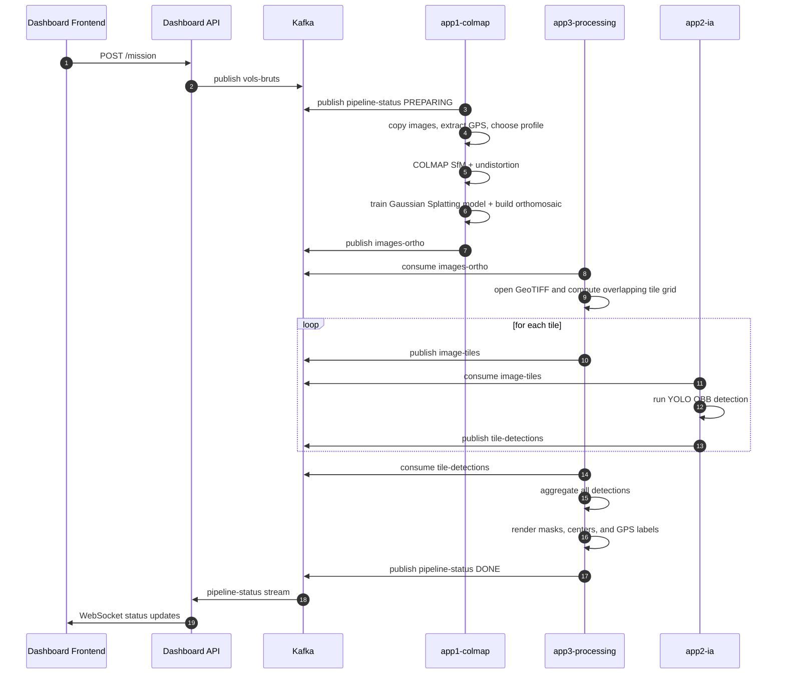
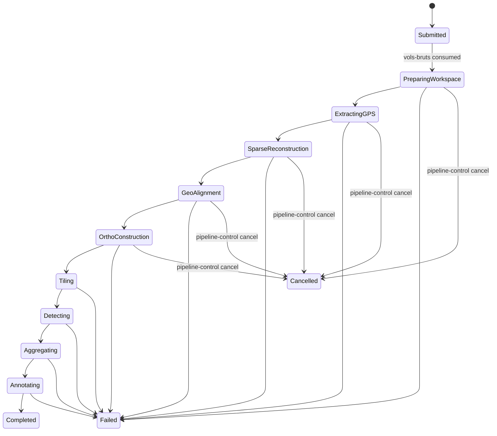
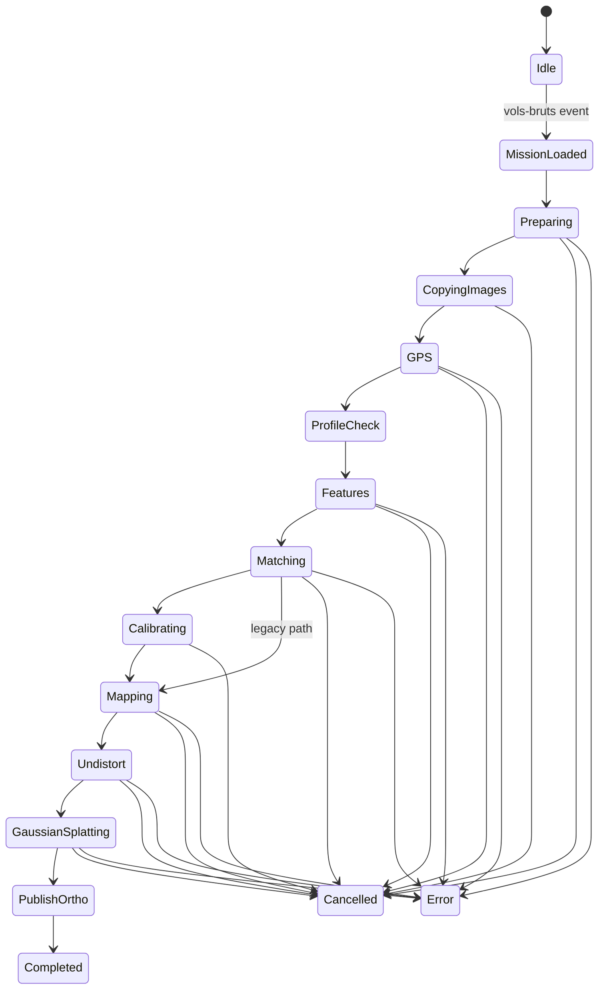
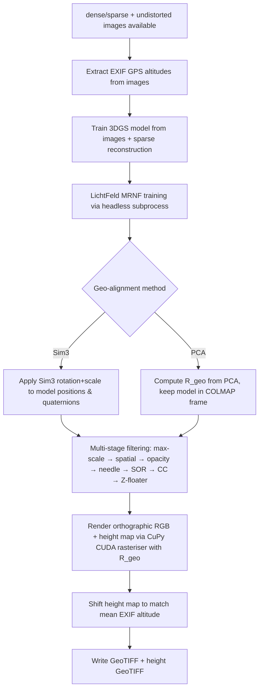
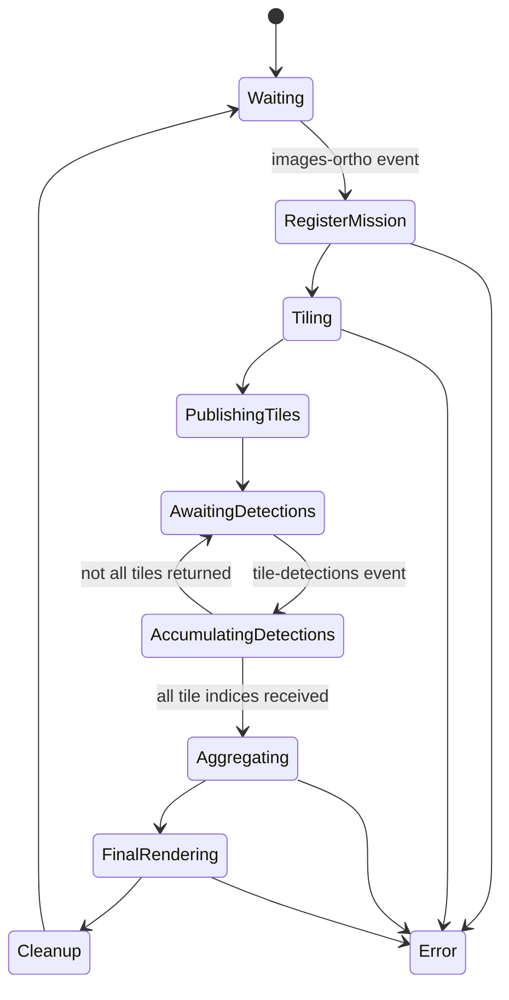
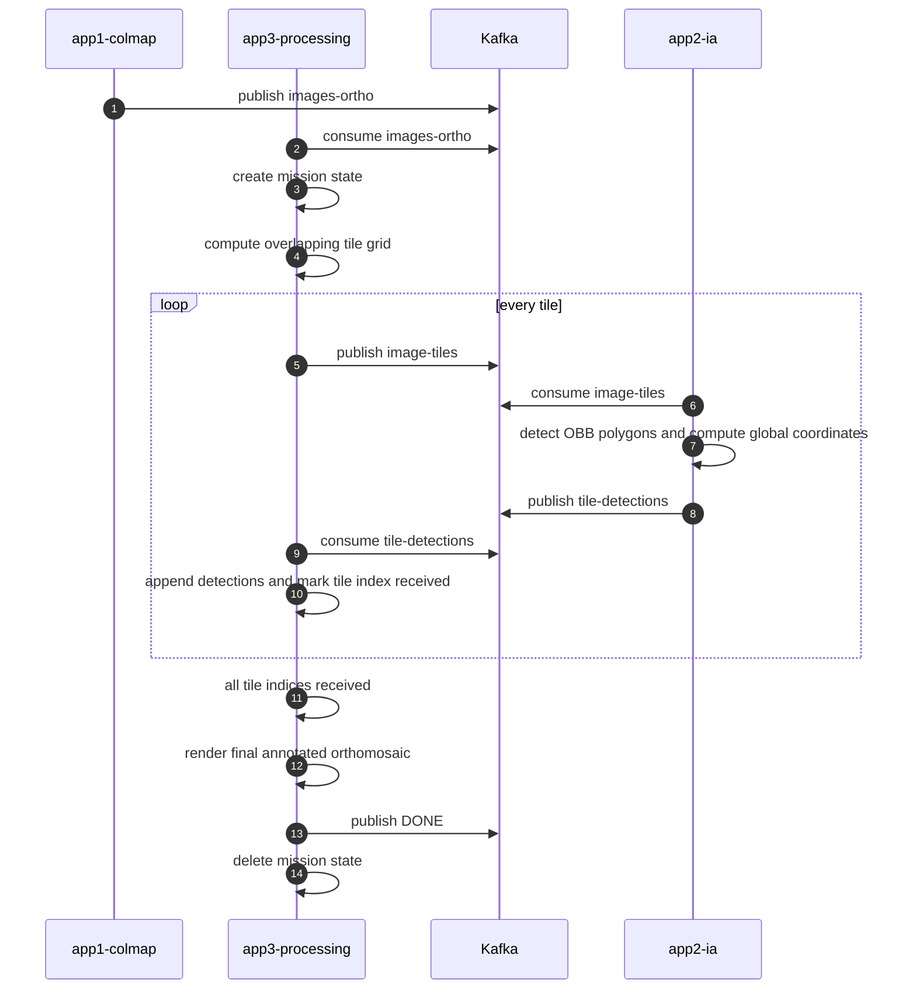

# DroneAI Pipeline Documentation

## Purpose

This document explains the runtime architecture, event flow, state machines, file layout, and algorithmic behavior of the DroneAI pipeline as it is implemented in this repository.

It is intentionally more detailed than the installation guide. The goal is to document how the system behaves once deployed, how missions move through Kafka and Kubernetes, and how the orthomosaic and final annotated outputs are produced.

For upstream COLMAP theory, command semantics, and reconstruction internals, refer to the official COLMAP documentation:

- https://colmap.github.io/
- https://github.com/colmap/colmap

This repository adds orchestration, event transport, mission state handling, geo-referencing, orthomosaic generation, tiling, oriented-object detection, aggregation, and dashboard control on top of COLMAP.

## System overview

The pipeline is a local event-driven photogrammetry and detection system composed of five services:

1. `app4-dashboard/frontend`
2. `app4-dashboard/api`
3. `app1-colmap`
4. `app3-processing`
5. `app2-ia`

The runtime data path is:

1. A mission is created from the dashboard.
2. The API publishes the mission to Kafka topic `vols-bruts`.
3. The COLMAP worker consumes the mission, reconstructs the scene, and writes `orthomosaic.tif`.
4. The COLMAP worker publishes an orthomosaic event to Kafka topic `images-ortho`.
5. The processing worker consumes the orthomosaic event, slices the image into overlapping tiles, and publishes one Kafka event per tile to `image-tiles`.
6. The IA worker consumes tiles, runs either YOLO OBB or SAM 3 prompt-based detection, and publishes detections to `tile-detections`.
7. The processing worker consumes all tile detections, merges overlap duplicates, reprojects them back into orthomosaic pixel coordinates, and writes the final annotated orthomosaic.
8. All workers emit progress events to `pipeline-status` and the dashboard API forwards them over WebSocket to the frontend.

The control path is:

1. The dashboard asks the API to cancel a mission.
2. The API publishes a control event to `pipeline-control`.
3. The COLMAP worker's dedicated control thread marks cancellation in shared state.
4. Long-running subprocess loops periodically check that state and abort the mission.

## Deployment topology

The deployed runtime is driven by two manifests:

- `kafka-local.yaml`: namespace, broker, services, deployments, volumes, ports, and resource requests
- `dashboard-api-rbac.yaml`: the dashboard API service account and pod-reader RBAC in namespace `kafka`

Main runtime objects:

- namespace: `kafka`
- Kafka broker service: `my-kafka.kafka.svc.cluster.local:9092`
- COLMAP worker deployment: `colmap-worker`
- IA worker deployment: `ia-worker`
- processing worker deployment: `processing-worker`
- dashboard API deployment: `dashboard-api`
- dashboard frontend deployment: `dashboard-frontend`

Operational notes:

- The host root `/` is mounted into the worker pods at `/host`.
- The logical workspace root used by the pipeline is `/mnt/j/workspace`.
- Inside containers, the same host files are accessed through `/host/mnt/j/workspace`.
- The COLMAP worker and IA worker both request one NVIDIA GPU.
- The IA worker reads `HF_TOKEN` from the Kubernetes secret `hf-token` for approved access to the gated Hugging Face `facebook/sam3` model distribution.
- The IA worker mounts a persistent Hugging Face cache at `/cache/huggingface`, backed by `/var/lib/drone-ai/huggingface-cache` on the host.
- The processing worker receives explicit overlap-deduplication env vars from `kafka-local.yaml`.
- Kafka is deployed in-cluster. There is no separate host Kafka service.
- The dashboard API deployment runs as service account `dashboard-api-sa`.
- `dashboard-api-sa` is granted `get`, `list`, and `watch` on pods in namespace `kafka` so the API can serve `/pods`.
- `build_and_deploy.sh` applies both manifests for a full stack rollout.
- The incremental deploy scripts also reapply the relevant manifest before restart so env, mounts, and RBAC changes are not skipped.

## Shared Python package

The repository contains a shared Python package under `shared/` that is imported by multiple services.

Current files:

- `shared/config.py`
- `shared/database.py`
- `shared/geo_alignment.py`
- `shared/pipeline_params.py`
- `shared/storage.py`
- `shared/validation.py`

Current responsibilities:

- define the Kafka broker and topic names used across services
- define the default workspace root (`/mnt/j/workspace` unless overridden by `WORKSPACE_DIR`)
- define the service completion order used by the dashboard API (`COLMAP`, `TILER`, `IA`)
- define the `modern` and `legacy` COLMAP parameter presets exposed to the dashboard
- define parameter metadata used by the frontend to render editable controls
- provide helper functions that merge mission overrides with the selected pipeline preset
- persist missions, logs, and detections through SQLAlchemy
- expose S3-compatible storage helpers used with MinIO
- validate mission identifiers and contained filesystem paths
- compute and serialize the Sim3 transform between raw and aligned COLMAP models

As implemented today:

- `app1-colmap` imports configuration, parameter, database, storage, validation,
  and geo-alignment helpers
- `app2-ia` imports shared topic names and S3 storage helpers
- `app3-processing` imports shared topic names, S3 storage, and database helpers
- `app4-dashboard/api` imports configuration, pipeline defaults, validation,
  database, and storage helpers

The worker-specific `app2-ia/detection_core.py` and
`app3-processing/processing_core.py` modules contain reusable detection,
tiling, deduplication, rendering, and GIS-export logic. The Kafka loops and the
infrastructure-free local runner call the same core functions.

## Services and responsibilities

### Dashboard frontend

The frontend is the operator interface. Its responsibilities are:

- browse datasets
- submit missions
- display streaming mission status
- allow cancellation
- guide the user toward the workspace path used by the deployed pipeline

The frontend does not perform any heavy computation. It depends on the API for mission submission and on the WebSocket stream for live status.

### Dashboard API

The API is the control plane for the pipeline.

Primary endpoints:

- `POST /mission`
- `POST /mission/cancel`
- `GET /browse`
- `GET /datasets`
- `GET /status/summary`
- `GET /pods`
- `GET /system/resources`
- `GET /mission/parameters`
- `POST /mission/estimate`
- `GET /`
- `WS /ws/status`

Primary responsibilities:

- validate and serialize mission requests
- publish mission events to `vols-bruts`
- publish cancellation commands to `pipeline-control`
- consume `pipeline-status`
- buffer recent raw status messages in memory
- persist mission state and logs in PostgreSQL
- compute an `overall_status` from the shared service order `COLMAP -> TILER -> IA`
- replay buffered history to newly connected WebSocket clients
- expose a summary view of known missions through `GET /status/summary`
- expose pod health and restart information through `GET /pods`
- fall back to a static pod list when Kubernetes service-account credentials are unavailable
- expose host memory totals from `/proc/meminfo` through `GET /system/resources`
- expose shared pipeline presets and parameter metadata through `GET /mission/parameters`
- estimate recommended maximum image size for an input directory through `POST /mission/estimate`

The bounded WebSocket replay buffer remains in memory, but mission state,
service progress, logs, original parameters, and resume metadata are persisted
in PostgreSQL. Alembic owns the database schema.

### COLMAP worker (`app1-colmap`)

The COLMAP worker is the photogrammetry and orthomosaic service.

Its responsibilities are:

- receive raw mission metadata from `vols-bruts`
- materialize the mission workspace under the mounted host filesystem
- extract GPS from EXIF and determine a projected UTM CRS
- select the photogrammetry profile: `modern` or `legacy`
- run COLMAP feature extraction, matching, mapping, and undistortion
- generate an orthomosaic using 3D Gaussian Splatting
- extract drone EXIF GPS altitude data and use it to shift the height map to real-world elevations
- publish the orthomosaic event to `images-ortho`
- publish detailed progress and log events to `pipeline-status`
- honor cancellation commands from `pipeline-control`

This is the most stateful and operationally complex service in the pipeline.

### Processing worker (`app3-processing`)

The processing worker combines two runtime roles:

1. orthomosaic tiler
2. detection aggregator and final-image renderer

It consumes two topics simultaneously:

- `images-ortho`
- `tile-detections`

In practice it does the following:

- open the produced orthomosaic GeoTIFF
- slice it into overlapping JPEG tiles
- publish tile jobs to `image-tiles`
- track per-mission state in memory
- collect detections from all returned tiles
- merge overlap duplicates before final rendering
- resolve GPS labels from either direct detection coordinates or orthomosaic CRS/affine metadata
- render masks, contours, center points, and GPS labels onto the orthomosaic
- save the final annotated GeoTIFF

This service owns the transition from one georeferenced orthomosaic to many detector tiles, then back to one annotated orthomosaic.

### IA worker (`app2-ia`)

The IA worker is a tile-level dual-backend detection service. It supports Ultralytics YOLO OBB and Meta SAM 3 prompt-based segmentation. For SAM 3, treat the upstream source repository and the gated Hugging Face model distribution as separate license/compliance items.

Its runtime responsibilities are:

- consume tile jobs from `image-tiles`
- load a local aerial OBB checkpoint, currently `yolo26l-obb.pt` by default, with UI-selectable YOLO11/YOLO26 `l`/`m`/`s`/`n` variants per mission
- lazily load the gated Hugging Face `facebook/sam3` model when the mission requests the SAM 3 backend and the supplied token has model access
- run the selected detector on each tile
- run prompt-based instance segmentation for SAM 3 tile jobs
- convert tile-local detections into orthomosaic-global pixel coordinates
- preserve each oriented detection polygon in the `segment` field expected by app3
- optionally transform projected coordinates into latitude and longitude
- publish per-tile detection results to `tile-detections`
- publish status and throughput updates to `pipeline-status`

## Kafka topics and event contracts

### `vols-bruts`

Produced by:

- dashboard API

Consumed by:

- COLMAP worker

Semantic meaning:

- mission submission event

Expected payload shape:

```json
{
  "vol_id": "mission_001",
  "input_dir": "/host/mnt/j/workspace/mission_001",
  "workspace_dir": "/mnt/j/workspace",
  "epsg": "EPSG:4326",
  "camera_model": "PINHOLE",
  "pipeline": "modern",
  "tile_size": 1024,
  "ai_confidence": 0.5,
  "ai_backend": "sam3",
  "sam_prompt": "car",
  "classes": ["car"]
}
```

Notes:

- `workspace_dir` is the base root, not necessarily the mission directory itself.
- The COLMAP worker normalizes it and appends `vol_id` when required.
- `pipeline` selects the parameter profile.

### `pipeline-control`

Produced by:

- dashboard API

Consumed by:

- COLMAP worker control thread

Semantic meaning:

- mission control command

Expected payload shape:

```json
{
  "vol_id": "mission_001",
  "command": "cancel"
}
```

Notes:

- Cancellation only interrupts the COLMAP worker directly.
- The rest of the pipeline reacts indirectly because the orthomosaic event is never published when the mission is cancelled early.

### `pipeline-status`

Produced by:

- COLMAP worker
- processing worker
- IA worker

Consumed by:

- dashboard API

Semantic meaning:

- live mission progress and logs

Canonical payload shape:

```json
{
  "vol_id": "mission_001",
  "step": "GAUSS",
  "progress": 75,
  "status": "processing",
  "service": "COLMAP",
  "log": "Training Gaussian Splatting model"
}
```

Important details:

- `service` can be `COLMAP`, `TILER`, or `IA`.
- `step` is service-defined and reused by the dashboard as the public progress vocabulary.
- The API stores only a bounded in-memory history of recent status messages.

### `images-ortho`

Produced by:

- COLMAP worker

Consumed by:

- processing worker

Semantic meaning:

- orthomosaic ready for tiling

Payload shape:

```json
{
  "vol_id": "mission_001",
  "ortho_s3_key": "missions/mission_001/orthomosaic.tif",
  "classes": ["car"],
  "ai_confidence": 0.3
}
```

Notes:

- `ortho_s3_key` points to the GeoTIFF uploaded by app1.
- The processing worker downloads it into its own temporary workspace.

### `image-tiles`

Produced by:

- processing worker

Consumed by:

- IA worker

Semantic meaning:

- tile job for detection

Payload shape:

```json
{
  "vol_id": "mission_001",
  "tile_index": 12,
  "tile_path": "/mnt/j/workspace/mission_001/tiles/mission_001/tile_12.jpg",
  "offset_x": 2048,
  "offset_y": 1024,
  "ai_backend": "sam3",
  "sam_prompt": "car",
  "classes": ["car"],
  "ai_confidence": 0.3,
  "total_tiles": 180,
  "ortho_transform": [c, a, b, f, d, e],
  "ortho_crs": "EPSG:32631"
}
```

Important details:

- `tile_path` is published without the `/host` prefix so downstream services can remap it as needed.
- the default tile output is mission-scoped under `tiles/<vol_id>/` to avoid cross-mission collisions.
- `offset_x` and `offset_y` anchor the tile within the full orthomosaic.
- `ai_backend` selects the detector backend in app2.
- `sam_prompt` carries the text concept for SAM 3 missions.
- `total_tiles` is set before publication to avoid a race where detections arrive before the aggregator knows the mission tile count.
- `ortho_transform` and `ortho_crs` are carried forward so the IA worker can compute geographic coordinates directly.

### `tile-detections`

Produced by:

- IA worker

Consumed by:

- processing worker

Semantic meaning:

- detection results for one tile

Payload shape:

```json
{
  "vol_id": "mission_001",
  "tile_index": 12,
  "detections": [
    {
      "vol_id": "mission_001",
      "global_pixel_x": 2121.4,
      "global_pixel_y": 1170.8,
      "geo_lon": 3.129123,
      "geo_lat": 42.481234,
      "confidence": 0.88,
      "class_id": 2,
      "segment": [[2110.0, 1162.0], [2132.0, 1164.0], [2140.0, 1182.0]]
    }
  ]
}
```

Important details:

- `global_pixel_x` and `global_pixel_y` are already offset back into orthomosaic coordinates by app2.
- `segment` points are also returned in global orthomosaic coordinates.
- `geo_lat` and `geo_lon` may be present directly, but app3 can recompute them from the orthomosaic transform if needed.

## Mission workspace layout

For a mission with `vol_id=mission_001`, the COLMAP worker typically uses:

```text
/host/mnt/j/workspace/mission_001/
  clean_images/
  database.db
  geo_data.txt
  geo_data.txt.crs
  sparse/
    0/
  sparse_geo/
  dense/
    sparse/
    images/
  alignment_transform.json
  gaussian_checkpoints/
    full/
      point_cloud_iter7000.ply
    final.ply
  orthomosaic.tif
  orthomosaic.height.tif
  orthomosaic_annotated.tif
  tiles/
    mission_001/
      tile_0.jpg
      tile_1.jpg
      ...
```

Important mission artifacts:

- `geo_data.txt`: image-to-projected-coordinate reference file used for alignment
- `geo_data.txt.crs`: persisted projected CRS selected during GPS extraction
- `database.db`: COLMAP feature and match database
- `alignment_transform.json`: Sim3 transform from COLMAP coordinates to projected coordinates
- `gaussian_checkpoints/`: 3D Gaussian Splatting model checkpoints and final merged PLY
- `gaussian_checkpoints/final.ply`: final filtered Gaussian model in COLMAP-local coordinates
- `orthomosaic.tif`: georeferenced RGB orthomosaic
- `orthomosaic.height.tif`: companion height map (DSM) GeoTIFF with real-world altitudes from drone EXIF
- `orthomosaic_annotated.tif`: final annotated orthomosaic produced by app3

## End-to-end event sequence



## Global mission state model

This is the operational state machine across services, not a single-process implementation detail.



## COLMAP worker detailed behavior

### Input normalization

When a mission is received, the worker:

1. reads the JSON mission event
2. stores `current_mission_id`
3. clears the mission cancellation flag
4. normalizes the workspace path so it points inside the container-visible `/host` mount
5. normalizes the input dataset path the same way

This matters because the API and frontend speak in host paths, but the worker process runs inside Kubernetes and accesses the mounted host filesystem through `/host`.

### Cancellation model

Cancellation is handled by a dedicated Kafka control consumer thread.

Mechanism:

- the control thread subscribes to `pipeline-control`
- on `{"command": "cancel", "vol_id": ...}` it sets `cancel_requested=True` only if the current worker mission matches
- long-running subprocess loops use non-blocking reads from child stdout and poll the shared flag frequently
- if cancellation is requested, the subprocess is killed and the worker raises `PipelineCancelledError`

This design avoids waiting indefinitely on silent subprocesses.

### Pipeline profiles

The worker supports two profile families.

#### Modern profile

Characteristics:

- feature type: `ALIKED_N16ROT`
- matcher type: `ALIKED_LIGHTGLUE`
- mapper command: `global_mapper`
- view graph calibration enabled
- orientation reading enabled
- Gaussian Splatting orthomosaic enabled (default)

This is the default and the main intended runtime path.

> **Note:** ALIKED and LightGlue require ONNX Runtime support compiled into COLMAP. The current `Dockerfile.base` does not include ONNX Runtime, so the modern profile will fail at feature extraction with `"ALIKED feature extraction requires ONNX support."` Until ONNX Runtime is added to the COLMAP build, use the legacy profile (`"pipeline": "legacy"`) which uses SIFT and works without ONNX.

#### Legacy profile

Characteristics:

- feature type: SIFT
- matcher type: SIFT-compatible spatial matching
- mapper command: `mapper`
- no view graph calibration
- Gaussian Splatting orthomosaic enabled (same as modern)

This exists for compatibility and fallback scenarios. The legacy profile changes SfM defaults, not the orthomosaic mode. It is currently the only working profile because the COLMAP build does not include ONNX Runtime (required by ALIKED/LightGlue in the modern profile).

### Smart resume and compatibility checks

Before reconstruction, the worker checks whether an existing `database.db` is compatible with the requested pipeline profile.

The logic infers descriptor type by inspecting descriptor blob size:

- 128 bytes per feature means SIFT
- 512 bytes per feature means ALIKED float descriptors

If the persisted database was created by the opposite profile, it is deleted so the worker can re-extract features cleanly.

This is important because reusing a database with the wrong feature representation would corrupt the remainder of the pipeline.

### Gaussian Splatting rerun readiness

The Gaussian Splatting path treats the workspace as reusable when:

- `dense/sparse/cameras.bin` exists
- `dense/sparse/images.bin` exists
- `dense/sparse/points3D.bin` exists
- undistorted images exist in `dense/images/`

This readiness is checked at startup and refreshed again after `image_undistorter`. If undistorted images and the sparse model are present, the worker jumps directly to the `GAUSS` stage.

### GPU index normalization

The worker runs COLMAP inside a container, so CUDA device indices are relative to the devices exposed through `CUDA_VISIBLE_DEVICES`, not the host's global GPU numbering.

Consequences:

- mission payloads that pass GPU index `-1` are normalized to `0`
- feature extraction, matching, and bundle-adjustment GPU indices also default to `0`

This avoids the common COLMAP abort `selected_gpu_index < num_cuda_devices ... Invalid CUDA GPU selected` when the host GPU is labeled differently from the container-local device list.

### GPS extraction and CRS persistence

GPS extraction does more than read latitude and longitude.

The worker:

1. scans source images for EXIF GPS tags
2. converts DMS coordinates to decimal degrees
3. determines the UTM zone dynamically from longitude and hemisphere from latitude
4. creates a transformer from `EPSG:4326` to the chosen UTM CRS
5. writes projected coordinates into `geo_data.txt`
6. stores the selected CRS in `geo_data.txt.crs`

Why the CRS sidecar exists:

- the orthomosaic must keep the real projected CRS across reruns
- re-inferring the CRS incorrectly would break the mapping from orthomosaic pixels back to real-world coordinates
- app3 and app2 depend on correct orthomosaic CRS metadata for GPS label reconstruction

If GPS extraction has already been done, the worker attempts to reuse the persisted CRS from `geo_data.txt.crs`.

## COLMAP worker state diagram



## Orthomosaic construction

This section describes the repository-specific orthomosaic logic in detail.

### Overview

The orthomosaic builder uses a **3D Gaussian Splatting (3DGS) pipeline**.

It trains a Gaussian radiance field directly from COLMAP undistorted images and the sparse reconstruction, renders an orthographic True Digital Orthophoto Map (TDOM), and writes a georeferenced GeoTIFF with a companion height map shifted to real-world drone EXIF altitudes.

Pipeline steps:

1. Load COLMAP sparse reconstruction and alignment transform from `dense/sparse/`
2. Extract drone EXIF GPS altitudes from undistorted images
3. Optionally partition the scene into an m×n grid (VastGaussian divide-and-conquer)
4. Train a 3DGS model per cell via LichtFeld-Studio headless CLI (MRNF strategy, C++/CUDA)
5. Merge cell models (retain only Gaussians in core, non-overlap region)
6. Geo-alignment:
   - **Sim3 path** (with `alignment_transform.json`): apply rotation+scale to model, keep translation as float64 for GeoTIFF origin
   - **PCA path** (no alignment transform): compute `R_geo` rotation matrix from camera PCA, pass it to the renderer — the model stays in the original COLMAP coordinate frame to preserve SH coefficient consistency
7. Configurable multi-stage post-processing filter chain: max-scale → spatial crop → opacity → needle removal → SOR → connected-component → Z-floater removal (each individually togglable)
8. Render orthographic RGB orthomosaic and height map via CuPy CUDA rasteriser (with `R_geo` for PCA path)
9. Shift height map to match mean drone EXIF GPS altitude
10. Write GeoTIFF with projected CRS

### Gaussian Splatting orthophoto pipeline

This is the primary and recommended orthomosaic path. It is implemented in `app1-colmap/gaussian_ortho/`.

#### Research foundations

The implementation draws from several key papers:

- **3D Gaussian Splatting** (Kerbl et al. 2023): core Gaussian scene representation with position, covariance (rotation quaternion + log-scale), opacity, and spherical harmonics colour coefficients
- **3DGS as MCMC** (Kheradmand et al. 2024): Markov Chain Monte Carlo densification strategy with bounded Gaussian count (`cap_max`), stochastic relocation instead of unbounded clone/split — used by LichtFeld MRNF internally
- **LichtFeld-Studio** (MRNF strategy): high-performance C++/CUDA training with multi-resolution neural features, progressive resolution scheduling, and built-in VRAM management
- **CuPy** with custom CUDA RawKernels: lightweight GPU-accelerated orthographic rasteriser for TDOM rendering
- **VastGaussian** (Lin et al. 2024): divide-and-conquer scene partitioning into overlapping grid cells with visibility-based camera assignment, independent per-cell training, and overlap-aware merging
- **Tortho-Gaussian** (Wang et al. 2024): Fully Anisotropic Gaussian Kernel (FAGK) with SH-based view-dependent opacity, and orthographic projection matrix formulation (Equation 9)

#### Key design decisions

**Training stays in COLMAP-local coordinates.** The Gaussian model is trained in compact float32 coordinates centred near zero. The Sim3 geo-alignment is applied only after training, and the translation component (~10⁶ m for UTM) is kept as float64 and folded into the GeoTIFF origin. This avoids catastrophic float32 precision loss (e.g. Y ≈ 4,702,500 → float32 ULP = 0.5 m = 25 px banding at GSD 0.02 m).

**PCA path keeps the model in COLMAP frame entirely.** When no Sim3 alignment is available, a PCA-based rotation `R_geo` is computed from camera positions and passed to the orthographic renderer instead of being applied to the model. This preserves consistency between SH coefficients, positions, and rotations — applying the rotation to positions and quaternions but not to SH coefficients causes a frame mismatch that produces blurry, washed-out colours when rendered from nadir.

**No dense stereo required.** The pipeline only needs the undistorted images and sparse model from `dense/sparse/` and `dense/images/`.

**LichtFeld-Studio handles training as a native C++/CUDA process.** The Python pipeline invokes LichtFeld-Studio in headless mode via subprocess, monitors progress by parsing its `indicators`-library progress bar from stdout, and imports the resulting PLY checkpoint. MRNF (Multi-Resolution Neural Features) is the recommended strategy — it handles progressive resolution scheduling, VRAM management, and densification internally.

**EXIF altitude integration.** Drone GPS altitude is extracted from image EXIF metadata and averaged. The rendered height map is shifted so its mean matches the mean EXIF altitude, giving real-world elevation values in the output CRS.

#### Step 1: Load COLMAP reconstruction

The pipeline reads cameras, images, and 3D points from `dense/sparse/` via pycolmap. If an `alignment_transform.json` exists, it is loaded for later geo-alignment. Camera poses are stored as camera-to-world rotation + world-space translation.

#### Step 1b: Extract EXIF altitudes

GPS altitude is extracted from each undistorted image in `dense/images/` using EXIF `GPSAltitude` and `GPSAltitudeRef` tags. The mean of all valid altitudes is computed and stored for later height-map correction. If no EXIF altitude data is found, the pipeline falls back to model-relative Z values.

#### Step 2: Scene partitioning (optional)

For very large scenes, the model can be split into an m×n grid of overlapping cells (VastGaussian-style). Each cell gets its own set of cameras (assigned by visibility overlap) and local point cloud. Cells are trained independently. For typical drone missions (≤2000 images), a single partition (1×1) is sufficient and is the default.

#### Step 3: Training

Each cell is trained using LichtFeld-Studio's headless CLI with the MRNF (Multi-Resolution Neural Features) strategy:

- **Binary**: LichtFeld-Studio C++/CUDA executable, invoked via subprocess with `--headless --train`
- **Strategy**: MRNF (recommended) — handles progressive resolution scheduling, densification, and VRAM management internally
- **Progress monitoring**: the Python pipeline reads LichtFeld’s stdout and parses progress from the `indicators` C++ library output (format: `{iter}/{total} | Loss: {loss} | Splats: {count}`). The `indicators` library uses `\r` carriage returns for in-place updates, so the reader splits on both `\r` and `\n`. LichtFeld’s MCP HTTP server is only available in GUI mode, not in the headless CLI mode used by the pipeline.
- **Output**: a standard 3DGS PLY checkpoint, loaded into the Python GaussianModel for post-processing and rendering
- **Cancellation**: the subprocess is killed via SIGTERM if a cancellation is requested through the dashboard

LichtFeld-Studio manages all training internals (loss, optimisers, resolution scheduling, memory). The Python pipeline is responsible only for:
1. Preparing per-cell COLMAP data directories
2. Launching and monitoring the subprocess
3. Loading the resulting PLY
4. All post-training steps (filtering, rendering, GeoTIFF output)

Default training parameters (configurable via dashboard UI):

| Parameter | Default | Description |
| --- | --- | --- |
| `gs_iterations` | 30000 | Training iterations |
| `gs_data_factor` | 1 | Image downscaling factor (LichtFeld schedules resolution internally) |
| `gs_cap_max` | 5,000,000 | Maximum Gaussian count |
| `gs_sh_degree` | 3 | Maximum spherical harmonics degree |

#### Step 4: Merge

If partitioning was used, cell models are merged by retaining only Gaussians whose centres fall within the core (non-overlap) region of each cell. This discards duplicates in overlapping borders.

#### Step 5: Geo-alignment

The geo-alignment step has two paths depending on whether an `alignment_transform.json` exists.

**Sim3 path** (alignment transform available):

The Sim3 transform is split:

- **Rotation + scale**: applied to model positions (`s * R @ xyz`), log-scales (`+= log(s)`), and rotation quaternions (pre-multiplied)
- **Translation**: stored as float64 `geo_origin`, used only for GeoTIFF coordinate computation

This split is critical for float32 precision preservation.

**PCA path** (no alignment transform):

The model stays in the original COLMAP coordinate frame. A rotation matrix `R_geo` is computed from camera PCA (smallest principal component of camera positions gives the vertical direction) and passed to the orthographic renderer as a parameter. The renderer uses `R_geo` to orient the virtual nadir camera without modifying the model.

This design preserves the consistency between Gaussian positions, rotation quaternions, and spherical harmonics coefficients. Previously, the PCA rotation was applied directly to positions and quaternions but NOT to SH coefficients, causing a frame mismatch: the SH evaluation computed view-dependent colours in the rotated frame while the coefficients were trained in COLMAP frame. This manifested as colour artefacts (blurry, washed-out rendering) when viewed from nadir. Keeping the model in COLMAP frame and passing `R_geo` to the renderer avoids this problem entirely.

#### Step 5b–5e: Post-processing filter chain

The trained model undergoes a configurable multi-stage filtering pipeline. Each filter can be individually enabled or disabled via the dashboard UI.

1. **Max-scale + spatial crop + opacity + needle removal** (5b, `gs_filter_enabled`): remove Gaussians with any activated scale larger than `gs_filter_max_scale` (default 1.0, 0 = disabled), remove Gaussians farther from all cameras than `gs_filter_dist` × scene diameter (default 1.0, 0 = disabled), remove nearly transparent Gaussians (opacity < `gs_filter_opacity`, default 0.005), and remove highly elongated "needle" Gaussians whose max/min scale ratio exceeds `gs_filter_needle` (default 0, disabled by default).

2. **Statistical Outlier Removal (SOR)** (5c, `gs_filter_sor`): build a k-NN tree (k=16) via `scipy.spatial.cKDTree`. Compute mean distance to 16 nearest neighbours. Remove Gaussians where mean distance > μ + σ × `gs_filter_sor_sigma` (default 4.0). Disabled by default — enable when floater clusters are visible.

3. **Connected-Component filter** (5d, `gs_filter_cc`): build a k-NN adjacency graph (k=16) as a sparse matrix. Compute connected components via `scipy.sparse.csgraph.connected_components`. Keep only the largest connected component, removing all disconnected floater clusters. Disabled by default.

4. **Z-Floater Removal** (5e, `gs_filter_z_floater`): IQR-based fence (5× IQR) on the vertical axis. For the PCA path, the vertical axis is determined by projecting Gaussian positions through `R_geo`'s Z row, not simply using the model's Z coordinate. Removes sky/background Gaussians that accumulate into haze in orthographic rendering. Disabled by default.

All filter parameters are exposed in the **Orthomosaic** parameter group in the dashboard (see tunables table below).

#### Step 6: Orthographic rendering

The cleaned model is rendered using a custom CuPy CUDA rasteriser:

- A virtual top-down camera is positioned above the scene, looking straight down
- SH degree is capped at 1 for orthographic rendering (all ortho rays are parallel → higher SH bands produce spatially-uniform offset, not banding)
- For large outputs, rendering is chunked into 4096×4096-pixel tiles and stitched
- Both RGB (uint8) and height (float32) maps are produced

The height map converts depth-in-camera to world Z: `height = z_top - depth`.

#### Step 7: Height map altitude correction

If EXIF altitudes were found in step 1b, the mean height map value is shifted to match the mean drone EXIF altitude:

```
z_offset = mean_exif_altitude - mean(height_map)
height_map = height_map + z_offset
```

This gives real-world elevation values in the output CRS. If no EXIF altitude data was found, the raw model Z values are kept.

#### Step 8: GeoTIFF writing

The output is written as two GeoTIFF files:

1. **RGB orthomosaic** (`orthomosaic.tif`): 3-band uint8, LZW compressed, with projected CRS and affine transform from `from_origin(geo_x_min, geo_y_max, resolution, resolution)`
2. **Height map** (`orthomosaic.height.tif`): 1-band float32, LZW compressed, same CRS and affine transform

The `geo_x_min` and `geo_y_max` are computed by adding the float64 `geo_origin` translation to the local-coordinate extent bounds. This preserves sub-centimetre positional accuracy.

### Orthomosaic construction flow



### Gaussian Splatting ortho rerun readiness

App1 does not treat the dense workspace as reusable unless:

- `dense/sparse/cameras.bin`, `images.bin`, and `points3D.bin` all exist
- `dense/images/` directory exists with undistorted images

### GS pipeline tunables exposed in the dashboard UI

All GS parameters are exposed in the **Orthomosaic** parameter group in the dashboard. The frontend renders these dynamically from `PARAMETER_METADATA` in `shared/pipeline_params.py`:

| UI Label | Key | Type | Default | Range |
| --- | --- | --- | --- | --- |
| Ortho Resolution (m/px) | `ortho_mesh_resolution` | float | 0.02 | 0.005–1.0 |
| GS Training Iterations | `gs_iterations` | int | 30000 | 1000–100000 |
| GS Training Image Scale | `gs_data_factor` | select | 1 | 1/2/4/8 |
| GS Max Gaussians | `gs_cap_max` | int | 5000000 | 500000–20000000 |
| GS Spherical Harmonics Degree | `gs_sh_degree` | select | 3 | 1/2/3 |
| Enable Post-training Filters | `gs_filter_enabled` | bool | true | — |
| Max Scale Filter | `gs_filter_max_scale` | float | 1.0 | 0–100 |
| Distance Filter Multiplier | `gs_filter_dist` | float | 1.0 | 0–10 |
| Opacity Threshold | `gs_filter_opacity` | float | 0.005 | 0–1.0 |
| SOR Filter | `gs_filter_sor` | bool | false | — |
| Connected-Component Filter | `gs_filter_cc` | bool | false | — |
| Z-Floater Removal | `gs_filter_z_floater` | bool | false | — |
| Needle Removal Ratio | `gs_filter_needle` | float | 0.0 | 0–500 |
| SOR Sigma Threshold | `gs_filter_sor_sigma` | float | 4.0 | 1.0–10.0 |

### Scalability

Memory and timing profiling for the GS pipeline with LichtFeld MRNF training (RTX 3090 24 GB):

| Images | Gaussians (cap_max) | data_factor | Iterations | Training VRAM | Training time | Output size | Notes |
| --- | --- | --- | --- | --- | --- | --- | --- |
| 113 | 3M | 1 | 15000 | ~11 GB | ~650 s | 7187×6613 px | vol_banyuls, validated end-to-end |
| 1140 | 5M | 1 | 30000 | ~11 GB | ~4060 s | 22487×19491 px | vol_sauzet, validated end-to-end on RTX 3090 |

LichtFeld-Studio manages VRAM internally. Training VRAM is roughly proportional to `cap_max` and largely independent of image count (images are loaded one-at-a-time by the C++ backend).

### Gaussian Splatting package structure

The GS pipeline is implemented as a Python package at `app1-colmap/gaussian_ortho/`:

| Module | Purpose |
| --- | --- |
| `generate_gaussian_orthophoto.py` | Main entry point, pipeline orchestration, GeoTIFF output |
| `lichtfeld_trainer.py` | LichtFeld-Studio headless subprocess wrapper, stdout progress parsing, PLY export |
| `model_filtering.py` | Multi-stage spatial filtering: max-scale, distance crop, opacity, needle, SOR, connected-component, Z-floater |
| `pca_alignment.py` | PCA-based geo-alignment: compute R_geo rotation matrix from camera positions |
| `gaussian_model.py` | Gaussian model class with FAGK opacity SH, PLY I/O |
| `cuda_rasterizer.py` | CuPy CUDA rasteriser for orthographic Gaussian splatting |
| `ortho_renderer.py` | Orthographic camera setup, auto-adaptive chunked rendering (chunk_size based on available VRAM), height map extraction |
| `colmap_loader.py` | COLMAP binary/pycolmap loader, Sim3 transform utilities |
| `scene_info.py` | Scene metadata (cameras, point cloud, bounds, radius) |
| `partition.py` | VastGaussian-style m×n grid partitioning with overlap |
| `merge.py` | Overlap-aware model merging (keep core-region Gaussians only) |
| `geo_writer.py` | GeoTIFF writer for RGB + height map, with embedded sRGB ICC profile |
| `exif_altitude.py` | EXIF GPS altitude extraction from drone images |

### Orthomosaic coordinate transform diagram

This diagram shows the exact coordinate-space transitions used by the Gaussian Splatting orthomosaic builder and later reused by app2 and app3.

```mermaid
flowchart LR
  A[Image EXIF GPS<br/>lat lon alt] --> B[GPS extraction]
  B --> C[Projected control points<br/>geo_data.txt in UTM CRS]

  D[Sparse local COLMAP reconstruction] --> E[model_aligner]
  C --> E
  E --> F[Sparse geo reconstruction]

  D --> G[Shared image projection centers]
  F --> G
  G --> H{Alignment method}
  H -->|Sim3| I1[Estimate Sim3<br/>R scale t]
  H -->|PCA| I2[PCA on sparse points<br/>→ R_geo rotation only]
  I1 --> I[alignment_transform.json]
  I2 --> I

  J[Trained 3D Gaussians<br/>in local COLMAP coordinates] --> K{Alignment method}
  I --> K
  K -->|Sim3| L1[Apply R·s to means + quats<br/>keep t as float64 origin]
  K -->|PCA| L2[Keep model unrotated<br/>pass R_geo to renderer]
  L1 --> M
  L2 --> M

  M[Ortho camera over AABB<br/>min_x max_x min_y max_y] --> N[CuPy CUDA rasterise ortho tiles<br/>RGB + depth, viewmat includes R_geo]
  N --> O[Assemble full raster<br/>pixel grid at chosen resolution]

  O --> P1[Shift height map<br/>+ float64 t + EXIF altitude]
  P1 --> P2[GeoTIFF affine transform<br/>from_origin min_x max_y res]
  P2 --> P[orthomosaic.tif + orthomosaic.height.tif<br/>with projected CRS]

  P --> Q[app2/app3 use affine + CRS]
  Q --> R[projected coordinates from global pixels]
  R --> S[EPSG:4326 lat lon labels]
```



Read it in this order:

1. GPS extraction produces projected control points in the chosen UTM CRS.
2. `model_aligner` creates a geo-referenced sparse reconstruction.
3. Shared camera centers between local and geo sparse models estimate a Sim3 or PCA transform.
4. **Sim3 path**: R·s is applied to Gaussian means and covariance axes in float32; the translation t is kept as a float64 GeoTIFF origin to avoid precision loss. **PCA path**: the model stays in COLMAP frame (preserving SH coefficient consistency); `R_geo` is passed to the renderer which embeds it in the view matrix.
5. An orthographic camera is set over the axis-aligned bounding box and the CuPy CUDA rasteriser renders tiled RGB + depth.
6. The height map is shifted by the float64 translation z-component plus mean EXIF GPS altitude.
7. The final GeoTIFF affine transform and CRS let downstream services convert orthomosaic pixels back into latitude and longitude.

## Processing worker detailed behavior

The processing worker is the most important post-COLMAP service, so this section is deliberately precise.

### Dual-topic design

The service subscribes to both:

- `images-ortho`
- `tile-detections`

This allows one process to own both halves of the post-processing lifecycle:

1. initial orthomosaic slicing
2. final detection aggregation and annotation

The in-memory mission registry coordinates tiling completion and final
rendering inside one processing-worker lifetime. Individual detections and
tile counts are also persisted in PostgreSQL, but automatic reconstruction of
an interrupted registry after a processing-worker restart remains future
hardening work.

### Per-mission state structure

When an orthomosaic arrives, the worker stores a mission record like:

```json
{
  "ortho_path": ".../orthomosaic.tif",
  "transform": [c, a, b, f, d, e],
  "crs": "EPSG:32631",
  "tiles_count": 0,
  "detections": [],
  "received_tiles": [],
  "total_tiles": 180
}
```

Operationally, that state contains:

- the source orthomosaic path
- the orthomosaic affine transform serialized for later use
- the CRS string
- the list of accumulated detections
- the set of tile indices already received
- the expected total number of tiles

The mission state is deleted once the final annotated image is produced.

### Tile generation algorithm

The tiler uses overlapping windows, not a simple butt-jointed grid.

Key helper:

- `build_tile_starts(full_size, tile_size, overlap)`

Behavior:

- when the image is smaller than one tile, start at `0`
- otherwise, advance with stride `tile_size - overlap`
- always append the final start position so the last tile reaches the image boundary exactly

Implications:

- the rightmost and bottommost image regions are always covered
- tile coverage is stable even when image dimensions are not multiples of tile size
- overlap mitigates border truncation for detectors

### Path normalization and tile location

When the processing worker receives an orthomosaic path, it rewrites it to `/host/...` if needed so the container can access the host file.

Tile files are then written into either:

- a configured `TILES_BASE_DIR`, or
- a mission-scoped `tiles/<vol_id>/` subdirectory next to the orthomosaic

Before new tiles are written, stale `tile_*.jpg` files are removed only from that mission directory.

### GeoTIFF metadata capture

When slicing begins, app3 opens the orthomosaic with Rasterio and records:

- image width
- image height
- the affine transform in GDAL tuple order
- the CRS string

This metadata is stored in mission state and copied into each tile job so app2 can geolocate detections without reopening the full orthomosaic.

### Tiling output format

Tiles are written as JPEG with simple band normalization:

- if the orthomosaic has more than 3 bands, only the first 3 are kept
- if the orthomosaic has 1 band, it is replicated into 3 bands for JPEG compatibility

Each tile preserves its own local Rasterio window transform, but the tile event also carries the full orthomosaic transform because app2 computes global projected coordinates using full-image pixel coordinates.

### Race-condition prevention

Before producing any tile messages, app3 stores `total_tiles` in mission state.

This avoids a race where detections come back before the aggregator knows how many tiles belong to the mission.


### Processing worker state diagram



### Detection aggregation model

When a `tile-detections` message arrives:

1. app3 finds the corresponding mission state
2. appends the message detections into the mission-level `detections` list
3. records the returned `tile_index` in the `received_tiles` set
4. compares `len(received_tiles)` against `total_tiles`
5. if all tiles are present, it triggers final rendering

Before final rendering, app3 deduplicates overlapping detections from adjacent tiles. The current merge rule sorts by polygon area first, then merges a smaller candidate when any of the following is true:

- the candidate polygon centroid falls inside a larger kept polygon
- any candidate polygon vertex falls inside a larger kept polygon
- the detections are still near each other and their bounding boxes overlap above the configured IoU threshold

The processing deployment currently sets:

- `UNTILER_DEDUPE_CENTER_THRESHOLD=40`
- `UNTILER_DEDUPE_IOU_THRESHOLD=0.05`

Completion is keyed on returned tile identities, not on detection counts. An empty detection result still counts as a completed tile because the tile index is recorded either way.

### GPS resolution logic

The processing worker supports two ways to produce GPS labels.

Preferred path:

- use `geo_lat` and `geo_lon` already provided by app2

Fallback path:

1. read the global pixel center from the detection
2. apply the orthomosaic affine transform to convert the pixel center into projected coordinates
3. reproject from the orthomosaic CRS to `EPSG:4326`

This fallback is what allows labels to remain correct even when app2 does not populate valid geographic coordinates.

The correctness of this fallback depends completely on the orthomosaic carrying the right projected CRS metadata.

### Final orthomosaic annotation

The final rendering path is straightforward:

1. opens the orthomosaic GeoTIFF
2. converts the first three bands to OpenCV RGB layout
3. iterates over deduplicated detections
4. draws the polygon fill, contour, center point, and GPS label
5. writes the result to `*_annotated.tif`

Rendering characteristics:

- masks are rendered in RGB red
- center points are rendered in green
- text is cyan with a dark outline for readability
- labels prefer positions that stay within image bounds

### Processing event sequence



## IA worker detailed behavior

Although the user-facing focus of this document is on app3 and orthomosaic construction, app2 is part of that chain and its behavior affects both.

### Model loading

At startup, app2 resolves a local aerial OBB checkpoint from `AERIAL_MODEL_DIR`.

Default runtime behavior:

- variant `best` resolves to `yolo26l-obb.pt`
- mission requests can override the default with `ai_model_variant` such as `yolo26m`, `yolo11s`, or `yolo11n`
- the worker downloads the checkpoint from `ultralytics/assets` if it is not already present
- `AERIAL_MODEL_FILE` can override the checkpoint path entirely

It chooses device:

- `cuda:0` when available
- otherwise CPU

### Inference sizing

The runtime IA worker uses a fixed OBB inference image size controlled by `AERIAL_MODEL_IMGSZ`.

Default:

- `1024`

Purpose:

- keep runtime latency predictable across tiles
- match the aerial detector checkpoint expectation
- simplify GPU memory planning in the deployed pod

### Two-pass detection strategy

The detector uses an ordered attempt list on the same raw prediction result.

Primary pass:

- requested confidence
- fixed OBB image size

Fallback pass:

- lower confidence threshold, floored at `0.10`
- same image size

The worker keeps the best result seen so far and stops early if a pass yields detections.

### Coordinate lifting

For each detection, app2 converts tile-local coordinates to orthomosaic-global coordinates by adding:

- `offset_x`
- `offset_y`

This is done for:

- detection center
- every vertex of the oriented polygon carried in `segment`

### Geographic coordinate lifting

If the tile event carries an orthomosaic transform and CRS, app2 also computes:

1. projected coordinates from global pixels using the affine tuple
2. geographic longitude and latitude by transforming to `EPSG:4326`

These optional values reduce work for app3, but app3 can recompute them if necessary.

## Failure modes and fallbacks

### Input directory missing

If the mission input path does not exist inside the container-visible host mount, app1 emits an `ERROR` status and the mission stops before reconstruction.

### Incompatible reconstruction database

If an existing `database.db` belongs to the wrong feature profile, app1 deletes it and rebuilds the feature database.

### Insufficient alignment data

If too few common image centers exist between sparse-local and sparse-geo reconstructions, app1 cannot estimate the Sim3 transform robustly and falls back to the PCA alignment path.

### Gaussian Splatting failure

If the Gaussian Splatting training or rendering raises an exception, app1 emits an error status and the mission stops.

### Processing worker missing orthomosaic

If app3 cannot open the orthomosaic file, it emits an error status and stops processing that mission.

### Partial tile-return problem

The processing worker waits for all tile indices. If the IA worker never returns one or more tiles, final aggregation never fires. There is currently no timeout-based reconciliation or dead-letter handling in app3.

## Important invariants

These are the assumptions that must remain true for the current implementation to behave correctly.

1. The host dataset must exist under `/mnt/j/workspace`.
2. Worker containers must see the host filesystem through `/host`.
3. The orthomosaic must keep its projected CRS metadata intact.
4. The Sim3 path applies rotation and scale to Gaussian means/axes in float32 while the translation is kept as a float64 GeoTIFF origin. The PCA path keeps the model in COLMAP frame and passes `R_geo` to the renderer to preserve SH coefficient consistency.
5. Reruns require the sparse SfM model (`sparse/{cameras,images,points3D}.bin`) and optionally the alignment transform (PCA fallback is used if absent).
6. Inside worker containers, COLMAP GPU indices are relative to visible devices, so a single visible GPU always means index `0`.
7. Tile events must carry the original orthomosaic transform and CRS.
8. App3 must set `total_tiles` before tile events begin returning.
9. `tile_index` uniqueness is the aggregator's completion key.
10. The final annotated GeoTIFF is written by app3, not app1.

## Operator-oriented stage map

These are the major progress stages you will typically see on the dashboard.

From app1:

- `PREPARING`
- `COPYING_IMAGES`
- `GPS_EXTRACTION`
- `FEATURES`
- `MATCHING`
- `CALIBRATING`
- `MAPPING`
- `UNDISTORT`
- `ALIGNING`
- `GAUSS` (3D Gaussian Splatting training and ortho rendering)
- `ORTHO`
- `DONE`
- `ERROR`
- `CANCELLED`

From app3:

- `TILING_START`
- `TILING_IN_PROGRESS`
- `TILING_DONE`
- `AGGREGATING_DETECTIONS`
- `FINAL_IMAGE`
- `DONE`
- `ERROR`

From app2:

- `DETECTING`
- `DONE` through the final success message path
- `ERROR`

## Recommended reading order for developers

If you are changing the pipeline, read the implementation in this order:

1. `app4-dashboard/api/main.py`
2. `app1-colmap/main.py`
3. `app3-processing/main.py`
4. `app2-ia/main.py`
5. `kafka-local.yaml`

Reason:

- the API defines the mission contract
- app1 defines the workspace and orthomosaic contract
- app3 defines the tile and final annotated-image contract
- app2 fills the detection contract
- the manifest defines the runtime filesystem and broker topology those contracts rely on

## Scope boundaries

This document is intentionally precise about repository-specific behavior and deliberately does not duplicate the entire upstream COLMAP manual.

Use the upstream COLMAP docs for:

- camera model theory
- feature extractor details
- mapper internals

Use this document for:

- this repository's service boundaries
- mission and topic contracts
- file layout
- geo-alignment strategy
- orthomosaic generation logic
- processing worker behavior
- failure handling and invariants
