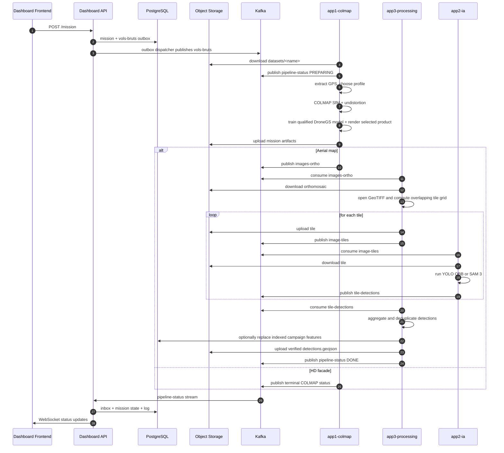
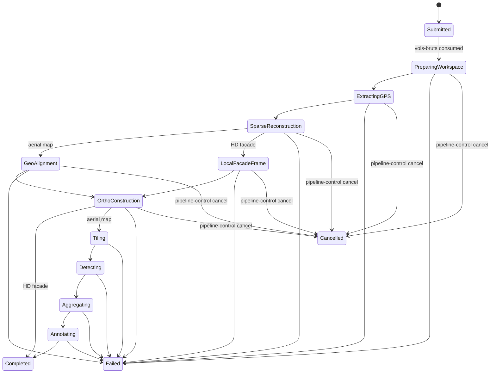
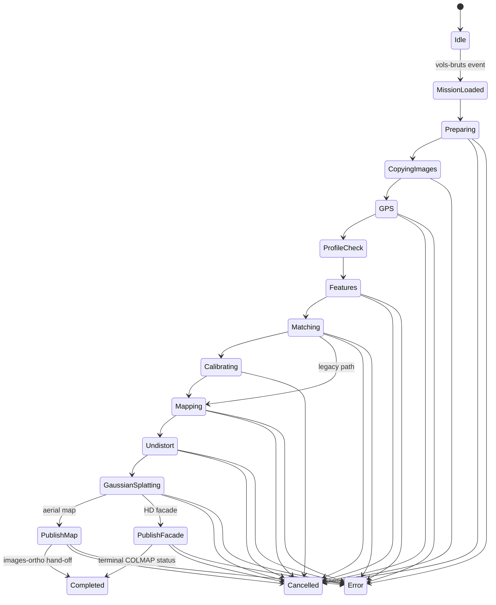
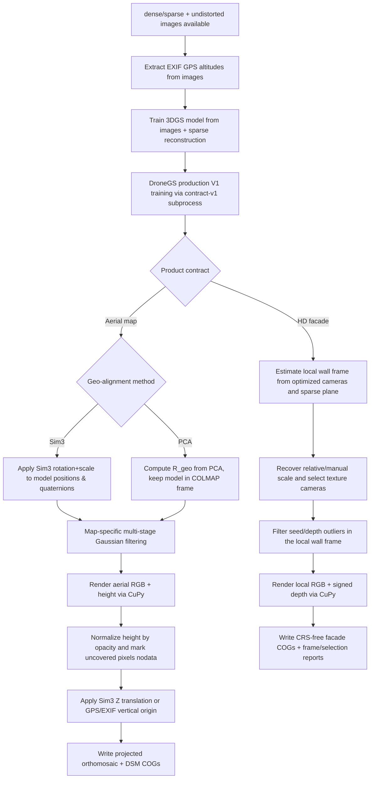
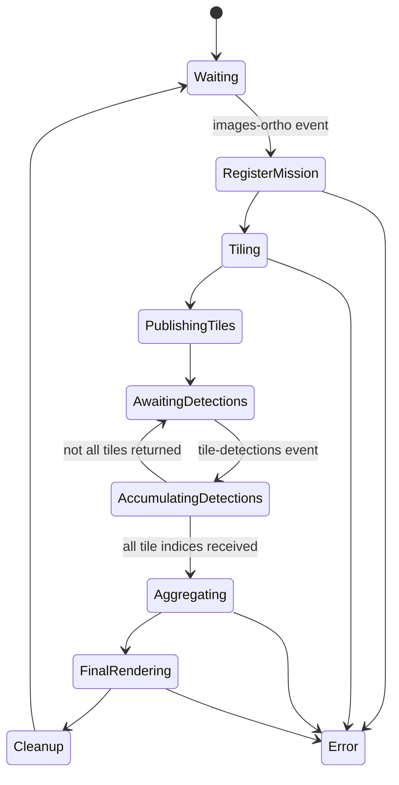
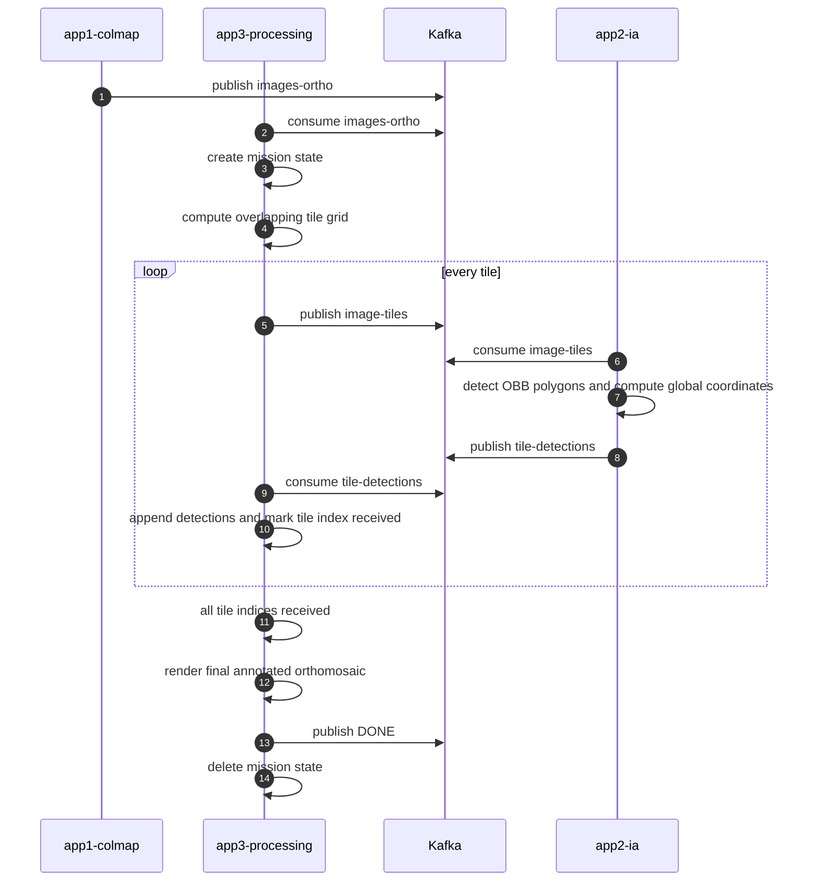

# DroneAI Pipeline Documentation

## Purpose

This document explains the runtime architecture, event flow, state machines, file layout, and algorithmic behavior of the DroneAI pipeline as it is implemented in this repository.

It is intentionally more detailed than the installation guide. The goal is to document how the system behaves once deployed, how missions move through Kafka and Kubernetes, and how the orthomosaic and final annotated outputs are produced.

For upstream COLMAP theory, command semantics, and reconstruction internals, refer to the official COLMAP documentation:

- https://colmap.github.io/
- https://github.com/colmap/colmap

This repository adds orchestration, event transport, mission state handling, geo-referencing, orthomosaic generation, tiling, oriented-object detection, aggregation, and dashboard control on top of COLMAP.

HD facade orthophotos are a separate local-coordinate product. They do
not use a projected CRS, absolute RTK/GCP alignment, terrain height semantics,
Web Mercator tiling or the aerial detection stages. The image-selection,
optimized-camera frame, relative/manual scale and artifact contract are
detailed in [`docs/FACADE_ORTHOPHOTO.md`](docs/FACADE_ORTHOPHOTO.md). The first
Mavic 3E field validation is recorded in
[`docs/benchmarks/cahors-facade-2026-08-01.md`](docs/benchmarks/cahors-facade-2026-08-01.md).

## System overview

The pipeline is a local event-driven photogrammetry and detection system composed of five services:

1. `app4-dashboard/frontend`
2. `app4-dashboard/api`
3. `app1-colmap`
4. `app3-processing`
5. `app2-ia`

The runtime data path is:

1. Images are uploaded below an S3 prefix such as `datasets/site-a/`.
2. The API persists the mission and its `vols-bruts` outbox row in one
   transaction.
3. The API outbox dispatcher publishes the mission to Kafka.
4. The COLMAP worker downloads the selected dataset into `/work/<drive>/<id>`,
   reconstructs the scene and uploads durable artifacts below
   `missions/<id>/`. An aerial-map mission publishes `images-ortho`; a facade
   mission ends successfully here with `details.terminal=true` after publishing
   its local RGB/depth products and audit reports.
5. For aerial maps only, the processing worker downloads the orthomosaic,
   creates overlapping tiles, uploads them to S3 and publishes `image-tiles`.
6. The IA worker downloads each tile, runs YOLO OBB or SAM 3, and publishes
   `tile-detections`.
7. The processing worker merges overlap duplicates, publishes verified
   GeoJSON and optionally persists indexed PostGIS features.
8. Workers emit `pipeline-status`; the API applies each unique event to
   PostgreSQL through its inbox transaction and forwards it over WebSocket.

The control path is:

1. The dashboard asks the API to cancel a mission.
2. The API durably enqueues a `pipeline-control` outbox event.
3. The dispatcher publishes it to Kafka.
4. Dedicated control consumers in the COLMAP, IA and processing workers mark
   the mission as cancelled in process-local state.
5. Long-running loops check that state at their available cancellation points.

## Deployment topology

`deploy.sh` exposes the complete system through two orchestrators:

- `local` uses `compose.local.yaml`;
- `distributed` uses the Helm chart under `charts/drone-ai/`.

Both topologies run the same five application images, Kafka, MinIO,
PostgreSQL/PostGIS and the same dashboard API contract.

Main runtime objects:

- namespace: `drone-ai` by default (`global.namespace`)
- Kafka broker service: `my-kafka.drone-ai.svc.cluster.local:9092`
- MinIO services: `minio`, `minio-api`, and `minio-console`
- PostgreSQL service: `postgres`
- COLMAP worker deployment: `colmap-worker`
- IA worker deployment: `ia-worker`
- processing worker deployment: `processing-worker`
- dashboard API deployment: `dashboard-api`
- dashboard frontend deployment: `dashboard-frontend`

Operational notes:

- Mission inputs and durable outputs live in S3-compatible object storage.
- The COLMAP worker uses `/work/system` as an `emptyDir` and optionally mounts
  configured host work drives below `/work/<name>`.
- The selected mission work drive is temporary scratch space. App1 uploads
  durable artifacts to S3 and cleans the local mission directory.
- The COLMAP worker and IA worker both request one NVIDIA GPU.
- The IA worker reads `HF_TOKEN` from the Kubernetes secret `hf-token` for approved access to the gated Hugging Face `facebook/sam3` model distribution.
- The IA worker mounts a persistent model cache at `/cache/huggingface`.
- The processing worker receives explicit overlap-deduplication values from the
  Helm template.
- Kafka is deployed in-cluster. There is no separate host Kafka service.
- The dashboard API deployment runs as service account `dashboard-api-sa`.
- `dashboard-api-sa` is granted `get`, `list`, and `watch` on pods so the API
  can serve `/pods`.
- `deploy.sh distributed` runs `helm upgrade --install`; the legacy
  `build_and_deploy.sh` and `setup.sh` entry points delegate to it.
- The chart's revisioned migration job executes `alembic upgrade head`;
  database-dependent pods wait for the head revision in an init container and
  CI verifies an upgrade/downgrade/re-upgrade round-trip.

## Shared Python package

The repository contains a shared Python package under `shared/` that is imported by multiple services.

Key responsibilities are grouped rather than duplicated in workers:

- configuration, storage and persistence: `config.py`, `storage.py`,
  `database.py`;
- reliable events: `event_contracts.py`, `inbox_outbox.py`,
  `kafka_reliability.py`, `worker_messaging.py`;
- product configuration: `pipeline_params.py`, `dronegs_profile.py`,
  `facade_process.py`, `validation.py`;
- geometry and controls: `geo_alignment.py`, `projected_crs.py`,
  `rtk_refinement.py`, `gcp_control.py`, `facade_selection.py`;
- published assets and provenance: `geospatial_assets.py`,
  `product_manifest.py`.

Current responsibilities:

- define the Kafka broker and topic names used across services
- define the default COLMAP worker workspace used when a mission does not
  select an explicitly mounted work drive
- define the map service completion order (`COLMAP`, `TILER`, `IA`); a COLMAP
  status carrying `details.terminal=true` completes a facade mission
- define the `modern` and `legacy` COLMAP parameter presets exposed to the dashboard
- define parameter metadata used by the frontend to render editable controls
- provide helper functions that merge mission overrides with the selected pipeline preset
- persist missions, logs, and detections through SQLAlchemy
- expose S3-compatible storage helpers used with MinIO
- reconcile prefix deletions after every S3 `DeleteObjects` call and retry
  per-object failures up to `S3_DELETE_MAX_ATTEMPTS` (default: `3`), raising
  an error instead of reporting a partial deletion as successful
- validate mission identifiers and contained filesystem paths
- compute and serialize the Sim3 transform between raw and aligned COLMAP models
- validate and enrich versioned Kafka events
- provide broker-independent retry, dead-letter, and manual-commit primitives
- provide transactional inbox claims, durable outbox enqueueing and the API
  dispatcher
- provide one shared progress publisher and control-consumer loop for workers
- normalize the selected IA backend through one shared policy

As implemented today:

- `app1-colmap` imports configuration, parameter, database, storage, validation,
  event, reliability, messaging, and geo-alignment helpers
- `app2-ia` imports shared topic, event, messaging, reliability, validation,
  and S3 storage helpers
- `app3-processing` imports shared topic, event, messaging, reliability, S3
  storage, and database helpers
- `app4-dashboard/api` imports configuration, pipeline defaults, validation,
  database, storage, reliability, event, and inbox/outbox helpers

DJI metadata, projected-CRS selection, RTK pose-prior injection, the immutable
DroneGS production profile and the qualified facade process are centralized in
`shared/dji_metadata.py`, `shared/projected_crs.py`,
`shared/rtk_refinement.py`, `shared/dronegs_profile.py` and
`shared/facade_process.py` respectively.

The worker-specific `app2-ia/detection_core.py` and
`app3-processing/processing_core.py` modules contain reusable detection,
tiling, deduplication, rendering, and GIS-export logic. The Kafka loops and the
infrastructure-free local runner call the same core functions.

Worker modules are safe to import: their Kafka poll loops and control threads
start only from `worker_main()` under a `__main__` guard.

## Services and responsibilities

### Dashboard frontend

The frontend is the operator interface. Its responsibilities are:

- browse datasets
- establish an HttpOnly API session from an operator-provided credential
- submit missions
- display streaming mission status
- allow cancellation
- select an uploaded S3 dataset prefix and an advertised COLMAP work drive

The frontend does not perform any heavy computation. It depends on the API for mission submission and on the WebSocket stream for live status.

### Dashboard API

The API is the control plane for the pipeline.

Its progressive strict-typing boundary covers the package itself,
RBAC/session security, Kafka/outbox publication, the transactional status
consumer and WebSocket hub, Kubernetes status records and infrastructure-free
image preview helpers. Mission and map Pydantic schemas are checked against
the real framework types; raster rate limiting, mission state/resume policy
and geospatial query/storage helpers expose explicit local protocols and typed
JSON contracts. Browser authentication, mission lifecycle/status and
administrative outbox recovery are the first strictly typed route adapters;
dataset and geospatial adapters remain subsequent increments rather than being
hidden behind broad ignores.

Primary endpoints:

- `POST|GET|DELETE /auth/session`
- `POST /mission`
- `POST /mission/cancel`
- `GET /browse`
- `GET /datasets`
- `GET /status/summary`
- `GET /pods`
- `GET /mission/parameters`
- `POST /mission/resume`
- `DELETE /mission/{vol_id}`
- `POST /datasets/upload` (server-validated multi-file batch)
- `GET /preview/{s3_key}`
- `GET /maps/{vol_id}/metadata/{layer}`
- `GET /maps/{vol_id}/tiles/{layer}/{z}/{x}/{y}.png`
- `GET /maps/{vol_id}/vectors.geojson?bbox=west,south,east,north`
- `GET /maps/{vol_id}/export/raster/{layer}?format=cog|geotiff`
- `GET /maps/{vol_id}/export/vectors?format=gpkg|geojson&scope=...&crs=...`
- `GET|POST /maps/{vol_id}/analyses`
- `POST /maps/{vol_id}/analyses/{run_id}/retry`
- `POST /maps/{vol_id}/analyses/{run_id}/cancel`
- `GET /maps/{vol_id}/analyses/{run_id}/vectors.geojson`
- `GET /maps/{vol_id}/search`
- `POST /maps/{vol_id}/features`
- `PATCH|DELETE /maps/{vol_id}/features/{feature_id}`
- `GET /operations/outbox/dead` (admin)
- `POST /operations/outbox/{id}/replay` (admin)
- `GET /`
- `WS /ws/status`

Primary responsibilities:

- authenticate browser sessions and enforce viewer/operator/admin roles
- validate and serialize mission requests
- publish mission events to `vols-bruts`
- publish cancellation commands to `pipeline-control`
- consume `pipeline-status`
- buffer recent raw status messages in memory
- persist mission state and logs in PostgreSQL
- compute map completion from `COLMAP -> TILER -> IA` and facade completion
  from the terminal COLMAP product event
- replay buffered history to newly connected WebSocket clients
- expose a summary view of known missions through `GET /status/summary`
- expose pod health and restart information through `GET /pods`
- fall back to a static pod list when Kubernetes service-account credentials are unavailable
- expose pipeline defaults, the map/facade process catalog and parameter
  metadata through `GET /mission/parameters`
- expose bounded COG map tiles, rerunnable AI campaigns, indexed feature
  search and optimistic manual-vector editing
- stream raster downloads and generate QGIS-ready GeoPackage/GeoJSON exports;
  GeoPackages default to the raster EPSG and reproject from WGS84 on demand

The bounded WebSocket replay buffer remains in memory, but mission state,
service progress, logs, original parameters, and resume metadata are persisted
in PostgreSQL. Alembic defines and applies versioned migrations both for
manually managed databases and through the Helm migration hook.

Every non-health HTTP route and the status WebSocket require authentication
when enabled. A raw API client may use `Authorization: Bearer` or `X-API-Key`.
The dashboard exchanges the key once through `POST /auth/session`; the API
returns an eight-hour, HttpOnly, SameSite=Lax cookie that also authenticates
the WebSocket. Production CORS uses explicit origins with credentials and
rejects wildcard configuration.

The API package is split by responsibility:

| Module | Responsibility |
|---|---|
| `main.py` | application factory, middleware, router composition, lifespan |
| `mission_state.py` | mission persistence, status policy, serialization, resume policy |
| `messaging.py` | mission/control event construction and outbox publisher gateway |
| `realtime.py` | status consumer, bounded history, WebSocket fan-out |
| `kubernetes_status.py` | read-only Kubernetes pod adapter |
| `image_preview.py` | framework-independent image conversion |
| `routers/missions.py` | mission and operational HTTP endpoints |
| `routers/datasets.py` | S3 browsing, preview, upload, download, deletion |
| `routers/maps.py` | authenticated composition root for geospatial routes |
| `routers/map_rasters.py` | bounded COG rendering and legacy/manual vector reads |
| `routers/map_analyses.py` | AI campaign lifecycle and campaign vector reads |
| `routers/map_features.py` | spatial search and manual vector CRUD |
| `routers/map_exports.py` | streamed raster downloads and CRS-aware vector exports |
| `map_schemas.py` | geospatial HTTP request contracts |
| `map_support.py` | mission lookup, validation and GeoJSON serialization |
| `routers/operations.py` | dead-outbox inspection and controlled replay |
| `shared/geospatial_assets.py` | COG conversion, preview, tiles and WGS84 vectors |
| `shared/geospatial_workspace.py` | GeoJSON/style validation and viewport bounds helpers |
| `shared/qgis_crs.py` | framework-neutral EPSG resolution and lazy vector reprojection |
| `shared/qgis_exports.py` | bounded-memory GeoJSON and standards-compliant GeoPackage writing |

HTTP routes do not own Kafka polling, image conversion, Kubernetes parsing, or
mission-state policy. `main.py` is intentionally only the composition root.

### COLMAP worker (`app1-colmap`)

The COLMAP worker is the photogrammetry and raster-product service.

Its responsibilities are:

- receive raw mission metadata from `vols-bruts`
- download the selected S3 dataset into the chosen `/work` scratch drive
- select the aerial-map or HD-facade product contract, then the compatible
  photogrammetry profile
- for maps, extract EXIF/MRK positions and uncertainties, distinguish
  ellipsoidal height, and select one audited projected CRS for the footprint;
  for facades, use positions only to propose pairs and recover relative scale
- run bounded COLMAP feature extraction, matching, global mapping, optional
  RTK pose-prior refinement, and undistortion
- generate either a georeferenced orthomosaic/DSM or a local HD-facade
  orthophoto/depth product using 3D Gaussian Splatting
- record drone altitude metadata and, when configured, anchor the relative
  height map without changing or inventing its vertical datum
- upload durable mission artifacts below `missions/<vol_id>/` and clean local
  scratch data
- publish map products to `images-ortho`, or a terminal COLMAP status carrying
  `details.process=facade` and `details.terminal=true`
- publish detailed progress and log events to `pipeline-status`
- honor cancellation commands from `pipeline-control`

This is the most stateful and operationally complex service in the pipeline.

Its implementation is split by responsibility under
`app1-colmap/colmap_worker/`:

| Module | Responsibility |
|---|---|
| `main.py` | small compatibility entry point; re-exports the supported worker API and calls `worker_main()` only when executed |
| `worker.py` | Kafka producer/consumer lifecycle, control thread and mission envelope |
| `runtime.py` | explicitly configured producer/reporter, cancellation state and progress tracking; no broker connection at import time |
| `mission_runner.py` | ordered application flow and guaranteed workspace cleanup |
| `contracts.py` | immutable typed states passed between stages |
| `stages/preparation.py` | profile resolution, download, selection, clean copy and cache invalidation |
| `stages/reconstruction.py` | projected-reference bootstrap, feature extraction and bounded matching |
| `sparse_mapping.py` | mapping-engine selection, shared timeout budget, fallback and sparse-quality promotion gate |
| `stages/rtk.py` | optional covariance-aware RTK refinement and promotion gate |
| `stages/alignment.py` | image undistortion, stale-GCP invalidation and isolated GCP, GNSS or local-facade alignment strategies |
| `dronegs_config.py` | immutable DroneGS run configuration plus named-profile and qualification identity checks |
| `stages/gaussian.py` | checkpoint recovery/synchronization, training, qualification and raster rendering |
| `stages/publication.py` | preflight verification of all required assets, manifest creation, durable publication, optional recovery assets and completion |
| `artifacts.py` | focused filesystem predicates and cache invalidation helpers |

`PipelinePreparation`, `PipelineReconstruction`, `PipelineRtkState`,
`PipelineAlignmentState`, `PipelineGaussianState` and
`PipelinePublicationState` form the explicit data flow. Stages do not import
the entry point, create Kafka clients or start threads. Architecture tests cap
the composition root and focused-module sizes, while CI applies modern Ruff
rules, a McCabe ceiling of 15 across the worker and strict progressive typing
across the complete worker package.

### Processing worker (`app3-processing`)

The processing worker combines two runtime roles behind explicit services:

1. `OrthomosaicTiler`, which owns raster windows, tile uploads and the durable
   tile journal;
2. `AnalysisWorkflow`, which owns AI receipts, recovery, deduplication and
   final publication;
3. the compatibility aggregator for the initial mission pipeline.

It consumes two topics simultaneously:

- `images-ortho`
- `tile-detections`

In practice it does the following:

- open the produced orthomosaic GeoTIFF
- slice it into overlapping JPEG tiles
- publish tile jobs to `image-tiles`
- journal per-mission and per-campaign state in PostgreSQL
- collect detections from all returned tiles
- merge overlap duplicates before final vector publication
- transform pixel polygons through the orthomosaic affine/CRS into WGS84
- publish verified GeoJSON to object storage
- optionally rebuild the indexed PostGIS feature set transactionally

`main.py` is the Kafka composition root only. Raster mechanics live in
`orthomosaic_tiler.py`; rerunnable campaign mechanics live in
`analysis_workflow.py`; `processing_dispatcher.py` routes validated events;
and `legacy_aggregation.py` owns the initial mission compatibility journal and
recovery path. CI applies Ruff cyclomatic-complexity budgets to these modules.
The complete app2 and app3 workers pass the modern Bugbear, simplification,
upgrade, Ruff-specific and async rule set as a progressive quality ratchet,
plus strict mypy checks. Tensor-to-NumPy conversion, raster access, detection
records, tiling plans, durable campaign state and recovery events therefore
remain typed at the reusable local/Kafka boundary. Small protocols describe
the Kafka, raster and callback integrations while ORM and validated JSON data
stay isolated at explicit dynamic boundaries.
Architecture tests cap the composition roots and
dashboard containers so responsibilities cannot silently collapse back into
monoliths.

This service owns the transition from one georeferenced orthomosaic to many
detector tiles, then back to one deduplicated vector product.

### IA worker (`app2-ia`)

The IA worker is a tile-level dual-backend detection service. It supports Ultralytics YOLO OBB and Meta SAM 3 prompt-based segmentation. For SAM 3, treat the upstream source repository and the gated Hugging Face model distribution as separate license/compliance items.

Its Kafka entrypoint follows the same composition-root rule as app1. SAM3
model lifecycle and immutable provenance live in `sam3_backend.py`; per-tile
download, inference routing, coordinate conversion, result publication and
progress state live in `tile_detection_workflow.py`. Heavy Torch,
Transformers and Hugging Face imports remain lazy, so the reusable geometry
and workflow boundary stays testable in the lightweight CPU environment.

Its runtime responsibilities are:

- consume tile jobs from `image-tiles`
- load a local aerial OBB checkpoint, currently `yolo26l-obb.pt` by default, with UI-selectable YOLO11/YOLO26 `l`/`m`/`s`/`n` variants per mission
- lazily load the gated Hugging Face `facebook/sam3` model at the immutable
  `SAM3_MODEL_REVISION` commit when the mission requests the SAM 3 backend and
  the supplied token has model access
- run the selected detector on each tile
- run prompt-based instance segmentation for SAM 3 tile jobs
- convert tile-local detections into orthomosaic-global pixel coordinates
- preserve each oriented detection polygon in the `segment` field expected by app3
- optionally transform projected coordinates into latitude and longitude
- publish per-tile detection results to `tile-detections`
- attach a bounded provenance manifest to every tile result: repository,
  immutable revision or release, artifact SHA-256, inference parameters,
  runtime device and library versions
- publish status and throughput updates to `pipeline-status`

The processing worker records the first manifest in `AIAnalysisRun` and rejects
subsequent tiles whose manifest differs. The API and final GeoJSON expose this
record, so a run cannot silently combine results from different weights,
library versions, parameters or CPU/GPU runtimes.

## Kafka topics and event contracts

### Common event envelope

All newly produced events use schema version 1. Consumers still accept the
pre-envelope payloads from older deployments and normalize them at the edge.
Every event contains:

```json
{
  "schema_version": 1,
  "event_type": "image_tile",
  "event_id": "image_tile:8c5d...",
  "correlation_id": "mission_001",
  "causation_id": "orthomosaic:4a71...",
  "attempt": 0,
  "emitted_at": "2026-07-23T12:00:00+00:00"
}
```

`image-tiles`, `tile-detections`, and orthomosaic hand-off events use
deterministic identifiers derived from their mission and logical item. This
makes duplicates observable. The API inbox/outbox already uses stable event
IDs for mission, control, and status boundaries; worker hand-offs use the same
ID discipline but are not yet backed by durable worker outboxes.

### Delivery and failure semantics

The COLMAP, IA, processing, and dashboard-status consumers disable Kafka
automatic offset commits. A message offset is committed synchronously only
after its handler succeeds and required output publication is flushed.

Handler failures use a bounded exponential retry policy:

- `KAFKA_RETRY_MAX_ATTEMPTS`, default `3`
- `KAFKA_RETRY_BASE_DELAY_SECONDS`, default `1`
- `KAFKA_RETRY_MAX_DELAY_SECONDS`, default `30`

After the last failure, the original message, source topic/partition/offset,
consumer group, expected contract, attempt count, and sanitized error are
published to `pipeline-dead-letter`. The poison-message offset is committed
only after that publication is confirmed. If dead-letter delivery itself
fails, the source offset remains uncommitted.

These guarantees are **at-least-once**, not exactly-once. A crash between an
external side effect and the Kafka commit can still replay that side effect.
Deterministic event IDs and process-local tile deduplication reduce the impact,
but cross-replica exactly-once processing for worker side effects would require
extending the inbox/outbox boundary and coordinating database/object-store
writes.

The contract and retry machinery is covered with broker-free fakes, so its
state transitions are testable without Kafka, Postgres, MinIO, or Kubernetes.

### Transactional inbox/outbox

Migration `0002_inbox_outbox.py` adds:

- `inbox_events`, unique on `(consumer_group, event_id)`
- `outbox_events`, unique on `event_id`

Migration `0003_geospatial_aggregation.py` adds durable legacy tile receipts.
Migration `0004_geospatial_workspace.py` adds:

- `ai_analysis_runs`, the campaign lifecycle, style, inference configuration,
  progress, error and object-store result reference;
- `ai_analysis_tiles`, unique on `(analysis_run_id, tile_index)`, including
  offsets, WGS84 bounds and verified result keys for recovery;
- `map_features`, a generic EPSG:4326 PostGIS geometry table with GiST index,
  provenance, names, descriptions, colors, tags and optimistic versions.

Migration `0005_analysis_recovery_leases.py` adds bounded retry and exclusive
finalization state for analysis campaigns: generation-aware attempts, dead
tiles, lease owner/expiry and explicit replay-safe recovery fields.

See
[`docs/GEOSPATIAL_WORKSPACE.md`](docs/GEOSPATIAL_WORKSPACE.md)
for the rerun, viewport and recovery contract.

The first integration boundary covers the dashboard control plane:

- creating a mission and enqueuing its `vols-bruts` event share one database
  transaction
- transitioning a mission to resume and enqueuing the resume event share one
  transaction
- cancellation commands are durably enqueued before the API returns success
- consuming `pipeline-status`, updating mission state, writing the mission log,
  and completing the inbox receipt share one transaction

The API lifespan runs an outbox dispatcher. It selects pending or retryable
rows with `FOR UPDATE SKIP LOCKED`, publishes their already-versioned payload,
and marks them published. Multiple API replicas can therefore dispatch without
claiming the same row concurrently.

Publication remains at-least-once: a process can publish successfully and die
before committing `published`. The row will then be retried with the same
deterministic `event_id`, and the consumer inbox suppresses the duplicate
domain mutation.

The dispatcher uses the same bounded exponential retry policy as direct Kafka
handling. Failed rows keep the error, attempt count, and next `available_at`.
The state machine and shared-transaction rollback are tested with SQLite and
publisher doubles; no broker or PostgreSQL server is required for those tests.

For a manually managed database, apply the schema migration before deploying
this code:

```bash
alembic upgrade head
```

For a manually managed database, Alembic is the authoritative path. The
current Helm hook instead creates missing tables with SQLAlchemy metadata. That
is sufficient for a new empty database, but it is not a replacement for
versioned in-place schema migration.

Current boundary: mission/control/status events use the transactional
inbox/outbox. Heavy worker outputs that cross GPU, S3, and Kafka still use
deterministic IDs plus manual commits. Extending the outbox to those workers
requires deciding where their long-running external side effects end and the
short database transaction begins; holding a database transaction throughout
COLMAP or inference is explicitly avoided.

### `vols-bruts`

Produced by:

- dashboard API

Consumed by:

- COLMAP worker

Semantic meaning:

- mission submission event

Expected payload shape:

```json
{
  "vol_id": "mission_001",
  "input_dataset": "datasets/site-a",
  "pipeline": "modern",
  "tile_size": 1024,
  "ai_confidence": 0.5,
  "ai_backend": "sam3",
  "ai_model_variant": "yolo26l",
  "sam_prompt": "car",
  "classes": ["car"],
  "colmap_params": {},
  "work_drive": "local"
}
```

Notes:

- `input_dataset` must be a normalized S3 prefix below `datasets/`.
- `work_drive` must be one of the drives advertised by
  `GET /mission/parameters`.
- `pipeline` selects the parameter profile.
- YOLO accepts only `airplane`, `bicycle`, `boat`, `bus`, `car`, `motorcycle`,
  and `truck`; unsupported classes are rejected instead of silently selecting
  vehicle labels. SAM3 prompts remain free-form.
- The common schema-version/event-ID envelope surrounds these domain fields.

### `pipeline-control`

Produced by:

- dashboard API

Consumed by:

- COLMAP worker control thread
- IA worker control thread
- processing worker control thread

Semantic meaning:

- mission control command

Expected payload shape:

```json
{
  "vol_id": "mission_001",
  "command": "cancel"
}
```

Notes:

- Cancellation is cooperative rather than pre-emptive.
- Each worker stops at the cancellation checks implemented around its current
  long-running or per-item work.

### `pipeline-status`

Produced by:

- COLMAP worker
- processing worker
- IA worker

Consumed by:

- dashboard API

Semantic meaning:

- live mission progress and logs

Canonical payload shape:

```json
{
  "vol_id": "mission_001",
  "step": "GAUSS",
  "progress": 75,
  "status": "processing",
  "service": "COLMAP",
  "log": "Training Gaussian Splatting model"
}
```

Important details:

- `service` can be `COLMAP`, `TILER`, or `IA`.
- `status` is one of `processing`, `success`, `error`, or `cancelled`; producers
  and consumers reject other values at the shared event-contract boundary.
- `step` is service-defined and reused by the dashboard as the public progress vocabulary.
- The API persists mission state and one `MissionLog` row per unique status
  event in the inbox transaction.
- The WebSocket hub separately keeps the latest 300 messages in memory for
  replay to newly connected clients.
- A COLMAP success is terminal only when both `details.process="facade"` and
  `details.terminal=true` are present. A map status cannot shorten the normal
  `COLMAP -> TILER -> IA` completion contract.
- Operator cancellation is a terminal `cancelled` state, distinct from an
  unexpected `error`. A cancelled COLMAP attempt can be restarted when its
  saved mission parameters are available.

### `images-ortho`

Produced by:

- COLMAP worker

Consumed by:

- processing worker

Semantic meaning:

- orthomosaic ready for tiling

Payload shape:

```json
{
  "vol_id": "mission_001",
  "ortho_s3_key": "missions/mission_001/orthomosaic.tif",
  "classes": ["car"],
  "ai_confidence": 0.3
}
```

Notes:

- `ortho_s3_key` points to the GeoTIFF uploaded by app1.
- The processing worker downloads it into its own temporary workspace.

### `image-tiles`

Produced by:

- processing worker

Consumed by:

- IA worker

Semantic meaning:

- tile job for detection

Payload shape:

```json
{
  "vol_id": "mission_001",
  "tile_index": 12,
  "tile_s3_key": "missions/mission_001/tiles/tile_12.jpg",
  "offset_x": 2048,
  "offset_y": 1024,
  "ai_backend": "sam3",
  "sam_prompt": "car",
  "classes": ["car"],
  "ai_confidence": 0.3,
  "total_tiles": 180,
  "ortho_transform": [c, a, b, f, d, e],
  "ortho_crs": "EPSG:32631"
}
```

Important details:

- `tile_s3_key` points to the JPEG uploaded by the processing worker.
- Tile output is mission-scoped below `missions/<vol_id>/tiles/`.
- `offset_x` and `offset_y` anchor the tile within the full orthomosaic.
- `ai_backend` selects the detector backend in app2.
- `sam_prompt` carries the text concept for SAM 3 missions.
- `total_tiles` is set before publication to avoid a race where detections arrive before the aggregator knows the mission tile count.
- `ortho_transform` and `ortho_crs` are carried forward so the IA worker can compute geographic coordinates directly.

### `tile-detections`

Produced by:

- IA worker

Consumed by:

- processing worker

Semantic meaning:

- detection results for one tile

Payload shape:

```json
{
  "vol_id": "mission_001",
  "tile_index": 12,
  "detections": [
    {
      "vol_id": "mission_001",
      "global_pixel_x": 2121.4,
      "global_pixel_y": 1170.8,
      "geo_lon": 3.129123,
      "geo_lat": 42.481234,
      "confidence": 0.88,
      "class_id": 2,
      "segment": [[2110.0, 1162.0], [2132.0, 1164.0], [2140.0, 1182.0]]
    }
  ]
}
```

Important details:

- `global_pixel_x` and `global_pixel_y` are already offset back into orthomosaic coordinates by app2.
- `segment` points are also returned in global orthomosaic coordinates.
- `geo_lat` and `geo_lon` may be present directly, but app3 can recompute them from the orthomosaic transform if needed.

### `pipeline-dead-letter`

Produced by any consumer whose bounded retries are exhausted. It is intended
for diagnosis and explicit replay; no automatic DLQ replayer is provided.

## Mission workspace layout

For `vol_id=mission_001`, the COLMAP worker uses temporary scratch space:

```text
/work/<selected-drive>/mission_001/
  raw_images/
  clean_images/
  database.db
  geo_data.txt
  geo_data.txt.crs
  sparse/
    0/
  sparse_geo/
  dense/
    sparse/
    images/
  alignment_transform.json
  gaussian_checkpoints/
    final.ply
  orthomosaic.tif
  orthomosaic.tif.cog.json
  orthomosaic.preview.webp
  orthomosaic.height.tif
  facade_orthophoto.tif
  facade_orthophoto.height.tif
  facade_frame.json
  facade_selection_report.json
  product_manifest.json
```

The orthomosaic and facade filenames above are alternatives selected by the
product contract; one mission does not publish both sets.

After upload, app1 removes this local mission directory. Durable objects use
the S3 layout:

```text
datasets/<dataset-name>/...
missions/mission_001/
  orthomosaic.tif
  orthomosaic.height.tif
  facade_orthophoto.tif
  facade_orthophoto.height.tif
  facade_frame.json
  facade_selection_report.json
  product_manifest.json
  alignment_transform.json
  rtk_prior_report.json
  imu_gravity_report.json
  gcp_alignment_report.json
  geo_data.txt
  geo_data.txt.crs
  colmap/
    database.db
    sparse/...
    sparse_geo/...
  gaussian/
    final.ply
    full/trainer_run.json
    full/canary_result.json
  gaussian-checkpoints/...
  tiles/
    tile_0.jpg
    tile_1.jpg
    ...
  detections.geojson
  analyses/
    <run-id>/
      tiles/...
      results/tile_<index>.geojson
      detections.geojson
```

Map-only alignment, tile, detection and analysis objects are absent from an HD
facade prefix. The facade raster/report entries are absent from a map prefix.

Important mission artifacts include:

- `geo_data.txt`: image-to-projected-coordinate reference file used for alignment
- `geo_data.txt.crs`: persisted projected CRS selected during GPS extraction
- `database.db`: COLMAP feature and match database
- `alignment_transform.json`: Sim3 transform from COLMAP coordinates to projected coordinates
- `gaussian/final.ply`: required, hash-verified filtered Gaussian model
- `gaussian/*/trainer_run.json` and `canary_result.json`: required training
  provenance and qualification decision
- `gaussian-checkpoints/`: recoverable in-progress training state
- `orthomosaic.tif`: tiled COG RGB with internal overview levels
- `orthomosaic.height.tif`: companion tiled COG height map (DSM)
- `facade_orthophoto.tif` and `facade_orthophoto.height.tif`: CRS-free local
  RGB/depth COGs for the HD-facade product
- `facade_frame.json` and `facade_selection_report.json`: local-frame and
  source-image-selection audit reports
- `product_manifest.json`: hash-linked sparse/RTK/GCP/DroneGS/render/COG/DSM
  provenance and effective training/qualification identities
- `*.cog.json`: native/WGS84 bounds, zoom range and raster metadata
- `*.preview.webp`: bounded preview that never decodes the full COG
- `detections.geojson`: deduplicated WGS84 AI polygons/points; the API also
  serves a viewport-filtered layer backed by the PostGIS spatial index

## End-to-end event sequence



## Global mission state model

This is the operational state machine across services, not a single-process implementation detail.



## COLMAP worker detailed behavior

### Input normalization

When a mission is received, the worker:

1. reads the JSON mission event
2. validates `vol_id` and the `datasets/...` S3 prefix
3. clears the mission cancellation flag
4. validates the requested work-drive name against `WORK_DRIVES`
5. resolves the scratch directory below `/work/<drive>/<vol_id>`
6. falls back to `/work/system/<vol_id>` if the configured drive is not
   mounted

The API and frontend exchange S3 prefixes, not host paths. Host paths are an
operator-level Helm concern used only to back optional `/work/<drive>`
mounts.

### Cancellation model

Cancellation is handled by a dedicated Kafka control consumer thread.

Mechanism:

- the control thread subscribes to `pipeline-control`
- on `{"command": "cancel", "vol_id": ...}` it sets `cancel_requested=True` only if the current worker mission matches
- long-running subprocess loops use non-blocking reads from child stdout and poll the shared flag frequently
- if cancellation is requested, the subprocess is killed and the worker raises `PipelineCancelledError`
- the worker attempts final workspace cleanup before publishing the terminal
  `cancelled` status and records `details.workspace_cleanup_succeeded`

This design avoids waiting indefinitely on silent subprocesses and prevents a
cleanup progress message from overwriting the terminal mission state.

### Workspace cleanup

Mission workspaces are scratch data and are removed after success, failure or
cancellation. Cleanup no longer suppresses filesystem errors: it returns a
verified boolean result and emits a structured `workspace_cleanup_succeeded`
or `workspace_cleanup_failed` event for non-terminal cleanup passes. During the
final pass it writes structured worker logs so that the terminal status remains
the last mission event. A cleanup failure is observable but does not replace an
already determined mission outcome; operators can remove the reported path
later.

### Pipeline profiles

The worker supports two profile families.

#### Modern profile

Characteristics:

- feature type: SIFT CUDA, 2,400 px and 4,096 features by default
- matcher type: bounded brute-force CUDA over a GPS/temporal pair graph
- mapper command: `global_mapper`
- view graph calibration enabled
- gimbal-derived gravity disabled by default, with an explicit 95%-coverage
  gate and report when an operator enables GLOMAP gravity rotation averaging
- two global BA passes and final iterative retriangulation, with a deterministic
  seed; stricter track thresholds remain isolated in the experimental preset
- automatic GLOMAP primary with compatible Caspar/Ceres fallback inside one
  shared 40-minute budget
- covariance-aware RTK refinement enabled only when corrected MRK coverage is
  sufficient; the candidate is promoted only when registration, sparse-point,
  reprojection, track-length and focal-drift metrics remain within configured
  tolerances
- Gaussian Splatting orthomosaic enabled (default)

This is the default and the main intended runtime path.

Facade jobs use the separate generic `FACADE_HD_V1` coverage-first recipe,
qualified on the Cahors reference campaign. Every unique input image is
retained by default; `SIMPLE_RADIAL` keeps
the solve compatible with Caspar, and the bounded graph uses 48 maximum / 16
minimum spatial neighbours plus six temporal neighbours. GPS proposes pairs
only; RTK, gravity, GCP fitting and CRS alignment remain disabled. The profile
uses 4200 px extraction/undistortion, 16,384 SIFT features/matched features, a
four-hour mapping budget, then 30,000 DroneGS iterations at up to 4096 px with
a two-million-Gaussian cap. The worker, API and dashboard all read this recipe
from `shared/facade_process.py`. Its held-out product gates are 18 dB PSNR and
0.25 SSIM; the final Cahors detail-free run reached 21.616 dB / 0.564 while
reducing aggregate loss from 0.4272 to 0.1588 in 11,370 seconds.

Two measured modern presets deliberately optimize different objectives:

| Preset | Sparse recipe | Intended use | Helenenschacht checkpoint result |
|---|---|---|---|
| Survey / planimetry | 2,400 px, 4,096 features, first octave -1, guided matching off, general RTK loss scale 7.82 | XY and faster turnaround | about 5.0 cm horizontal RMSE |
| `Precision 3D · RTK` | 3,200 px, 8,192 features, first octave 0, guided matching on, RTK loss scale 62.56 | DSM, relief and volume | 6.32 cm H, 15.74 cm V, 16.96 cm 3D RMSE |

The 3D preset is not a universal replacement for Survey. On Helenenschacht it
improves the selected DSM RMSE to 11.44 cm but gives up about 1.3 cm of sparse
horizontal RMSE compared with the best 2,400 px RTK run. The stronger Cauchy
scale is therefore preset-specific; the general default remains 7.82.

ALIKED N16Rot/N32 and LightGlue remain available as explicit expert choices.
The image includes ONNX Runtime GPU and checksum-verified embedded models, but
they are not the large-scene default: on the 8 GiB RTX 4070 Laptop they were
slower and close to the VRAM limit on ALBAGNAC.

#### Legacy profile

Characteristics:

- feature type: SIFT
- matcher type: SIFT-compatible spatial matching
- mapper command: `mapper`
- no view graph calibration
- OPENCV camera model and Ceres incremental BA
- 4,000 px feature/undistortion ceiling, two BA passes and retriangulation
- Gaussian Splatting orthomosaic enabled (same as modern)

This exists for compatibility and slower reference comparisons. It changes
SfM defaults, not the orthomosaic mode.

### Smart resume and compatibility checks

Before reconstruction, the worker checks whether existing COLMAP artifacts are
compatible with the requested reconstruction recipe. A versioned SHA-256
fingerprint covers feature resolution/count/octave, matching, camera/mapping,
RTK refinement iterations and robust-loss scale, and undistortion parameters.
A changed or missing legacy fingerprint invalidates the dependent artifacts
once instead of silently reusing stale features or poses.

The logic infers descriptor type by inspecting descriptor blob size:

- 128 bytes per feature means SIFT
- 512 bytes per feature means ALIKED float descriptors

If the persisted database was created by the opposite descriptor family, it is
also deleted so the worker can re-extract features cleanly.

This is important because reusing a database with the wrong feature representation would corrupt the remainder of the pipeline.

### Gaussian Splatting rerun readiness

The Gaussian Splatting path treats the workspace as reusable when:

- `dense/sparse/cameras.bin` exists
- `dense/sparse/images.bin` exists
- `dense/sparse/points3D.bin` exists
- undistorted images exist in `dense/images/`

This readiness is checked at startup and refreshed again after `image_undistorter`. If undistorted images and the sparse model are present, the worker jumps directly to the `GAUSS` stage.

A completed Gaussian training result is reusable according to its immutable
training contract, not according to the current PSNR/SSIM acceptance
thresholds. If only a canary threshold changes, app1 recomputes the canary from
the persisted manifest and evaluation metrics. It neither quarantines the
valid PLY nor restarts 30,000 iterations. A compatible result that still fails
the new threshold fails fast; a newly accepted result discards the large
optimizer checkpoint after promotion.

### GPU index normalization

The worker runs COLMAP inside a container, so CUDA device indices are relative to the devices exposed through `CUDA_VISIBLE_DEVICES`, not the host's global GPU numbering.

Consequences:

- mission payloads that pass GPU index `-1` are normalized to `0`
- feature extraction, matching, and bundle-adjustment GPU indices also default to `0`

This avoids the common COLMAP abort `selected_gpu_index < num_cuda_devices ... Invalid CUDA GPU selected` when the host GPU is labeled differently from the container-local device list.

### GPS extraction and CRS persistence

GPS extraction does more than read latitude and longitude.

The worker:

1. scans source images and DJI sidecars for EXIF/MRK GPS;
2. prefers corrected MRK coordinates and ENU uncertainty when available;
3. classifies MRK `Ellh` as ellipsoidal rather than silently labelling it
   orthometric;
4. evaluates the complete footprint before selecting a projected CRS;
5. uses the applicable RGF93 CC9 zone for a compact metropolitan-France
   mission, Lambert-93 for a wide French footprint, or centroid UTM elsewhere;
6. accepts an explicit official `EPSG:<code>` when the deliverable requires it;
7. writes projected coordinates into `geo_data.txt`;
8. stores the effective CRS and policy sidecars.

Why the CRS sidecar exists:

- the orthomosaic must keep the real projected CRS across reruns
- re-inferring the CRS incorrectly would break the mapping from orthomosaic pixels back to real-world coordinates
- app3 and app2 depend on correct orthomosaic CRS metadata for GPS label reconstruction

If GPS extraction has already been done, the worker reuses the persisted CRS
only when the requested policy and source identity still match. Changing the
CRS invalidates stale georeferencing products without discarding reusable
features or sparse geometry.

### Independent checkpoint evaluation

Checkpoint evaluation is deliberately separate from reconstruction. The GCP
file may be used after a sparse model or DSM exists, but it must not feed the
bundle adjustment when the objective is an independent accuracy measurement.

- `tools/evaluate_gcp_checkpoints.py` triangulates annotated target centres
  from registered camera rays and reports horizontal, vertical, 3D and
  reprojection errors.
- `tools/evaluate_dsm_checkpoints.py` verifies the raster/model CRS, reads one
  1×1 window per surveyed point, and reports signed and absolute vertical
  statistics without loading a multi-gigabyte DSM into memory.

Horizontal and vertical acceptance thresholds must remain distinct. A fine
output GSD is not an acceptance criterion, and a denser tie cloud is not a
substitute for checkpoints.

### Covariance-weighted GCP adjustment

When `gcp_adjustment_enabled=true`, GCP are no longer independent by
definition. DroneAI triangulates their image markings in the final sparse
model and estimates a robust Sim3 from only the points whose role is
`adjustment`. It does not claim that COLMAP natively supports surveyed 3D scene
points in bundle adjustment.

`gcp_accuracy.csv` supplies per-point one-sigma horizontal, vertical and image
marking uncertainty. The triangulation covariance is rotated/scaled into the
projected CRS, added to survey covariance, and used to normalize XYZ residuals
before a Cauchy loss. `checkpoint` points never influence the transform;
`disabled` points are ignored. The complete fit, hashes, rejected observations,
per-point errors and roles are published as `gcp_alignment_report.json`.
The same Sim3 is also applied to the published `colmap/sparse_geo` model, so it
cannot silently remain in an older GPS-only frame while the ortho uses GCP.

Before promotion, the worker evaluates the adjustment baseline and independent
checkpoint horizontal RMSE, vertical RMSE and normalized error. A failed gate
stops publication. A mission without checkpoints remains supported for
backwards compatibility but is labelled `accepted-unverified`; survey policy
can require checkpoints with `gcp_require_checkpoints=true`.

## COLMAP worker state diagram



## Orthomosaic construction

This section describes the repository-specific orthomosaic logic in detail.

### Overview

The orthomosaic builder uses a **3D Gaussian Splatting (3DGS) pipeline**.

It trains a Gaussian radiance field directly from COLMAP undistorted images
and the sparse reconstruction, renders an orthographic True Digital
Orthophoto Map (TDOM), and writes a georeferenced GeoTIFF with a companion
height map. Any camera-altitude anchoring preserves the recorded vertical
reference and is not an orthometric conversion.

Pipeline steps:

1. Load COLMAP sparse reconstruction and alignment transform from `dense/sparse/`
2. Extract drone EXIF GPS altitudes from undistorted images
3. Optionally partition the scene into an m×n grid (VastGaussian divide-and-conquer)
4. Train a 3DGS model per cell via the native DroneGS CLI (MRNF strategy, C++/CUDA)
5. Merge cell models (retain only Gaussians in core, non-overlap region)
6. Geo-alignment:
   - **Sim3 path** (with `alignment_transform.json`): apply rotation+scale to
     model, keep translation as float64 for GeoTIFF origin, and map the renderer
     view direction back through `Rᵀ` before evaluating SH in its training frame
   - **PCA path** (no alignment transform): compute `R_geo` rotation matrix from camera PCA, pass it to the renderer — the model stays in the original COLMAP coordinate frame to preserve SH coefficient consistency
7. Configurable multi-stage post-processing filter chain: max-scale → spatial crop → opacity → needle removal → SOR → connected-component → Z-floater removal (each individually togglable)
8. Render orthographic RGB orthomosaic and height map via CuPy CUDA rasteriser
   (with `R_geo` for PCA and an inverse Sim3 direction transform for SH)
9. Convert local model Z to the available vertical reference: add the
   withheld Sim3 Z translation, or the GPS/EXIF-derived origin on the PCA path
10. Write GeoTIFF with projected CRS

### Gaussian Splatting orthophoto pipeline

This is the primary and recommended orthomosaic path. It is implemented in `app1-colmap/gaussian_ortho/`.

#### Research foundations

The implementation draws from several key papers:

- **3D Gaussian Splatting** (Kerbl et al. 2023): core Gaussian scene representation with position, covariance (rotation quaternion + log-scale), opacity, and spherical harmonics colour coefficients
- **3DGS as MCMC** (Kheradmand et al. 2024): bounded-cap stochastic topology refinement rather than unbounded clone/split
- **DroneGS**: standalone C++/CUDA MRNF training with structural FastGS buckets/checkpoints, warp-cooperative backward, fused L1/SSIM loss, progressive SH, bounded scene-resident image caching, and deterministic manifests
- **CuPy** with custom CUDA RawKernels: lightweight GPU-accelerated orthographic rasteriser for TDOM rendering
- **VastGaussian** (Lin et al. 2024): divide-and-conquer scene partitioning into overlapping grid cells with visibility-based camera assignment, independent per-cell training, and overlap-aware merging
- **Tortho-Gaussian** (Wang et al. 2024): Fully Anisotropic Gaussian Kernel (FAGK) with SH-based view-dependent opacity, and orthographic projection matrix formulation (Equation 9)

#### Key design decisions

**Training stays in COLMAP-local coordinates.** The Gaussian model is trained in compact float32 coordinates centred near zero. The Sim3 geo-alignment is applied only after training, and the translation component (~10⁶ m for UTM) is kept as float64 and folded into the GeoTIFF origin. This avoids catastrophic float32 precision loss (e.g. Y ≈ 4,702,500 → float32 ULP = 0.5 m = 25 px banding at GSD 0.02 m).

**PCA path keeps the model in COLMAP frame entirely.** When no Sim3 alignment is available, a PCA-based rotation `R_geo` is computed from camera positions and passed to the orthographic renderer instead of being applied to the model. This preserves consistency between SH coefficients, positions, and rotations — applying the rotation to positions and quaternions but not to SH coefficients causes a frame mismatch that produces blurry, washed-out colours when rendered from nadir.

**No dense stereo required.** The pipeline only needs the undistorted images and sparse model from `dense/sparse/` and `dense/images/`.

**DroneGS handles training as a native C++/CUDA process.** The Python pipeline invokes the contract-v1 executable as a subprocess, consumes JSON Lines progress events, validates `trainer_run.json` and `canary_result.json`, and imports the resulting standard 3DGS PLY. DroneGS is the only executable Gaussian backend; LichtFeld remains solely as a documented historical benchmark and GPL provenance source.

**Altitude integration.** DJI MRK ellipsoidal height is preferred over EXIF
when available; EXIF-only vertical reference remains unknown. The optional
mean shift anchors model-relative Z to the recorded camera-altitude reference.
It does not convert ellipsoidal heights to NGF-IGN69, nor does it establish
surveyed surface accuracy.

#### Step 1: Load COLMAP reconstruction

The pipeline reads cameras, images, and 3D points from `dense/sparse/` via pycolmap. If an `alignment_transform.json` exists, it is loaded for later geo-alignment. Camera poses are stored as camera-to-world rotation + world-space translation.

#### Step 1b: Extract EXIF altitudes

Altitude is extracted from the mission metadata, preserving source and
vertical-reference classification. The mean of compatible observations may be
stored for later height-map anchoring. If none is available, the pipeline
keeps model-relative Z.

#### Step 2: Scene partitioning (optional)

For very large scenes, the model can be split into an m×n grid of overlapping cells (VastGaussian-style). Each cell gets its own set of cameras (assigned by visibility overlap) and local point cloud. Cells are trained independently. For typical drone missions (≤2000 images), a single partition (1×1) is sufficient and is the default.

#### Step 3: Training

Each cell is trained using the DroneGS contract-v1 CLI with MRNF:

- **Binary**: portable `/usr/local/bin/dronegs`, selected through `DRONEGS_BIN`
- **Strategy**: immutable `DRONEGS_PRODUCTION_PROFILE_V1`: MRNF with a
  bounded Gaussian cap, deterministic seed, progressive SH, structural FastGS,
  spatial-bounds pruning and the validated convergence finish
- **Progress monitoring**: one JSON object per stdout line (`iteration`, baseline loss, Gaussian count)
- **Recovery**: checksum-protected checkpoint V3 contains the full Gaussian,
  Adam, topology, schedule and deterministic RNG state and is synchronized to
  durable S3 recovery storage
- **Canary**: production V1 keeps `scene_index % 8 == 0` for immutable
  benchmark parity; custom profiles may select a central spatial block and
  guard ring
- **Output gate**: process exit zero, completed v1 `trainer_run.json`, and standard `point_cloud.ply`
- **Source safety**: the COLMAP input tree is mounted/read as input; every run writes to a separate empty output tree

DroneGS manages loss, optimizer schedules, topology, image caching, and GPU
memory. The Python pipeline is responsible for:
1. Preparing per-cell COLMAP data directories
2. Launching and monitoring the subprocess
3. Loading the resulting PLY
4. All post-training steps (filtering, rendering, GeoTIFF output)

Default training parameters (configurable via dashboard UI):

| Parameter | Default | Description |
| --- | --- | --- |
| `gs_backend` | `dronegs` | Native trainer; only supported value |
| `gs_iterations` | 15000 | Validated training budget |
| `gs_data_factor` | 4 | Image downscaling factor |
| `gs_max_width` | 1600 | Maximum resized image width |
| `gs_tile_mode` | 4 | Memory-aware tiling mode |
| `gs_cap_max` | 1,500,000 | Maximum Gaussian count |
| `gs_sh_degree` | 3 | Maximum spherical harmonics degree |
| `gs_seed` | 42 | Deterministic base seed |
| `gs_topology_cooldown` | 1000 | Final fixed-topology steps |
| `gs_photometric_finish` | 1000 | Final mixed-objective ramp |
| `gs_photometric_mse_percent` | 100 | Final active-pixel MSE weight |
| `gs_checkpoint_every` | 2000 | Atomic native checkpoint interval; zero disables periodic saves |
| `gs_test_every` | 8 | Deterministic held-out split interval |
| `gs_test_split` | modulo | V1 parity split; custom supports spatial-block |
| `gs_test_guard_percent` | 0 | Guard ring excluded from training for spatial-block |
| `gs_canary_min_psnr` | 18.0 | Minimum held-out PSNR required before rendering |
| `gs_canary_min_ssim` | 0.25 | Minimum held-out SSIM required before rendering |

#### Step 4: Merge

If partitioning was used, cell models are merged by retaining only Gaussians whose centres fall within the core (non-overlap) region of each cell. This discards duplicates in overlapping borders.

#### Step 5: Geo-alignment

The geo-alignment step has two paths depending on whether an `alignment_transform.json` exists.

**Sim3 path** (alignment transform available):

The Sim3 transform is split:

- **Rotation + scale**: applied to model positions (`s * R @ xyz`), log-scales (`+= log(s)`), and rotation quaternions (pre-multiplied)
- **Translation**: stored as float64 `geo_origin`, used only for GeoTIFF coordinate computation

This split is critical for float32 precision preservation.

**PCA path** (no alignment transform):

The model stays in the original COLMAP coordinate frame. A rotation matrix `R_geo` is computed from camera PCA (smallest principal component of camera positions gives the vertical direction) and passed to the orthographic renderer as a parameter. The renderer uses `R_geo` to orient the virtual nadir camera without modifying the model.

This design preserves the consistency between Gaussian positions, rotation quaternions, and spherical harmonics coefficients. Previously, the PCA rotation was applied directly to positions and quaternions but NOT to SH coefficients, causing a frame mismatch: the SH evaluation computed view-dependent colours in the rotated frame while the coefficients were trained in COLMAP frame. This manifested as colour artefacts (blurry, washed-out rendering) when viewed from nadir. Keeping the model in COLMAP frame and passing `R_geo` to the renderer avoids this problem entirely.

#### Step 5b–5e: Post-processing filter chain

The trained model undergoes a configurable multi-stage filtering pipeline. Each filter can be individually enabled or disabled via the dashboard UI.

1. **Max-scale + spatial crop + opacity + needle removal** (5b, `gs_filter_enabled`): remove Gaussians with any activated scale larger than `gs_filter_max_scale` (default 1.0, 0 = disabled), remove Gaussians farther from all cameras than `gs_filter_dist` × scene diameter (default 1.0, 0 = disabled), remove nearly transparent Gaussians (opacity < `gs_filter_opacity`, default 0.005), and remove highly elongated "needle" Gaussians whose max/min scale ratio exceeds `gs_filter_needle` (default 0, disabled by default).

2. **Statistical Outlier Removal (SOR)** (5c, `gs_filter_sor`): build a k-NN tree (k=16) via `scipy.spatial.cKDTree`. Compute mean distance to 16 nearest neighbours. Remove Gaussians where mean distance > μ + σ × `gs_filter_sor_sigma` (default 4.0). Disabled by default — enable when floater clusters are visible.

3. **Connected-Component filter** (5d, `gs_filter_cc`): build a k-NN adjacency graph (k=16) as a sparse matrix. Compute connected components via `scipy.sparse.csgraph.connected_components`. Keep only the largest connected component, removing all disconnected floater clusters. Disabled by default.

4. **Z-Floater Removal** (5e, `gs_filter_z_floater`): IQR-based fence (5× IQR) on the vertical axis. For the PCA path, the vertical axis is determined by projecting Gaussian positions through `R_geo`'s Z row, not simply using the model's Z coordinate. Removes sky/background Gaussians that accumulate into haze in orthographic rendering. Disabled by default.

All filter parameters are exposed in the **Orthomosaic** parameter group in the dashboard (see tunables table below).

#### Step 6: Orthographic rendering

The cleaned model is rendered using a custom CuPy CUDA rasteriser:

- A virtual top-down camera is positioned above the scene, looking straight down
- SH degree is capped at 1 for orthographic rendering (all ortho rays are parallel → higher SH bands produce spatially-uniform offset, not banding)
- For large outputs, rendering is chunked into 4096×4096-pixel tiles and stitched
- Both RGB (uint8) and height (float32) maps are produced

The height map converts depth-in-camera to world Z:
`height = z_top - normalized_depth`. The CUDA rasterizer divides its weighted
depth sum by accumulated opacity before this conversion. Pixels without
Gaussian coverage are written as `NaN`, not as the ortho-camera elevation.

#### Step 7: Height map altitude correction

On the Sim3 path, scale and rotation have already been applied to the model,
but the large translation is deliberately withheld to preserve float32
precision. Its Z component is therefore added to the height map, just as its
X/Y components are added to the GeoTIFF origin.

On the PCA path, model heights are first converted to metres. When compatible
GPS/EXIF altitudes exist, the same camera-centroid origin used for horizontal
georeferencing is applied vertically. The ground surface is never shifted to
the mean drone altitude: a camera altitude is not a ground elevation.

This preserves the recorded vertical reference; it is not a geoid-grid
transformation or an independent elevation-accuracy validation. If no
compatible absolute altitude is available, the raster remains explicitly in
local model Z.

#### Step 8: GeoTIFF writing

The output is written as two GeoTIFF files:

1. **RGB orthomosaic** (`orthomosaic.tif`): 3-band uint8, LZW compressed, with projected CRS and affine transform from `from_origin(geo_x_min, geo_y_max, resolution, resolution)`
2. **Height map** (`orthomosaic.height.tif`): 1-band float32, LZW compressed,
   same CRS and affine transform, with uncovered pixels marked `nodata=NaN`

The `geo_x_min` and `geo_y_max` are computed by adding the float64 `geo_origin` translation to the local-coordinate extent bounds. This preserves sub-centimetre positional accuracy.

### Orthomosaic construction flow



### Gaussian Splatting ortho rerun readiness

App1 does not treat the dense workspace as reusable unless:

- `dense/sparse/cameras.bin`, `images.bin`, and `points3D.bin` all exist
- `dense/images/` directory exists with undistorted images

### Reconstruction tunables exposed in the dashboard UI

The **Reconstruction** phase first exposes **Cartographie aérienne** and
**Façade HD** as distinct processes. Switching process starts from the
selected pipeline defaults and overlays the backend-owned process profile, so
map values cannot leak into a facade configuration (or the reverse). The same
phase then exposes the complete alignment contract:

| Group | Principal controls |
| --- | --- |
| Product | explicit aerial-map or vertical-facade process selection |
| Facade | image selection/exclusion ranges, yaw/pass filters, local scale, texture incidence, seed quality and facade canary gates |
| Features | extractor, maximum resolution, feature cap, SIFT first octave and CPU threads |
| Matching | brute-force/LightGlue choice, optional guided pass, GPS/spatial/sequential graph, neighbor and distance bounds |
| Mapping | camera model, GLOMAP/Caspar/Ceres engine, deterministic seed, BA/track limits, strict retriangulation, registration gate and timeout |
| Georeferencing | automatic/France CC9/UTM/custom CRS, explicit EPSG, alignment tolerance, bounded RTK pass, optional gimbal gravity, weighted GCP adjustment and robust-loss scales |
| Undistortion | maximum image size, 2,400 px in the survey profile |

The `modern` defaults use the best planimetric candidate measured on
Helenenschacht: SIFT CUDA at 2,400 px, 4,096 features, bounded GPS pairs, two
GLOMAP BA passes, final retriangulation, a 40-minute mapping budget and a
2,400 px undistortion ceiling. It registered 176/176 images in 174 seconds and
reached 5.0 cm horizontal checkpoint RMSE. The measured ALBAGNAC/SAVERES
sub-hour path remains the explicit fast preset at 1,600 px, 2,048 features,
one BA pass and no retriangulation. The separate `Precision 3D · RTK` preset
uses the measured 3,200/8,192 recipe and a 3,200 px undistortion ceiling.
The modular worker was revalidated end to end on the same 176-image campaign;
the current measurements and RTK/GCP promotion-gate decisions are recorded in
[`docs/benchmarks/helenenschacht-modular-worker-validation-2026-08-03.md`](docs/benchmarks/helenenschacht-modular-worker-validation-2026-08-03.md).
Selecting a preset resets every field;
editing an expert value keeps it visible and marks the recipe custom.

The former 4,096 px A/B candidate is no longer presented as the precision
preset: it did not beat the selected 3,200 px recipe in 3D and cost more time.
Position priors constrain the subsequent `pose_prior_mapper`; current GLOMAP
global positioning itself does not consume RTK positions.

GLOMAP can consume gravity during global rotation averaging. DroneAI converts
complete Autel/DJI gimbal metadata to COLMAP camera axes only when explicitly
enabled and at least 95% of database images are covered. On Helenenschacht the
conversion agreed with visual optical axes to 0.56° median, but changed
horizontal checkpoint RMSE by only 0.011 mm while mapping time increased
17.9%; the default therefore remains disabled.

### GS pipeline tunables exposed in the dashboard UI

All GS parameters are exposed in the **Orthomosaic** parameter group in the dashboard. The frontend renders these dynamically from `PARAMETER_METADATA` in `shared/pipeline_params.py`:

| UI Label | Key | Type | Default | Range |
| --- | --- | --- | --- | --- |
| Ortho Resolution (m/px) | `ortho_mesh_resolution` | float | 0.02 | 0.005–1.0 |
| GS Training Backend | `gs_backend` | select | dronegs | dronegs |
| DroneGS Production Recipe | `gs_production_profile` | select | DRONEGS_PRODUCTION_PROFILE_V1 | production V1/custom |
| GS Training Iterations | `gs_iterations` | int | 15000 | 5000–100000 |
| GS Training Image Scale | `gs_data_factor` | select | 4 | auto/1/2/4/8 |
| GS Maximum Training Width | `gs_max_width` | int | 1600 | 256–4096 |
| Ortho Mip Filter Variance | `gs_ortho_mip_filter_variance` | float | 0.03 | 0.01–1.0 |
| Ortho Mip Opacity Compensation | `gs_ortho_mip_filter_compensation` | bool | true | — |
| GS Tile Mode | `gs_tile_mode` | select | 4 | 1/2/4 |
| GS Max Gaussians | `gs_cap_max` | int | 1500000 | 1000000–10000000 |
| GS Spherical Harmonics Degree | `gs_sh_degree` | select | 3 | 1/2/3 |
| DroneGS Deterministic Seed | `gs_seed` | int | 42 | 0–2147483647 |
| DroneGS Optimizer Profile | `gs_optimizer_profile` | select | reference-absolute | validated profiles |
| DroneGS Raster Profile | `gs_raster_profile` | select | fastgs | bounded/fastgs/auto |
| DroneGS Pruning Policy | `gs_pruning_policy` | select | spatial-bounds | spatial-bounds/original |
| DroneGS SH Activation Interval | `gs_sh_degree_interval` | int | 1000 | 1–10000 |
| DroneGS Topology Cooldown | `gs_topology_cooldown` | int | 1000 | 0–10000 |
| DroneGS Photometric Finish | `gs_photometric_finish` | int | 1000 | 0–10000 |
| DroneGS Final MSE Weight | `gs_photometric_mse_percent` | int | 100 | 0–100 |
| DroneGS Checkpoint Interval | `gs_checkpoint_every` | int | 2000 | 0–50000 |
| DroneGS Held-out Split Interval | `gs_test_every` | int | 8 | 0 or 2–100 |
| DroneGS Held-out Split Policy | `gs_test_split` | select | modulo | modulo/spatial-block |
| DroneGS Spatial Guard Ring | `gs_test_guard_percent` | float | 0 | 0–100 |
| DroneGS Canary Minimum PSNR | `gs_canary_min_psnr` | float | 18.0 | 0–100 |
| DroneGS Canary Minimum SSIM | `gs_canary_min_ssim` | float | 0.25 | 0–1 |
| Enable Post-training Filters | `gs_filter_enabled` | bool | true | — |
| Max Scale Filter | `gs_filter_max_scale` | float | 1.0 | 0–100 |
| Distance Filter Multiplier | `gs_filter_dist` | float | 1.0 | 0–10 |
| Opacity Threshold | `gs_filter_opacity` | float | 0.005 | 0–1.0 |
| SOR Filter | `gs_filter_sor` | bool | false | — |
| Connected-Component Filter | `gs_filter_cc` | bool | false | — |
| Z-Floater Removal | `gs_filter_z_floater` | bool | false | — |
| Needle Removal Ratio | `gs_filter_needle` | float | 0.0 | 0–500 |
| SOR Sigma Threshold | `gs_filter_sor_sigma` | float | 4.0 | 1.0–10.0 |

### Scalability

The current production gate uses the existing Albagnac COLMAP reconstruction
on an RTX 4070 Laptop GPU:

| Engine | Images | Cap | Factor | Iterations | Training | PSNR | SSIM | LPIPS |
| --- | ---: | ---: | ---: | ---: | ---: | ---: | ---: | ---: |
| DroneGS production V1 (dev.45 acceptance run) | 1,376 | 1.5M | 4 | 15,000 | 972.731 s | 22.175919 | 0.642557 | 0.325408 |
| LichtFeld deterministic control | 1,376 | 1.5M | 4 | 15,000 | 994.228 s | 21.513821 | 0.586497 | 0.371055 |

The metrics come from the same frozen DroneGS dev.38 evaluator on the same 172
held-out views. DroneGS keeps resized RGB8 images in a bounded 256 MiB-to-2 GiB
host cache and streams one active view to the GPU.

The final dev.47 binary and immutable V1 profile were also repeated five times
on the 1,066-image SAVERES RTK workspace. All runs completed with 932 training
and 134 held-out views; median wall time was 607.1 seconds, median peak VRAM
2,124 MiB, mean PSNR 19.4122 dB and mean SSIM 0.49155. The five seeds,
dataset/binary/PLY hashes and dispersion are recorded in
`docs/benchmarks/saleres-dronegs-production-v1-2026-07-28.json`.

### Gaussian Splatting package structure

The GS pipeline is implemented as a Python package at `app1-colmap/gaussian_ortho/`:

| Module | Purpose |
| --- | --- |
| `generate_gaussian_orthophoto.py` | Main entry point, pipeline orchestration, GeoTIFF output |
| `gaussian_training/backends.py` | DroneGS subprocess contract, checkpoint recovery and canary gate |
| `dronegs/` | Native C++23/CUDA trainer, tests, portable build, and LPIPS tool |
| `model_filtering.py` | Multi-stage spatial filtering: max-scale, distance crop, opacity, needle, SOR, connected-component, Z-floater |
| `pca_alignment.py` | PCA-based geo-alignment: compute R_geo rotation matrix from camera positions |
| `gaussian_model.py` | Gaussian model class with FAGK opacity SH, PLY I/O |
| `cuda_rasterizer.py` | CuPy CUDA rasteriser for orthographic Gaussian splatting |
| `ortho_renderer.py` | Orthographic camera setup, auto-adaptive chunked rendering (chunk_size based on available VRAM), height map extraction |
| `colmap_loader.py` | COLMAP binary/pycolmap loader, Sim3 transform utilities |
| `scene_info.py` | Scene metadata (cameras, point cloud, bounds, radius) |
| `partition.py` | VastGaussian-style m×n grid partitioning with overlap |
| `merge.py` | Overlap-aware model merging (keep core-region Gaussians only) |
| `geo_writer.py` | GeoTIFF writer for RGB + height map, with embedded sRGB ICC profile |
| `exif_altitude.py` | EXIF GPS altitude extraction from drone images |

### Orthomosaic coordinate transform diagram

This map-only diagram shows the exact coordinate-space transitions used by the
Gaussian Splatting orthomosaic builder and later reused by app2 and app3. The
HD-facade coordinate path is the local-frame branch in the preceding diagram
and is specified fully in
[`docs/FACADE_ORTHOPHOTO.md`](docs/FACADE_ORTHOPHOTO.md).

```mermaid
flowchart LR
  A[Image EXIF GPS<br/>lat lon alt] --> B[GPS extraction]
  B --> C[Projected control points<br/>geo_data.txt in UTM CRS]

  D[Sparse local COLMAP reconstruction] --> E[model_aligner]
  C --> E
  E --> F[Sparse geo reconstruction]

  D --> G[Shared image projection centers]
  F --> G
  G --> H{Alignment method}
  H -->|Sim3| I1[Estimate Sim3<br/>R scale t]
  H -->|PCA| I2[PCA on sparse points<br/>→ R_geo rotation only]
  I1 --> I[alignment_transform.json]
  I2 --> I

  J[Trained 3D Gaussians<br/>in local COLMAP coordinates] --> K{Alignment method}
  I --> K
  K -->|Sim3| L1[Apply R·s to means + quats<br/>keep t as float64 origin]
  K -->|PCA| L2[Keep model unrotated<br/>pass R_geo to renderer]
  L1 --> M
  L2 --> M

  M[Ortho camera over AABB<br/>min_x max_x min_y max_y] --> N[CuPy CUDA rasterise ortho tiles<br/>RGB + depth, viewmat includes R_geo]
  N --> O[Assemble full raster<br/>pixel grid at chosen resolution]

  O --> P1[Normalize depth by opacity<br/>uncovered pixels = nodata]
  P1 --> P1B[Apply one vertical origin<br/>Sim3 t.z or GPS/EXIF PCA origin]
  P1B --> P2[GeoTIFF affine transform<br/>from_origin min_x max_y res]
  P2 --> P[orthomosaic.tif + orthomosaic.height.tif<br/>with projected CRS]

  P --> Q[app2/app3 use affine + CRS]
  Q --> R[projected coordinates from global pixels]
  R --> S[EPSG:4326 lat lon labels]
```



Read it in this order:

1. GPS extraction produces projected control points in the chosen UTM CRS.
2. `model_aligner` creates a geo-referenced sparse reconstruction.
3. Shared camera centers between local and geo sparse models estimate a Sim3 or PCA transform.
4. **Sim3 path**: R·s is applied to Gaussian means and covariance axes in float32; the translation t is kept as a float64 GeoTIFF origin to avoid precision loss. **PCA path**: the model stays in COLMAP frame (preserving SH coefficient consistency); `R_geo` is passed to the renderer which embeds it in the view matrix.
5. An orthographic camera is set over the axis-aligned bounding box and the CuPy CUDA rasteriser renders tiled RGB + depth.
6. The opacity-normalized height map receives exactly one vertical origin:
   the float64 Sim3 Z translation, or the GPS/EXIF-derived PCA origin.
7. The final GeoTIFF affine transform and CRS let downstream services convert orthomosaic pixels back into latitude and longitude.

## Processing worker detailed behavior

The processing worker is the most important post-COLMAP service, so this section is deliberately precise.

### Dual-topic design

The service subscribes to both:

- `images-ortho`
- `tile-detections`

This allows one process to own both halves of the post-processing lifecycle:

1. initial orthomosaic slicing
2. final detection aggregation and annotation

The in-memory mission registry coordinates tiling completion and final
rendering inside one processing-worker lifetime. Individual detections and
tile counts are also persisted in PostgreSQL, but automatic reconstruction of
an interrupted registry after a processing-worker restart remains future
hardening work.

### Per-mission state structure

When an orthomosaic arrives, the worker stores a mission record like:

```json
{
  "ortho_path": ".../orthomosaic.tif",
  "transform": [c, a, b, f, d, e],
  "crs": "EPSG:32631",
  "tiles_count": 0,
  "detections": [],
  "received_tiles": [],
  "total_tiles": 180
}
```

Operationally, that state contains:

- the source orthomosaic path
- the orthomosaic affine transform serialized for later use
- the CRS string
- the list of accumulated detections
- the set of tile indices already received
- the expected total number of tiles

The mission state is deleted once the final annotated image is produced.

### Tile generation algorithm

The tiler uses overlapping windows, not a simple butt-jointed grid.

Key helper:

- `build_tile_starts(full_size, tile_size, overlap)`

Behavior:

- when the image is smaller than one tile, start at `0`
- otherwise, advance with stride `tile_size - overlap`
- always append the final start position so the last tile reaches the image boundary exactly

Implications:

- the rightmost and bottommost image regions are always covered
- tile coverage is stable even when image dimensions are not multiples of tile size
- overlap mitigates border truncation for detectors

### Path normalization and tile location

The processing worker downloads the mission-scoped orthomosaic key from S3
into `/tmp/processing/<vol_id>/<run-id>/`. Tile files remain in that isolated
temporary workspace while their durable journal and object-store artifacts
are published.

Before new tiles are written, stale `tile_*.jpg` files are removed only from that mission directory.

### GeoTIFF metadata capture

When slicing begins, app3 opens the orthomosaic with Rasterio and records:

- image width
- image height
- the affine transform in GDAL tuple order
- the CRS string

This metadata is stored in mission state and copied into each tile job so app2 can geolocate detections without reopening the full orthomosaic.

### Tiling output format

Tiles are written as JPEG with simple band normalization:

- if the orthomosaic has more than 3 bands, only the first 3 are kept
- if the orthomosaic has 1 band, it is replicated into 3 bands for JPEG compatibility

Each tile preserves its own local Rasterio window transform, but the tile event also carries the full orthomosaic transform because app2 computes global projected coordinates using full-image pixel coordinates.

### Race-condition prevention

Before producing any tile messages, app3 stores `total_tiles` in mission state.

This avoids a race where detections come back before the aggregator knows how many tiles belong to the mission.


### Processing worker state diagram

This state machine applies only to aerial maps. HD-facade missions never emit
`images-ortho` and therefore never enter app3.



### Detection aggregation model

When a `tile-detections` message arrives:

1. app3 finds the corresponding mission state
2. appends the message detections into the mission-level `detections` list
3. records the returned `tile_index` in the `received_tiles` set
4. compares `len(received_tiles)` against `total_tiles`
5. if all tiles are present, it triggers final rendering

Before final rendering, app3 deduplicates overlapping detections from adjacent tiles. The current merge rule sorts by polygon area first, then merges a smaller candidate when any of the following is true:

- the candidate polygon centroid falls inside a larger kept polygon
- any candidate polygon vertex falls inside a larger kept polygon
- the detections are still near each other and their bounding boxes overlap above the configured IoU threshold

The processing deployment currently sets:

- `UNTILER_DEDUPE_CENTER_THRESHOLD=40`
- `UNTILER_DEDUPE_IOU_THRESHOLD=0.05`

Completion is keyed on returned tile identities, not on detection counts. An empty detection result still counts as a completed tile because the tile index is recorded either way.

### GPS resolution logic

The processing worker supports two ways to produce GPS labels.

Preferred path:

- use `geo_lat` and `geo_lon` already provided by app2

Fallback path:

1. read the global pixel center from the detection
2. apply the orthomosaic affine transform to convert the pixel center into projected coordinates
3. reproject from the orthomosaic CRS to `EPSG:4326`

This fallback is what allows labels to remain correct even when app2 does not populate valid geographic coordinates.

The correctness of this fallback depends completely on the orthomosaic carrying the right projected CRS metadata.

### Final orthomosaic annotation

The final rendering path is straightforward:

1. opens the orthomosaic GeoTIFF
2. converts the first three bands to OpenCV RGB layout
3. iterates over deduplicated detections
4. draws the polygon fill, contour, center point, and GPS label
5. writes the result to `*_annotated.tif`

Rendering characteristics:

- masks are rendered in RGB red
- center points are rendered in green
- text is cyan with a dark outline for readability
- labels prefer positions that stay within image bounds

### Processing event sequence

This sequence is the aerial-map continuation of the product branch shown in
the end-to-end diagram; it is intentionally absent for HD facades.



## IA worker detailed behavior

Although the user-facing focus of this document is on app3 and orthomosaic construction, app2 is part of that chain and its behavior affects both.

### Model loading

At startup, app2 resolves a local aerial OBB checkpoint from `AERIAL_MODEL_DIR`.

Default runtime behavior:

- variant `best` resolves to `yolo26l-obb.pt`
- mission requests can override the default with `ai_model_variant` such as `yolo26m`, `yolo11s`, or `yolo11n`
- the worker downloads the checkpoint from `ultralytics/assets` if it is not already present
- `AERIAL_MODEL_FILE` can override the checkpoint path entirely
- the selected artifact is hashed once per worker process and the SHA-256 is
  included in every analysis run manifest

SAM 3 is resolved separately from the YOLO model store. Both model and
processor calls pass the full 40-character `SAM3_MODEL_REVISION`; the worker
downloads and hashes `model.safetensors` from that exact revision before
inference. Updating SAM 3 therefore requires an explicit reviewed values
change instead of following the mutable Hugging Face `main` branch.

It chooses device:

- `cuda:0` when available
- otherwise CPU

### Inference sizing

The runtime IA worker uses a fixed OBB inference image size controlled by `AERIAL_MODEL_IMGSZ`.

Default:

- `1024`

Purpose:

- keep runtime latency predictable across tiles
- match the aerial detector checkpoint expectation
- simplify GPU memory planning in the deployed pod

### Two-pass detection strategy

The detector uses an ordered attempt list on the same raw prediction result.

Primary pass:

- requested confidence
- fixed OBB image size

Fallback pass:

- lower confidence threshold, floored at `0.10`
- same image size

The worker keeps the best result seen so far and stops early if a pass yields detections.

### Coordinate lifting

For each detection, app2 converts tile-local coordinates to orthomosaic-global coordinates by adding:

- `offset_x`
- `offset_y`

This is done for:

- detection center
- every vertex of the oriented polygon carried in `segment`

### Geographic coordinate lifting

If the tile event carries an orthomosaic transform and CRS, app2 also computes:

1. projected coordinates from global pixels using the affine tuple
2. geographic longitude and latitude by transforming to `EPSG:4326`

These optional values reduce work for app3, but app3 can recompute them if necessary.

## Failure modes and fallbacks

### Input dataset missing

If the selected `datasets/...` S3 prefix is invalid, unavailable, or contains
no downloadable images, app1 emits an `ERROR` status and stops before
reconstruction.

### Incompatible reconstruction database

If an existing `database.db` belongs to the wrong feature profile, app1 deletes it and rebuilds the feature database.

### Insufficient alignment data

If too few common image centers exist between sparse-local and sparse-geo reconstructions, app1 cannot estimate the Sim3 transform robustly and falls back to the PCA alignment path.

### Gaussian Splatting failure

If the Gaussian Splatting training or rendering raises an exception, app1 emits an error status and the mission stops.

### Processing worker missing orthomosaic

If app3 cannot download or open the orthomosaic object, it emits an error
status and stops processing that mission.

### Partial tile-return problem

The processing worker journals every expected tile and receipt. Periodic
recovery re-finalizes complete stale campaigns, republishes bounded batches of
missing tiles and reclaims stale finalization leases. Failed outbox events
enter a visible dead state after their retry budget and require an explicit
administrator replay.

## Important invariants

These are the assumptions that must remain true for the current implementation to behave correctly.

1. Mission input must be a normalized S3 prefix below `datasets/`.
2. The chosen work drive must be advertised through `WORK_DRIVES` and mounted
   below `/work`; otherwise app1 falls back to `/work/system`.
3. The orthomosaic must keep its projected CRS metadata intact.
4. The Sim3 path applies rotation and scale to Gaussian means/axes in float32 while the translation is kept as a float64 GeoTIFF origin. The PCA path keeps the model in COLMAP frame and passes `R_geo` to the renderer to preserve SH coefficient consistency.
5. Reruns require the sparse SfM model (`sparse/{cameras,images,points3D}.bin`) and optionally the alignment transform (PCA fallback is used if absent).
6. Inside worker containers, COLMAP GPU indices are relative to visible devices, so a single visible GPU always means index `0`.
7. Tile events must carry the original orthomosaic transform and CRS.
8. App3 must set `total_tiles` before tile events begin returning.
9. `tile_index` uniqueness is the process-local aggregator's completion key.
10. The final deduplicated GeoJSON is written by app3; raster annotation is a
    viewer overlay rather than a second full-size GeoTIFF.
11. Durable mission artifacts must be uploaded before temporary worker
    directories are removed.
12. GCP used to claim accuracy must remain outside pose, intrinsic and scene
    optimization; horizontal and vertical product checks are evaluated only
    after the corresponding artefact exists.

## Operator-oriented stage map

These are the major progress stages you will typically see on the dashboard.

From app1:

- `PREPARING`
- `DOWNLOADING_IMAGES`
- `COPYING_IMAGES`
- `GPS_EXTRACTION`
- `FEATURES`
- `MATCHING`
- `CALIBRATING`
- `MAPPING`
- `UNDISTORT`
- `ALIGNING`
- `GAUSS` (3D Gaussian Splatting training and ortho rendering)
- `ORTHO`
- `UPLOADING`
- `CLEANUP`
- `DONE`
- `ERROR`
- `CANCELLED`

From app3:

- `TILING_START`
- `TILING_IN_PROGRESS`
- `TILING_DONE`
- `AGGREGATING_DETECTIONS`
- `FINAL_IMAGE`
- `DONE`
- `ERROR`

From app2:

- `DETECTING`
- `DONE` through the final success message path
- `ERROR`

## Recommended reading order for developers

If you are changing the pipeline, read the implementation in this order:

1. `app4-dashboard/api/main.py`
2. `app4-dashboard/api/routers/`, `messaging.py`, `mission_state.py`, and
   `realtime.py`
3. `shared/event_contracts.py`, `shared/kafka_reliability.py`, and
   `shared/inbox_outbox.py`
4. `app1-colmap/colmap_worker/mission_runner.py`, `contracts.py`, then the
   modules below `stages/`; read `worker.py` and `worker_support.py` for the
   Kafka lifecycle
5. `app3-processing/main.py` and `app3-processing/processing_core.py`
6. `app2-ia/main.py` and `app2-ia/detection_core.py`
7. `charts/drone-ai/templates/` and `charts/drone-ai/values.yaml`

Reason:

- the API routers and gateways define the mission/control contract
- shared modules define the event and delivery semantics
- app1's typed stages define the workspace, reconstruction and product
  contracts; its worker module owns only the Kafka lifecycle
- app3 defines the tile and final annotated-image contract
- app2 fills the detection contract
- the Helm chart defines the runtime storage, broker, database, filesystem and
  RBAC topology

## Scope boundaries

This document is intentionally precise about repository-specific behavior and deliberately does not duplicate the entire upstream COLMAP manual.

Use the upstream COLMAP docs for:

- camera model theory
- feature extractor details
- mapper internals

Use this document for:

- this repository's service boundaries
- mission and topic contracts
- file layout
- geo-alignment strategy
- orthomosaic generation logic
- processing worker behavior
- failure handling and invariants

The remaining distributed limitations are deliberate and explicit:

- inbox/outbox currently covers the API control plane, not every worker output
- no transaction can span Postgres, S3, GPU work, and Kafka
- processing aggregation still has in-memory state for zero-detection tiles
- no automated dead-letter replay policy
- no multi-replica or broker-failover integration test in CI

The local orchestrator is the deterministic, infrastructure-free execution
path. The authenticated distributed stack is supported as a single-tenant
production baseline behind TLS. Public multi-tenant exposure still requires
OIDC, ownership filters and object-prefix isolation; high-availability claims
still require broker-rebalance, replica and service-restart fault campaigns.
