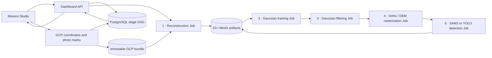
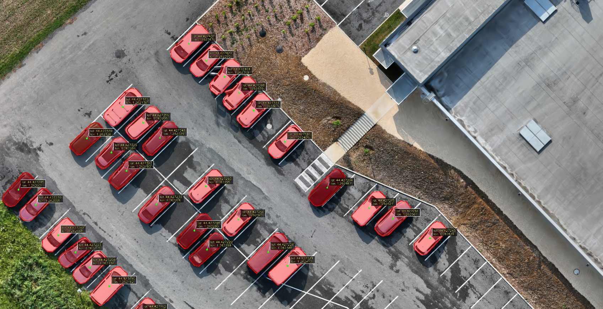

# DroneAI Pipeline

DroneAI turns drone imagery into aerial maps or high-definition facade
products. It combines photogrammetric reconstruction, DroneGS 3D Gaussian
Splatting, raster generation, optional AI inference and an operator dashboard.

> [!IMPORTANT]
> The production baseline now separates organizations in authentication,
> storage, compute and PostgreSQL RLS. Durable invitations, credential recovery,
> metadata-only platform support, commercial policy ledgers and protected
> control-worker high availability are implemented. It is not yet a public
> self-service SaaS: OIDC federation and self-service organization signup remain
> outside its present scope.

## Production processes

Both processes start with image ingest, feature matching, sparse
reconstruction and qualified DroneGS training. The dashboard exposes them as
separate choices:

| Process | How it works | Products |
|---|---|---|
| **Aerial map** | Aligns the scene to a metric CRS with GNSS/RTK and optional surveyed control, then runs tiling and AI analysis | Orthomosaic, height map, map tiles and GeoJSON/PostGIS detections |
| **HD facade** | Uses a coverage-first Caspar reconstruction, a local metric wall frame and no absolute RTK/GCP/gravity fit; aerial detection is skipped | HD facade orthophoto, local depth raster, frame and image-selection reports |

For facades, coherent close-detail sequences can be excluded when they
concentrate sparse points on one ornament. The validated profile favours a
more uniform seed because DroneGS performs the later densification. See the
[facade process guide](docs/FACADE_ORTHOPHOTO.md).

## Ways to run DroneAI

| Mode | Intended use | Entry point |
|---|---|---|
| Local dashboard | Complete workstation deployment with Docker Compose | `./deploy.sh local` |
| Distributed dashboard | Single-node K3s deployment managed by Helm; local Jobs use a Git-SHA tag, protected environments require OCI digests | `STAGE_JOBS_IMAGE_TAG=<git-sha> ./deploy.sh distributed` |
| Local runner | Infrastructure-free scientific diagnostics | `./tools/run_local_pipeline.sh` |

DroneAI uses S3-compatible object storage for datasets and mission artifacts,
Kafka for pipeline events, and PostgreSQL/PostGIS for mission and vector data.

The qualified Kubernetes execution path is an append-only five-stage DAG. Each
stage runs in its own bounded Job and publishes one checksum-addressed workspace
before its dependant can start:



Retries create a new immutable attempt against exact parent artifact IDs; they
do not replay successful ancestors. The Kafka fused-worker path remains a
compatibility mode for local deployments and existing missions.

## How the parts work together

### Dashboard and API — `app4-dashboard`

The Next.js frontend uploads datasets directly to S3 through short-lived
multipart URLs, then lets operators configure and launch missions, follow
progress, inspect map layers and export results. Its FastAPI backend validates
and journals upload sessions, stores mission state, publishes work to Kafka and
serves datasets and results from S3-compatible storage and PostGIS. The map
workspace also imports surveyed ground control, proposes photos from registered
camera visibility with an EXIF fallback, supports bounded sub-pixel marking and
an append-only operator history, and binds validated adjustment/checkpoint data
to reconstruction through immutable checksum-addressed inputs. Production
API replicas share raster rate-limit state in PostgreSQL and each receive the
status stream needed for their own WebSocket clients.

### Reconstruction and raster products — `app1-colmap`

The COLMAP image exposes independent one-shot reconstruction, Gaussian
training, Gaussian filtering and rasterization commands. They share the same
typed scientific boundaries as the compatibility worker, while S3 manifests
carry verified state between disposable Jobs. The pipeline creates either a
georeferenced map frame or a local facade frame, applies product-specific
quality gates and renders RGB and height/depth rasters. Only map missions
continue to AI. Aerial publication also requires a versioned spatial-coverage
report over the registered-camera footprint, preventing a sparse DSM from
passing solely because enough Gaussian primitives survived filtering.

### Raster processing — `app3-processing`

The processing image provides the compatibility Kafka tiling and aggregation
worker. In bounded stage-Job mode, the detection executor streams overlapping
raster windows directly, removes duplicates, publishes the final GeoJSON and
retains the same bounded tiling and provenance contracts. Indexed vectors can
then be persisted in PostGIS for spatial search.

### AI inference — `app2-ia`

The AI image exposes both the one-shot detection executor and the compatibility
tile worker. It runs either Meta SAM 3 prompt-based segmentation or
Ultralytics YOLO OBB, records immutable model provenance and publishes bounded
JSON/GeoJSON artifacts without embedding large segmentation payloads in Kafka.

### Shared services — `shared`

Shared modules define configuration, event contracts, validation, storage and
database helpers used by every service. MinIO or another S3-compatible store
holds large artifacts, Kafka carries asynchronous work and status events, and
PostgreSQL/PostGIS holds durable application and vector data.

### Local tools — `tools`

The local runners execute focused reconstruction, Gaussian training,
orthomosaic or full-pipeline diagnostics without the dashboard infrastructure.
They are intended for development and scientific validation rather than normal
operator use.

## Quick start

The recommended workstation setup is:

```bash
git clone https://github.com/olivelb/DroneAI.git
cd DroneAI
./deploy.sh local
```

For the distributed K3s deployment:

```bash
export STAGE_JOBS_IMAGE_TAG="$(git rev-parse --short=7 HEAD)"
./deploy.sh distributed
```

The deployment command prepares pinned external sources, builds the services,
starts the required infrastructure and prints the dashboard URL. `HF_TOKEN` is
optional for YOLO and required only for gated Hugging Face models such as SAM 3.
Omit `STAGE_JOBS_IMAGE_TAG` only when deliberately exercising the fused-worker
compatibility path.

## Documentation

The README is intentionally limited to the project overview. Use the dedicated
guides for implementation and operational details:

| Topic | Guide |
|---|---|
| Architecture, event contracts and processing | [`DOCUMENTATION.md`](DOCUMENTATION.md) |
| Local and distributed installation | [`DEPLOYMENT.md`](DEPLOYMENT.md) |
| OVHcloud MKS preproduction | [`docs/OVHCLOUD_PREPROD.md`](docs/OVHCLOUD_PREPROD.md) |
| Qualification, recovery and cost controls | [`docs/OPERATIONS.md`](docs/OPERATIONS.md) |
| Infrastructure-free workflow | [`LOCAL_PIPELINE.md`](LOCAL_PIPELINE.md) |
| HD facade process | [`docs/FACADE_ORTHOPHOTO.md`](docs/FACADE_ORTHOPHOTO.md) |
| Development, tests and dependency locks | [`DEVELOPMENT.md`](DEVELOPMENT.md) |
| Platform versioning and releases | [`docs/RELEASES.md`](docs/RELEASES.md) |
| Production boundary and release gates | [`docs/PRODUCTION_READINESS.md`](docs/PRODUCTION_READINESS.md) |
| Reconstruction and RTK alignment | [`docs/FAST_ALIGNMENT.md`](docs/FAST_ALIGNMENT.md) |
| Map workspace, measurements and exports | [`docs/GEOSPATIAL_WORKSPACE.md`](docs/GEOSPATIAL_WORKSPACE.md) |
| Resident-block HQ candidate, adaptive capacity and promotion gate | [`docs/contracts/quality-profiles-v3.md`](docs/contracts/quality-profiles-v3.md) |
| Documentation index and dated validation evidence | [`docs/README.md`](docs/README.md) |
| Third-party components and licenses | [`THIRD_PARTY_NOTICES.md`](THIRD_PARTY_NOTICES.md) |

## Showcase



The image shows vehicle detections reprojected onto an ALBAGNAC Mavic 3E RTK
orthomosaic. ALBAGNAC used onboard RTK without surveyed GCPs or independent
checkpoints, so this is a workflow showcase rather than an independently
verified accuracy claim; its reconstruction and DroneGS evidence is retained
in the [`docs/dronegs/benchmarks/`](docs/dronegs/benchmarks/) archive. For
comparison, [GAJAN](docs/GAJAN_R2S_VALIDATION.md) documents a standard-GNSS,
non-RTK integration run without GCPs, while the
[Helenenschacht comparison](docs/benchmarks/helenenschacht-our-workflow-vs-metashape-2026-08-01.md)
provides the benchmark with independent surveyed checkpoints.

## License

Original DroneAI code is licensed under the [MIT License](LICENSE). The
specified DroneGS translation units and the resulting combined native binary
are GPL-3.0-or-later. External source trees, container images, model code and
model weights retain their own licenses; review
[`THIRD_PARTY_NOTICES.md`](THIRD_PARTY_NOTICES.md) and the
[`DroneGS GPL register`](docs/dronegs/GPL_COMPONENTS.md) before redistribution.
