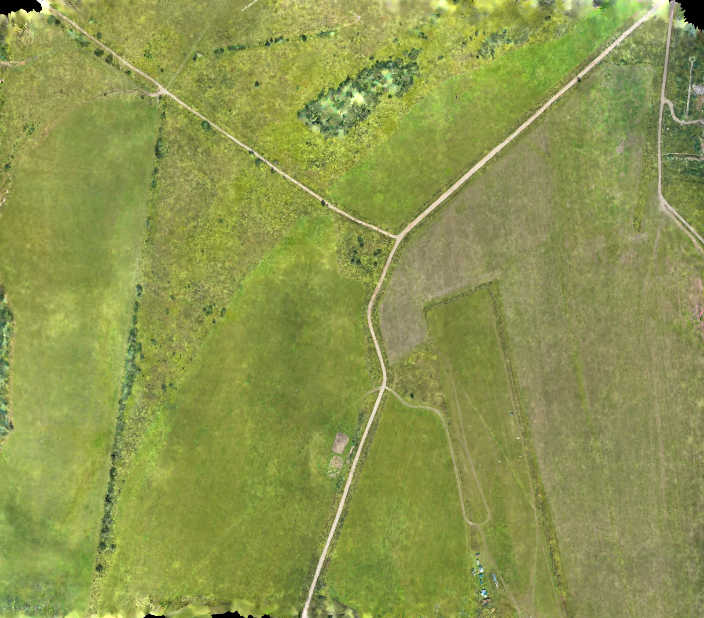
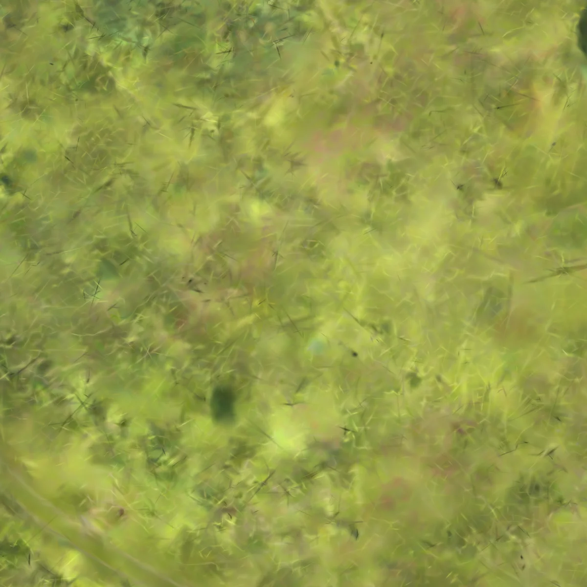
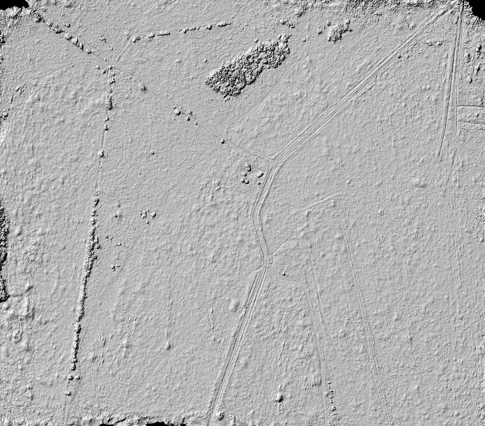

# Aerial GCP Fast resident full-scene seam qualification — 2026-08-14

## Verdict

The complete 444-camera aerial dataset completed the local `fast-resident`
diagnostic path on BIGZEN. The planner trained nine resident core/buffer
cells for 7,500 iterations, filtered and published 6,465,746 uniquely owned
Gaussians, passed the density and coverage gates, and produced matching RGB
and height GeoTIFFs in `EPSG:32636` at 5 cm/pixel.

The aggregation contract is technically continuous. Across all 12 resident
boundaries, the height boundary-to-interior gradient ratio remains between
0.978 and 1.009. The RGB ratio is between 1.058 and 1.248. Native-resolution
inspection did not reveal a hard colour or height step at the exact core
limits. The linear core/buffer compositor therefore avoids the cell breaks
that were present before feathering.

This run does **not** qualify Fast as a final cartographic product. Vegetation,
tracks and fine texture remain blurred, individual splats are visible, and
cell 6 contains one weak held-out view despite its passing aggregate canary.
Fast remains an operator preview and a cheap whole-scene aggregation test.
Normal and HQ must provide the product-quality evidence.



## Reproducible scope

| Item | Value |
| --- | --- |
| Application commit | `69720f9` |
| Host | BIGZEN, Ubuntu WSL2 |
| GPU | NVIDIA GeForce RTX 3090, 24,576 MiB |
| Runtime image | `drone-colmap:f16fe91` |
| Native trainer | `dronegs-native-mrnf-fastgs` dev.49 |
| Dataset | complete aerial GCP workspace, 444 registered cameras |
| Filtered sparse seed | 635,487 points from 832,099 quality candidates |
| Robust projected area | 915,966.87 m² |
| Local profile | `fast-resident`, resolving to `fast-v2` |
| Training | 7,500 iterations/cell, seed 42, SH degree 3 |
| Input reduction | factor 8, maximum width 1,600 px |
| Capacity | adaptive 1.5 M floor; 1.5 M operator ceiling |
| Effective resident buffer cap | 1.3 M/cell |
| Requested product | `EPSG:32636`, 0.050 m/pixel |
| Run label | `full444-fast-resident-7500-r1` |

The profile is deliberately local-only. The public Fast profile remains
unchanged. The run used projected-KNN initialization, an eight-pixel target
Gaussian spacing, resident partitioning and linear core/buffer feathering.

```bash
DRONEGS_BIN=/candidate/dronegs \
python3 tools/run_local_gaussian.py \
  /qual/workspace \
  --profile fast-resident \
  --run-label full444-fast-resident-7500-r1 \
  --verbose
```

## Planner, canaries and runtime

The required eight cells became a 3 x 3 geographic grid with all nine cells
active. Each cell reached approximately 1.29 M resident-buffer Gaussians.
All aggregate held-out canaries passed.

| Cell | Final buffer | Filtered unique core | PSNR | SSIM | Native wall time |
| ---: | ---: | ---: | ---: | ---: | ---: |
| 0 | 1,291,231 | 781,651 | 28.796 dB | 0.8798 | 395.8 s |
| 1 | 1,295,128 | 679,958 | 29.788 dB | 0.8870 | 421.5 s |
| 2 | 1,293,690 | 797,170 | 30.893 dB | 0.9013 | 403.3 s |
| 3 | 1,293,577 | 682,551 | 29.311 dB | 0.8817 | 412.5 s |
| 4 | 1,296,629 | 601,504 | 29.520 dB | 0.8896 | 441.4 s |
| 5 | 1,295,830 | 688,934 | 30.959 dB | 0.9071 | 416.3 s |
| 6 | 1,292,967 | 759,254 | 27.186 dB | 0.8077 | 401.1 s |
| 7 | 1,292,826 | 684,342 | 28.318 dB | 0.8674 | 425.2 s |
| 8 | 1,290,428 | 790,382 | 29.988 dB | 0.8938 | 399.7 s |

Cell 6 is the weakest diagnostic cell. One held-out view reached only
10.626 dB and 0.2367 SSIM while another reached 18.533 dB and 0.5675 SSIM.
The aggregate canary still passed, but this variance must remain visible in
future Normal/HQ qualification instead of being hidden by the mean.

End-to-end duration was 4,792.11 s (79 min 52.1 s):

| Phase | Duration |
| --- | ---: |
| Training and scene preparation | 4,669.02 s |
| Filtering | 32.18 s |
| Rasterization | 35.16 s |
| Quality gates and publication | 53.82 s |

Observed GPU utilization was normally 98–99% during native training, with
approximately 2.9–3.0 GiB VRAM in use. No OOM, NaN or interrupted cell was
observed. The run is compute-bound; filtering and final raster publication are
small compared with training.

## Density, coverage and resident artifacts

Filtering retained 6,465,746 of 6,493,314 uniquely owned core Gaussians
(99.58%). The density gate required 5,724,793 and accepted the result:

| Density metric | Result |
| --- | ---: |
| Achieved spacing | 0.37638 m |
| Achieved spacing | 7.5277 output pixels |
| Minimum compatible GSD | 0.04705 m/pixel |
| Requested GSD | 0.05000 m/pixel |

Coverage also passed: 99.7873% valid pixels over the expected footprint,
100% covered cells, 99.9980% worst interior cell and 100% camera-cell p10.

PDAL 2.10.2 successfully parsed a representative 382,206,279-byte resident
PLY. Cell 0 contains 1,291,231 points and exposes position, degree-three colour
SH, scale, rotation, opacity and opacity-SH fields. This confirms that the
multi-model output remains consumable as a standard binary PLY while retaining
the DroneGS attributes.

## Seam evidence

The seam report contains all 12 internal 3 x 3 grid boundaries. It is still an
evidence-only gate, so the result is interpreted together with visual checks.

| Metric over 12 seams | Minimum | Maximum |
| --- | ---: | ---: |
| RGB boundary mean | 0.702 / 255 | 1.357 / 255 |
| RGB p95 | 1.667 / 255 | 4.000 / 255 |
| RGB boundary/interior ratio | 1.058 | 1.248 |
| Height boundary mean | 0.00581 m | 0.01266 m |
| Height p95 | 0.01643 m | 0.04025 m |
| Height boundary/interior ratio | 0.978 | 1.009 |

The largest relative RGB ratio is 1.248 at the horizontal boundary between
cores `(0,2)` and `(1,2)`. The largest absolute RGB boundary gradient is
1.357/255 at the textured central boundary between `(1,1)` and `(2,1)`, but
its ratio is only 1.065 because adjacent texture has the same gradient level.
The height ratios remain centred on one, providing no evidence of a DEM step.

The following native 1,200 x 1,200 crop is centred on the cell 6 vertical
boundary. The boundary passes through the image centre; the visible defect is
the Fast splat/blur texture rather than a straight join.



The hillshade likewise shows continuous terrain and track geometry across the
grid. It also makes the surface noise expected from this preview profile clear.



## Products and retained evidence

Both GeoTIFFs use the same 20,406 x 17,941 grid, 5 cm affine pixel size,
`EPSG:32636` CRS and extent
`[414000.0631, 6634258.5598, 415020.3631, 6635155.6098]`. The height raster
ranges from 51.566 m to 81.297 m and stores float32 `NaN` NoData.

| Artifact | Size | SHA-256 |
| --- | ---: | --- |
| Completed run report | 48 KiB | `72a651627b56132c7477e15d4d5643fef33a2c9c5d92c7b5de180c47a82a3b77` |
| RGB GeoTIFF | 984 MiB | `871bbad1b3c071f2cd66e77816a83b68e040e3451ca1ebbea011f1734aa3bbf1` |
| Height GeoTIFF | 1.2 GiB | `3e250c88ef24c43b365353d178d315b7654425da49946505f79d9cc601bcef64` |

The complete workspace products, nine buffer PLYs, checkpoints, canaries,
seam report and native inspection crops remain on BIGZEN. No cleanup was
performed.

## Qualification boundary

Accepted:

- complete 444-camera, 3 x 3 resident training and publication;
- filtering, density, coverage, PLY and aggregate canary contracts;
- continuous linear core/buffer aggregation without a visible hard seam;
- bounded Fast memory use and reproducible 7,500-iteration execution.

Not accepted as final product evidence:

- image fidelity, because the preview remains blurred and splat-dominated;
- the weak individual held-out view in cell 6;
- survey accuracy or parity with the Metashape reference;
- Normal 15,000-iteration and HQ 30,000-iteration full-scene quality;
- facade resident aggregation, which requires its own geometry-specific run.

