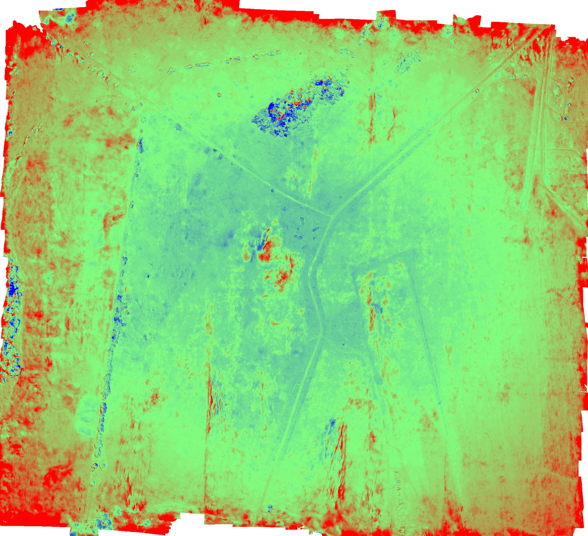
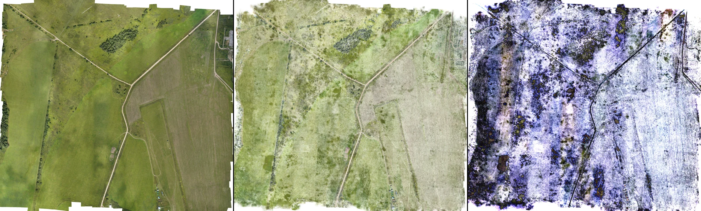

# Aerial GCP high-quality K3s benchmark — 2026-08-12

## Verdict

The high-quality geospatial chain completed on BIGZEN through four immutable
Kubernetes Stage Jobs: reconstruction, Gaussian training, Gaussian filtering
and rasterization. The run used 30,000 training iterations, a 12 M Gaussian
ceiling and a native 0.02 m output grid. It produced and content-addressed a
12.91 GB orthomosaic and an 8.07 GB height raster with accepted spatial
coverage.

This qualifies the execution and artifact path after the storage correction.
It does **not** qualify survey accuracy or final orthomosaic quality:

- the five independent checkpoints have 0.910 m vertical RMSE in DroneAI,
  compared with 0.082 m in the Metashape reference;
- the DroneAI-to-Metashape checkpoint difference is 0.893 m RMSE;
- the common DEM surface has 1.098 m mean absolute difference and 1.741 m
  RMSE;
- the orthomosaic has complete reference coverage and no gross horizontal
  translation, but its color, contrast and local detail are materially worse
  than the Metashape output.

The mission deliberately ran with `gcp_adjustment_enabled=false`. The GCPs
were held out to measure final accuracy rather than fed into the DroneAI
alignment, while the Metashape product was optimized with control points. The
result therefore quantifies the current uncorrected alignment gap; it is not
evidence that the surveyed GCP observations are ineffective.

## Reproducible scope

| Item | Value |
| --- | --- |
| Runtime application commit | `f16fe91` |
| Mission | `aerial-gcp-dem-hq-20260812` |
| Execution | K3s Stage Jobs on BIGZEN, Ubuntu WSL2 |
| GPU | NVIDIA GeForce RTX 3090, 24,576 MiB; driver 591.74 |
| Host memory available to WSL2 | 94 GiB |
| Runtime image | `drone-colmap:f16fe91` |
| Input | 444 Sony RX1R images, 6,000 x 4,000 pixels |
| Product CRS | WGS 84 / UTM zone 36N (`EPSG:32636`) |
| Profile | `high-quality-v2`, version 2 |
| Gaussian settings | adaptive, 5 M floor, 12 M ceiling, 30,000 iterations |
| Requested GSD | 0.02 m/pixel |
| Independent checkpoints | 1, 5, 14, 15 and 17 |
| Excluded surveyed points | 12 disabled; 19 rejected as erroneous |

The reference was generated with Metashape 2.3.1. Its source dense cloud has
77,211,023 points. The reference DEM is 9,264 x 8,651 at 0.117538 m/pixel;
the reference orthomosaic is 37,059 x 34,608 at 0.0293844 m/pixel.

The mission did not include detection/segmentation. This is a complete
high-quality geospatial run, not a new five-Job AI qualification.

## Execution evidence

| Stage | Run ID | Result | Duration |
| --- | --- | ---: | ---: |
| Reconstruction | `8d3c3774-0aa6-4523-9f23-a963da32a232` | 444/444 images, 832,099 sparse points | 44 min 36 s |
| Gaussian training | `b86785c2-7c06-4c52-a5c4-f3c6eeb8d1af` | 10,318,799 final Gaussians | 4 h 16 min 38 s |
| Gaussian filtering | `e5f92b85-96fd-4e2a-bb41-a617e1b27d0d` | 10,293,536 retained | 3 min 6 s |
| Rasterization | `40cd0114-47ff-49cd-965d-95f2f5732dea` | 53,041 x 48,319 at 0.02 m | 25 min 12 s |

The successful stage durations total approximately 5 h 29 min. Raster
coverage passed `GAUSSIAN_MAP_COVERAGE_V1`:

| Coverage metric | Result |
| --- | ---: |
| Valid-pixel ratio | 99.8943% |
| Covered expected cells | 100% |
| Worst expected cell | 81.5496% |
| Camera-cell p10 | 99.9994% |

The final raster artifact is
`fbd8eb0f-6ef2-5049-a28f-5eb2d811e36f`, with logical size
37,617,642,568 bytes and checksum
`ebf017802dfb66b4942d9ba80ccf1df5a27f1b6ce44ef605b0fa3c496dfece7a`.
Its materialized products are:

| Product | Bytes | SHA-256 |
| --- | ---: | --- |
| `orthomosaic.tif` | 12,909,751,027 | `18627f167bb10d7769d39c19d90c955670db69e089e4541037c05da79f0c2d6e` |
| `orthomosaic.height.tif` | 8,068,031,162 | `4d6c7dc5425602297aec63b63f64170bda3c395c211c184dfc129d7427aabb29` |
| `gaussian_coverage_report.json` | 24,295 | `d3a3bb5058f2fe1417fd069f5cf46514a462eccf6f1dcb4625129d3e35fefe25` |

The materialized files remain under
`Y:\BenchGCP\droneai-hq-20260812\outputs`. They were not deleted after the
test.

## Why the run initially failed at 75%

The 75% UI value was the three completed stages out of four while
rasterization was failing. The retained diagnostics establish two distinct
causes:

1. the standard 24 GiB memory limit was too small for a 10.29 M Gaussian,
   53,041 x 48,319 raster; the first retained Pod ended `OOMKilled`, exit 137;
2. the high-memory retry rendered successfully, but its root-backed
   `emptyDir` consumed the node filesystem. `DiskPressure` evicted PostgreSQL
   and MinIO, and final database publication failed with connection refused.

The successful retry used the same high-memory class but routed `/work` to
the selected J drive. Restore transferred 16.64 GB in 387 s and publication
transferred 12.91 GB in 349 s. The renderer's measured high-water resident
memory was about 37.2 GB. CuPy also reported that a 1.85 GB pinned-host
allocation failed and correctly fell back to a synchronous transfer.

The durable code correction now:

- sends HQ rasterization, or rasterization above 3 M requested Gaussians, to
  `gpu-high-memory`;
- persists the mission `work_drive` into every Stage Run;
- resolves the configured hostPath/PVC by drive name and mounts it on
  `/work`;
- fails closed when a selected drive is absent instead of silently falling
  back to root `emptyDir`;
- passes the storage catalogue through the Helm control-plane environment.

The BIGZEN monitor is persistent as the user service `droneai-monitor.service`.
Its terminal-state selection was also corrected so a successful retry replaces
older failed-attempt labels and logs.

## Final DEM comparison

The area comparison reprojects both DEMs onto the same 2,048 x 1,866 grid in
`EPSG:32636`, yielding 3,657,423 common valid samples. Bilinear resampling is
used for the continuous height field. This is a representative whole-area
comparison; checkpoint sampling below uses the native rasters directly.

| Metric | DroneAI versus Metashape |
| --- | ---: |
| Common valid area | 95.7048% of the overlap grid |
| Mean signed difference | +0.674 m |
| Median signed difference | +0.369 m |
| Mean absolute difference | 1.098 m |
| RMSE | 1.741 m |
| RMSE after removing constant bias | 1.605 m |
| Height correlation | 0.9643 |
| Difference p05 / p95 | -0.991 m / +3.347 m |



*Blue is a negative DroneAI-minus-Metashape difference, green is near zero,
and red is positive. The visualization is clipped symmetrically to
approximately +/-5.25 m. Large residuals occur mainly at vegetation, sharp
surface discontinuities and raster borders.*

## Independent checkpoint comparison

| Checkpoint | Survey Z (m) | DroneAI Z (m) | Metashape Z (m) | DroneAI - survey (m) | DroneAI - Metashape (m) |
| ---: | ---: | ---: | ---: | ---: | ---: |
| 1 | 54.454 | 56.050 | 54.550 | +1.596 | +1.501 |
| 5 | 67.419 | 68.395 | 67.389 | +0.976 | +1.006 |
| 14 | 63.190 | 63.707 | 63.283 | +0.517 | +0.424 |
| 15 | 72.556 | 72.062 | 72.659 | -0.494 | -0.597 |
| 17 | 75.018 | 74.655 | 75.084 | -0.363 | -0.429 |

| Five-checkpoint summary | Bias (m) | RMSE (m) |
| --- | ---: | ---: |
| DroneAI minus survey | +0.446 | 0.910 |
| Metashape minus survey | +0.066 | 0.082 |
| DroneAI minus Metashape | +0.381 | 0.893 |

A diagnostic plane fitted to the five DroneAI checkpoint errors reduces RMSE
from 0.910 m to 0.191 m, with slopes equivalent to approximately -0.054
degrees east-west and +0.132 degrees north-south. Five points are insufficient
to promote this fit into a correction or release metric, but the result is
strong evidence of a systematic orientation component. It is consistent with
an alignment that did not consume the GCP controls, rather than a constant
vertical offset alone.

## Final orthomosaic comparison



*Left: Metashape reference. Centre: DroneAI. Right: absolute RGB difference
amplified three times. The compact preview is visual evidence, not a source
raster.*

Both products were resampled onto the same projected comparison grid. Phase
correlation has a strong peak-to-sidelobe ratio above 97 and estimates less
than 0.15 m translation on a grid sampled at about 0.52 m/pixel. This rules out
a gross horizontal translation but does not establish centimetric horizontal
accuracy.

| Metric | Result |
| --- | ---: |
| Candidate coverage of valid reference pixels | 100% |
| RGB MAE | 57.84 / 255 |
| RGB RMSE | 66.15 / 255 |
| PSNR | 11.72 dB |
| Grayscale correlation | 0.1290 |
| Mean RGB bias (R, G, B) | +51.3, +51.4, +66.3 |

The candidate is visibly brighter, desaturated and locally noisier/softer.
The roads and field geometry align at overview scale, but this rendering is
not a credible substitute for the Metashape orthomosaic. Coverage gates alone
therefore remain necessary but insufficient quality evidence.

### Surface-colour renderer follow-up

A bounded rerender on the retained 10,293,536-Gaussian filtering artifact
isolated the dominant photometric defect without repeating reconstruction,
training or filtering. DroneGS trains against a black background, whereas the
v2 orthographic renderer composed partially transparent splats directly onto
white. Background transmittance therefore washed out valid surface pixels.

Renderer contract `cupy-ortho-v3-surface-color` now preserves accumulated
opacity, renders premultiplied radiance against the training background and
recovers surface RGB by alpha normalization. White is used only where no
Gaussian contributes. A GPU regression test fixes this contract for a
translucent half-grey surface.

The A/B window covers 100 x 100 m, from easting 414,414.638 m to
414,514.638 m and northing 6,634,612.328 m to 6,634,712.328 m in
`EPSG:32636`. It contains 25,000,000 pixels on the same 0.02 m grid. Both
candidate variants use the same filtered model, geometry, SH coefficients and
Mip filter; only surface-colour recovery changes.

| ROI metric versus Metashape | v2 white composition | v3 surface colour |
| --- | ---: | ---: |
| RGB MAE | 66.68 / 255 | 17.39 / 255 |
| RGB RMSE | 73.66 / 255 | 21.95 / 255 |
| PSNR | 10.79 dB | 21.30 dB |
| Grayscale correlation | -0.0219 | 0.2289 |
| Mean RGB bias | +62.3, +59.8, +77.0 | +8.3, +12.5, +1.9 |

This accepts the surface-colour correction: it removes the white veil and
improves PSNR by 10.52 dB on the fixed ROI. It does not accept local detail.
The remaining low correlation and visible streaked texture require a separate
surface-support/covariance investigation before a full replacement
orthomosaic is justified. The experimental ROI products and metrics remain on
BIGZEN under `Y:\BenchGCP\droneai-hq-20260812\sh-ab`; they are not production
artifacts and were not published to the mission.

The retained model explains that remaining boundary. Its median maximum
Gaussian scale is 0.359 m, its 75th percentile is 0.629 m, and median
anisotropy is 8.20. About 10.0% of the splats have a maximum scale above 1 m.
These supports span many pixels on a 0.02 m grid, so their elongated structure
is visible even though coverage is complete. Downsampling the corrected ROI
improves PSNR and correlation monotonically, but still reaches only 23.55 dB
and 0.446 grayscale correlation at 0.20 m/pixel. A coarser export therefore
cannot recover the missing local texture.

The next renderer phase should orthorectify source-camera pixels onto the
qualified height surface, with view selection, exposure compensation,
seamlines and multiband blending. Gaussian RGB remains appropriate for fast
preview and uncovered-pixel fallback; increasing the Gaussian cap alone is
not a credible route to a survey orthomosaic at source-image GSD on a 24 GiB
GPU.

## Reproducing the comparison

The reusable tool performs CRS validation, shared-grid DEM and RGB comparison,
native-raster checkpoint sampling, plane diagnostics and compact previews:

```bash
python tools/compare_geospatial_outputs.py \
  --candidate-ortho /path/to/orthomosaic.tif \
  --candidate-dem /path/to/orthomosaic.height.tif \
  --reference-ortho /path/to/metashape-orthomosaic.tif \
  --reference-dem /path/to/metashape-dem.tif \
  --gcp-list /path/to/gcp_list.txt \
  --gcp-accuracy /path/to/gcp_accuracy.csv \
  --output-dir /path/to/comparison
```

The complete machine-readable result is
[`aerial-gcp-hq-2026-08-12.comparison.json`](aerial-gcp-hq-2026-08-12.comparison.json).

## Qualification boundary and next work

Accepted:

- real K3s execution of the four high-quality geospatial Stage Jobs;
- 30,000 iterations and a 12 M ceiling on a 24 GiB RTX 3090;
- 10.29 M-Gaussian filtering, full 2 cm rendering and coverage gates;
- content-addressed restore/publication and materialized, checksummed outputs;
- corrected high-memory selection and non-root workspace routing.

Not accepted:

- survey-grade vertical accuracy;
- final orthomosaic appearance and photometric fidelity;
- centimetric horizontal accuracy from the coarse registration diagnostic;
- production COG conversion (the products remain valid striped intermediate
  GeoTIFFs);
- a five-Job run including AI detection/segmentation;
- OVHcloud GPU qualification while the requested quota remains unavailable.

Before claiming survey accuracy, a new run must apply GCP controls while
retaining independent checkpoints and then gate the final DEM on those
checkpoints. Before accepting the orthomosaic, the renderer's color/exposure,
surface selection and high-frequency detail need benchmark-backed correction.
Chunked host-to-device loading should also replace the 1.85 GB pinned-memory
request before concurrent HQ workloads are enabled.
