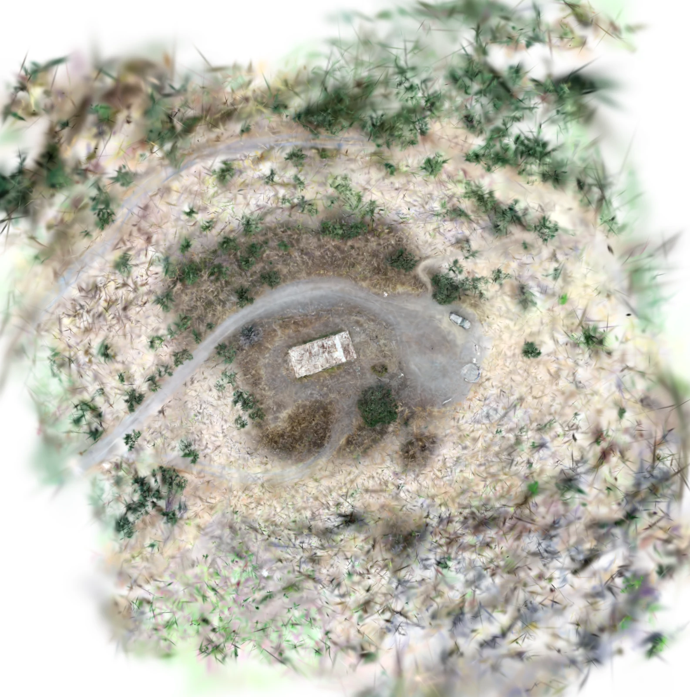

# Chapelle Banyuls P4 Fast E2E on BIGZEN — 9 August 2026

> [!IMPORTANT]
> The initial sections are immutable evidence for the earlier local Fast run at
> `adff3b9`. The
> [Q3 Kubernetes addendum](#q3-kubernetes-five-job-qualification-addendum)
> supersedes its former conclusion that stage Job mode was unqualified.

## Verdict

The infrastructure-free full pipeline completed successfully on BIGZEN at
commit `adff3b9` using the versioned `fast-v1` envelope. Reconstruction,
Gaussian training/filtering/rasterization and full YOLO tiling all produced
their declared artifacts in 217.6 seconds.

This is a **functional GPU E2E pass**, but **not a visual-quality or detection
qualification**. The chapel and roads are recognizable, while the 5 cm raster
is heavily smoothed and contains Gaussian streaks and white peripheral areas.
YOLO returned zero detections although the preview contains at least two
vehicle-like objects that merit manual review. Kubernetes five-Job dispatch,
S3 hand-offs, database publication and Kafka reconciliation were not exercised;
at commit `adff3b9`, that run alone was therefore insufficient to qualify
`stageJobs.enabled`. The later Q3 addendum below records the superseding
five-Job qualification.

## Environment and immutable inputs

| Item | Value |
|---|---|
| Execution host | BIGZEN, Windows 10 host with Ubuntu WSL2 |
| CPU/RAM allocation | 94 GiB visible to Ubuntu |
| GPU | NVIDIA GeForce RTX 3090, 24,576 MiB |
| Driver | 591.74 |
| CUDA runtime | 12.9.2 |
| DroneGS | `0.5.0-dev.47`, portable CUDA build |
| Git commit | `adff3b97cdd2896c5a23503d47ce2da64e90bb59` |
| COLMAP/Gaussian image | `sha256:c9f461db45aae943b3bb2e0e9feaddc38a22448ab09f4523a4ee45e2ae07025f` |
| Preflight image | `sha256:bcb37847668235b2f4a0e953978ea024413a66783ca17515be525d85666e56e8` |
| YOLO image | `sha256:b42876b53a6d6e4d1d92f1be9a5fd013e517ce616b692d6a37d061c6e20a155f` |
| Workspace | `/home/olivier/e2e/chapelle-banyuls-p4-fast-20260809` |

The source was the Windows `J:` volume on BIGZEN, exposed as the user's mapped
`Y:` drive, under `CHAPELLE BANYULS/P4 photo chapelle 30m`. It contained 115
files totalling 992,810,380 bytes. Preflight classified 114 files as readable
DJI FC6310 images, all with EXIF GPS, totalling 992,721,292 bytes. The capture
lasted from 17:24:50 to 17:30:05 on 7 September 2022 over an approximate 632.7 m
flight path. The files were copied to Ubuntu and an `rsync --checksum --dry-run`
reported no difference before execution.

The height reference is unknown or mixed. The DSM is internally aligned but
must not be described as an orthometric height product.

## Reproducible command

No CUDA, COLMAP or DroneGS image was rebuilt. The already qualified COLMAP image
also supplied the compatible Python/CuPy raster runtime, avoiding an unrelated
native rebuild.

```bash
cd /home/olivier/droneAI
DRONEAI_PREFLIGHT_IMAGE=drone-dashboard-api:latest \
DRONEAI_GAUSSIAN_IMAGE=drone-colmap:latest \
tools/run_local_pipeline.sh \
  /home/olivier/datasets/chapelle_banyuls_p4_30m \
  /home/olivier/e2e/chapelle-banyuls-p4-fast-20260809 \
  --profile fast
```

The first attempt exposed a bootstrap-order defect: the pipeline log made the
workspace non-empty before the COLMAP safety marker could be written. No native
processing had started. PR [#98](https://github.com/olivelb/DroneAI/pull/98)
keeps that log beside an unmarked workspace and moves it inside after marking;
the clean retry documented here then completed.

## Effective Fast profile

| Parameter | Effective value |
|---|---:|
| Input selection | all 114 readable images, uniform |
| Feature image size | 1,600 px |
| Maximum SIFT features | 2,048 |
| Matcher | bounded GPS pairs, SIFT brute force |
| Gaussian iterations | 7,500 |
| Gaussian cap | 1,500,000 |
| SH degree | 3 |
| Image factor | 8 |
| Raster resolution | 0.05 m/pixel |
| Filtering | enabled, spatial bounds |
| YOLO profile | full, `yolo26l-obb.pt`, 1,024 px tiles |

Unlike the `smoke` integration profile, Fast processes the complete dataset and
uses the user-facing `fast-v1` contract.

## Timings and reconstruction quality

| Stage | Wall time | Result |
|---|---:|---|
| COLMAP through alignment/undistortion | 162.4 s | 113 undistorted images and aligned sparse model |
| Gaussian through RGB/DSM publication | 49.4 s | completed report and two GeoTIFFs |
| Full tiled YOLO | 5.9 s | nine tiles and three declared output files |
| Total orchestrator | 217.6 s | completed |

COLMAP registered 113/114 selected images (99.12%) and reconstructed 19,190
sparse points. Mean/median point reprojection errors were 1.291/1.275 px. GPS
alignment residuals were 1.063 m horizontal median, 2.394 m horizontal p95,
1.201 m Euclidean median and 3.270 m maximum. The selected projected CRS was
RGF93 / CC42 (`EPSG:3942`).

DroneGS completed 7,500 iterations with loss 0.1325 on the reported full pass.
It loaded 160,315 Gaussians, retained 158,808 after max-scale, distance and
opacity filters (99.1%), and stayed far below the 1.5M safety cap. A sampled
training observation showed 92% GPU utilization and 2.8 GiB VRAM in use; this
was not a continuously recorded peak measurement.

The spatial coverage gate accepted the result: 100% valid pixels, covered
cells, worst-cell ratio and camera-cell p10 over its expected camera footprint.
That gate measures spatial presence, not visual sharpness.

## Products

| Product | Shape/type | Size | SHA-256 |
|---|---|---:|---|
| RGB orthomosaic | 2,714 × 2,739, uint8 RGB, EPSG:3942 | 21,561,757 B | `b8b7a6877fbfedbd07a2bcba65ac8b1d691e286ca8583d89f08a1187f1964db0` |
| Height raster | 2,714 × 2,739, float32, EPSG:3942 | 25,554,434 B | `069bb4138a953974853fa655a159773ce9dfd14ca6f1ad5a5bdf1267512c9728` |
| Filtered Gaussian PLY | 158,808 Gaussians | 37,480,165 B | `16b19a75e468c4c021bbceb6a8a84fc2ece55e70f197a3d0054cc6906a2e4462` |
| Detection JSON | empty list | 3 B | `37517e5f3dc66819f61f5a7bb8ace1921282415f10551d2defa5c3eb0985b570` |
| Detection GeoJSON | zero features | 84 B | `c3f4535fd0dc393c53e101cb2e6067028a4b6d1ec834badc7ad8bab4c8157986` |
| Annotated orthomosaic | zero rendered detections | 8,625,458 B | `45755244ff3d92b5ed10cadace129a5400fda1218afb64b1c898010c5a9c04f3` |

Both rasters cover `[1708943.735, 1252717.276, 1709079.435, 1252854.226]`
with a 0.05 m affine pixel size. The DSM has 90.60% finite pixels; finite
minimum/p2/median/p98/maximum values are 182.60/186.41/200.06/209.04/217.76 m.

## Visual and detection assessment



The overview has a 12.50% near-white pixel ratio. Central geometry is coherent,
but texture is soft and repeated elongated splats are visible in vegetation and
around the periphery. This outcome is suitable for validating data flow and
resource bounds, not for delivery as a survey orthomosaic.

YOLO used the exact model artifact `yolo26l-obb.pt` at Ultralytics assets
revision `v8.4.0`, SHA-256
`8674b0c24bf68aab5eb45009e0ac3808ce432237edf8cb5c50ae2191cb263a2b`,
with Ultralytics 8.4.113 and Torch 2.11.0+cu128. It processed nine overlapping
tiles and returned zero raw/deduplicated detections. Manual review should label
the visible vehicle-like objects before this is classified as a model miss, but
zero detections cannot be considered a successful detection qualification.

## Operational outcome and follow-ups

- The failed bootstrap output was only 168 KiB and was removed before the clean
  retry; the source copy and successful workspace were retained.
- The successful workspace occupies 1.3 GiB. Ubuntu retained 69 GiB free.
- The three Compose workers paused to avoid contention were restarted and were
  running after the test.
- Add visual-quality gates that measure sharpness/texture collapse and excessive
  white margins; the current coverage gate alone cannot detect this result.
- Create a small reviewed vehicle ground-truth set for this raster before tuning
  confidence, resolution or model selection.
- Compare Fast against Normal on this dataset before choosing a minimum
  deliverable profile; the Fast result is only the minimum functional profile.
- A separate Q3 deployment run must still exercise the five bounded Kubernetes
  Jobs, checksum S3 hand-offs, immutable database edges, cancellation/retry and
  reconciliation before enabling Job mode.

## Q3 Kubernetes five-Job qualification addendum

The follow-up mission `chapelle-q3-five-jobs-20260809` exercised the same 114
images through the deployed K3s control plane on BIGZEN.  Unlike the first run,
this execution used the durable stage DAG, PostgreSQL state, MinIO artifact
hand-offs and one bounded Kubernetes Job per stage.  The mission reached
`success` at 100% and published all five declared workspaces.

The operator-facing Dashboard was exercised through its SSH-forwarded local
URLs.  The mission catalogue, home navigation, exact selected-mission monitor,
three-second refresh, human-readable stage graph, retry history, lifecycle
logs, product sizes/checksums and technical disclosures all reflected the
durable API state.  Browser console inspection reported no errors.  Commits
`4cdf3d7`, `31c361a` and `6d7ceed` contain the live monitor and terminal-state
projection fixes found during this qualification.

### Runtime configuration

| Item | Effective value |
|---|---|
| Kubernetes | K3s on BIGZEN, namespace `drone-ai` |
| Kubernetes version | `v1.36.3+k3s1`, Linux/amd64 |
| Stage mode | `DRONEAI_STAGE_JOBS_ENABLED=true` |
| Global / owner / mission concurrency | 2 / 1 / 1 |
| GPU runtime | `runtimeClassName: nvidia`, one GPU per executor Job |
| GPU / driver / VRAM | NVIDIA GeForce RTX 3090 / 591.74 / 24,576 MiB |
| Executor Git tag | `5492ee8` |
| Reconstruction through rasterization | `drone-colmap:5492ee8`, image ID `sha256:74ccfccdde403d51d24a082c1c0ec24c815e0571305facc310f9b592daedb802` |
| Detection | `drone-ia:5492ee8`, image ID `sha256:4cd2b10d47ab11943e1bff35bf69b922359aebfbbcc226a65fe4f55634a82630` |
| GPU architecture selector | `ampere` for all five executors |
| Quality profile | `normal-v1`: 2,400 px, 4,096 features, 15,000 Gaussian iterations, 3M cap |
| SAM3 identity | `facebook/sam3` revision `3c879f39826c281e95690f02c7821c4de09afae7` |

The commit-derived executor tags were used unchanged by every Job; no COLMAP,
CUDA or model image was rebuilt during the retry.

### Stage outcome

| Stage | Attempt | Duration | Result |
|---|---:|---:|---|
| Reconstruction | 0 | 4 min 57 s | succeeded |
| Gaussian training | 0 | 13 min 02 s | succeeded, 3,000,000 Gaussians |
| Gaussian filtering | 0 | 57 s | succeeded, 2,969,271 retained (98.98%) |
| Ortho/DEM rasterization | 0 | 18 s | failed: legacy CPU resource class had no NVIDIA runtime |
| Ortho/DEM rasterization | 1 | 1 min 09 s | succeeded on RTX 3090 with `gpu-standard` |
| SAM3 detection | 0 | 2 min 09 s | succeeded on RTX 3090 |

The raster retry was created through the stage-run API with the exact filtering
artifact ID `8b5aabe9-0d1c-5f04-9dea-a9aece074c9e`.  Dependency reconciliation
then released the previously blocked detection Job automatically.  This
validated retry lineage and the normal blocked-to-runnable transition without
replaying the three successful upstream stages.

SAM3 used prompt/class `car`, 1,024 px tiles and confidence 0.5.  It processed
81 tiles using CUDA with bfloat16 autocast.  The measured run produced four raw
detections and one geolocated feature after deduplication.  Its model artifact
SHA-256 is
`6d06f0a5f84e435071fe6603e61d0b4cc7b40e0d39d487cfd4d67d8cc11cc14a`.

### Durable products

| Product | Size | SHA-256 |
|---|---:|---|
| Reconstruction workspace | 1.41 GiB | `2439b23e47fa905d09de03597768cbd6817ad1c72ee9379bea81fe145977b7e7` |
| Gaussian training workspace | 2.07 GiB | `d986370977f9d2df08200230c5f68bd888cfd71e1c0ed4f8bb074c69a26cdf35` |
| Gaussian filtering workspace | 2.72 GiB | `24cec3fc8aa144b1af49f8f11f6cf4af1d6a0ddb45f740b4f12f36b07014c8bd` |
| Raster product workspace | 2.99 GiB | `33fd0048a96aca012f4367b406ec232f205b1dbcd1ccdaa9a32582d251327906` |
| Detection workspace | 2.99 GiB | `8e485808347dd43d6603f09b4e4691ca2a0eb371351e55e4a36886ddca34155d` |

The raster product declares `orthomosaic.tif` and
`orthomosaic.height.tif` in `EPSG:3942`, with extent
`[1708938.735, 1252716.067, 1709079.395, 1252853.447]`.  The detection product
declares one feature in `.droneai/detection/detections.geojson`.

This pass qualifies the five-Job mode for continued preproduction testing.  It
does not by itself qualify unattended production operation: explicit
cancellation/timeout drills, pod/node interruption recovery and longer-running
reconciliation soak tests remain separate operational gates.
