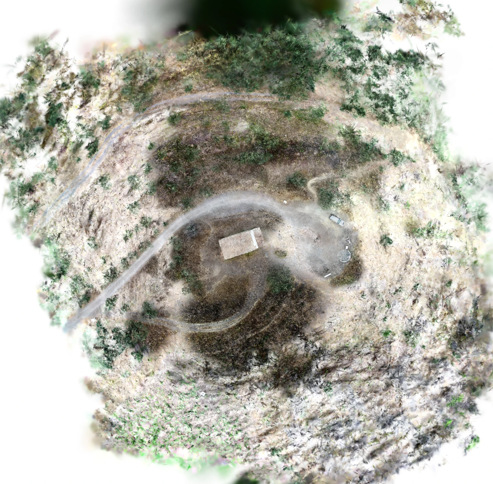

# Chapelle Banyuls P4 Normal E2E on BIGZEN — 9 August 2026

## Verdict

The infrastructure-free full pipeline completed successfully on BIGZEN at
commit `5b01b72` using the versioned `normal-v1` envelope. The Normal product
is a material visual improvement over Fast: the car is clearly recognizable,
central surfaces contain substantially more detail, and the final model grew
from 158,808 to 2,971,296 Gaussians. The complete run took 909.7 seconds.

This is a **photogrammetry and GPU E2E pass**, but **not a vehicle-detection
qualification**. Full YOLO inference returned no vehicle even though the car
is unambiguous in its 1,024 px tile. A direct diagnostic at confidence 0.01
also produced no `small vehicle` or `large vehicle` candidate. The miss is
therefore attributed to the current aerial OBB model/domain, rather than the
0.20 production threshold, tiling, or insufficient Normal raster detail.

Kubernetes five-Job dispatch, S3 hand-offs, database publication and Kafka
reconciliation were not exercised; `stageJobs.enabled` must remain disabled.

## Environment and immutable inputs

| Item | Value |
|---|---|
| Execution host | BIGZEN, Windows 10 host with Ubuntu WSL2 |
| RAM visible to Ubuntu | 94 GiB |
| GPU | NVIDIA GeForce RTX 3090, 24,576 MiB |
| Driver | 591.74 |
| CUDA runtime | 12.9.2 |
| DroneGS | `0.5.0-dev.47`, portable CUDA build |
| Git commit | `5b01b72dd7d928987d48b38b67a015ec7b4ec391` |
| COLMAP/Gaussian image | `sha256:c9f461db45aae943b3bb2e0e9feaddc38a22448ab09f4523a4ee45e2ae07025f` |
| Preflight image | `sha256:bcb37847668235b2f4a0e953978ea024413a66783ca17515be525d85666e56e8` |
| YOLO image | `sha256:b42876b53a6d6e4d1d92f1be9a5fd013e517ce616b692d6a37d061c6e20a155f` |
| Workspace | `/home/olivier/e2e/chapelle-banyuls-p4-normal-20260809` |

The immutable source is the same copy qualified by the
[Fast run](chapelle-banyuls-p4-fast-e2e-2026-08-09.md): 115 files totalling
992,810,380 bytes, including 114 readable DJI FC6310 images with EXIF GPS. The
source came from the BIGZEN Windows `J:` volume, exposed to the operator as
`Y:/CHAPELLE BANYULS/P4 photo chapelle 30m`, and was copied to
`/home/olivier/datasets/chapelle_banyuls_p4_30m`.

The height reference remains unknown or mixed. The DSM is internally aligned
but is not an orthometric height product.

## Reproducible command

No native image was rebuilt. The same already-qualified containers as the Fast
run were reused.

```bash
cd /home/olivier/droneAI
DRONEAI_PREFLIGHT_IMAGE=drone-dashboard-api:latest \
DRONEAI_GAUSSIAN_IMAGE=drone-colmap:latest \
tools/run_local_pipeline.sh \
  /home/olivier/datasets/chapelle_banyuls_p4_30m \
  /home/olivier/e2e/chapelle-banyuls-p4-normal-20260809 \
  --profile normal
```

The effective profile used all readable images, bounded GPS SIFT matching at
2,400 px and 4,096 features, two global BA passes with final retriangulation,
15,000 DroneGS iterations, a 3,000,000 Gaussian cap, image factor 4, SH degree
3, 0.05 m pixels and full `yolo26l-obb.pt` detection.

## Timings and reconstruction quality

| Stage | Fast | Normal | Normal result |
|---|---:|---:|---|
| COLMAP through undistortion | 162.4 s | 171.9 s | 113 images and aligned sparse model |
| Gaussian through RGB/DSM | 49.4 s | 731.9 s | two GeoTIFFs and filtered PLY |
| Full tiled YOLO | 5.9 s | 5.9 s | 12 tiles and zero detections |
| Total | 217.6 s | 909.7 s | completed |

| Metric | Fast | Normal |
|---|---:|---:|
| Registered/selected images | 113/114 | 113/114 |
| Sparse points | 19,190 | 35,682 |
| Mean reprojection error | 1.291 px | 1.218 px |
| Horizontal GPS median | 1.063 m | 1.068 m |
| Final Gaussians | 158,808 | 2,971,296 |
| Raster shape | 2,714 × 2,739 | 2,818 × 2,772 |

DroneGS reached its 3M training cap at iteration 14,250 and completed iteration
15,000 with a reported full-pass loss of 0.0857. Filtering retained 2,971,296
Gaussians. Observed GPU utilization reached 100%, while reported VRAM use
remained around 4.9 GiB; this was sampled, not a continuously recorded peak.

The spatial coverage gate accepted the output. A separate image diagnostic,
computed identically on both rasters, measured mean absolute grayscale gradient
2.85 for Fast and 7.91 for Normal (2.77×). This is useful comparative evidence,
not a calibrated photogrammetric accuracy metric. Normal has 84.20% non-white
pixels versus 87.50% for Fast because its raster extent includes wider
peripheral margins.

## Products

| Product | Shape/type | Size | SHA-256 |
|---|---|---:|---|
| RGB orthomosaic | 2,818 × 2,772, uint8 RGB, EPSG:3942 | 23,219,649 B | `7d70f263f86a23fb38afdd7e8f169cc8d952aa4c74b02ca7d327c2e782f4db82` |
| Height raster | 2,818 × 2,772, float32, EPSG:3942 | 26,238,511 B | `4ad873c370ae3dc164d9a34ae6ab74c086a5371afa26a896eae26082e04a89b0` |
| Filtered Gaussian PLY | 2,971,296 Gaussians | 701,227,334 B | `59e52a5bfdb65ff872806334ee930b43bf4f28b33a1192a4148db6b124b2479e` |
| Detection JSON | empty list | 3 B | `37517e5f3dc66819f61f5a7bb8ace1921282415f10551d2defa5c3eb0985b570` |
| Detection GeoJSON | zero features | 84 B | `c3f4535fd0dc393c53e101cb2e6067028a4b6d1ec834badc7ad8bab4c8157986` |
| Annotated orthomosaic | zero rendered detections | 13,053,046 B | `9a708146f6aa779f60ef9b4618ff6e55d965c869a401a733e8889444c0cc00f6` |

The rasters cover
`[1708937.937, 1252715.701, 1709078.837, 1252854.301]` at 0.05 m/pixel.
The DSM has 86.92% finite pixels; finite p1/median/p99 values are
185.15/199.52/209.65 m.

## Visual and detection assessment



The chapel, road and parked car are substantially clearer than in Fast. Some
vegetation still contains elongated Gaussian texture and the peripheral raster
still contains white or washed-out regions, so the coverage gate alone remains
insufficient as a delivery-quality gate.

The full detection pass used 12 overlapping 1,024 px tiles, confidence 0.20,
and the immutable `yolo26l-obb.pt` artifact at SHA-256
`8674b0c24bf68aab5eb45009e0ac3808ce432237edf8cb5c50ae2191cb263a2b`.
It returned zero raw and deduplicated detections. A retained diagnostic tile
contains the car at a clearly usable scale. Direct model inference at
confidence 0.01 returned only low-confidence false candidates such as
`helicopter` and `ship` elsewhere, with no vehicle candidate on the car.

This provides a reviewed positive vehicle example for a future regression
fixture. The next detection action should benchmark a model trained or
fine-tuned for nadir vehicles against this tile, rather than lowering the
production threshold and admitting unrelated false positives.

## Operational outcome

- The Normal workspace occupies 2.9 GiB; 66 GiB remained free on Ubuntu.
- The Fast workspace was preserved for reproducible comparison.
- The three Compose workers paused during the run were restarted successfully.
- Normal is now the minimum profile demonstrated to make this car visually
  reviewable; Fast remains an integration profile on this dataset.
- A reviewed ground-truth vehicle annotation and model comparison are still
  required before detection can be qualified.
