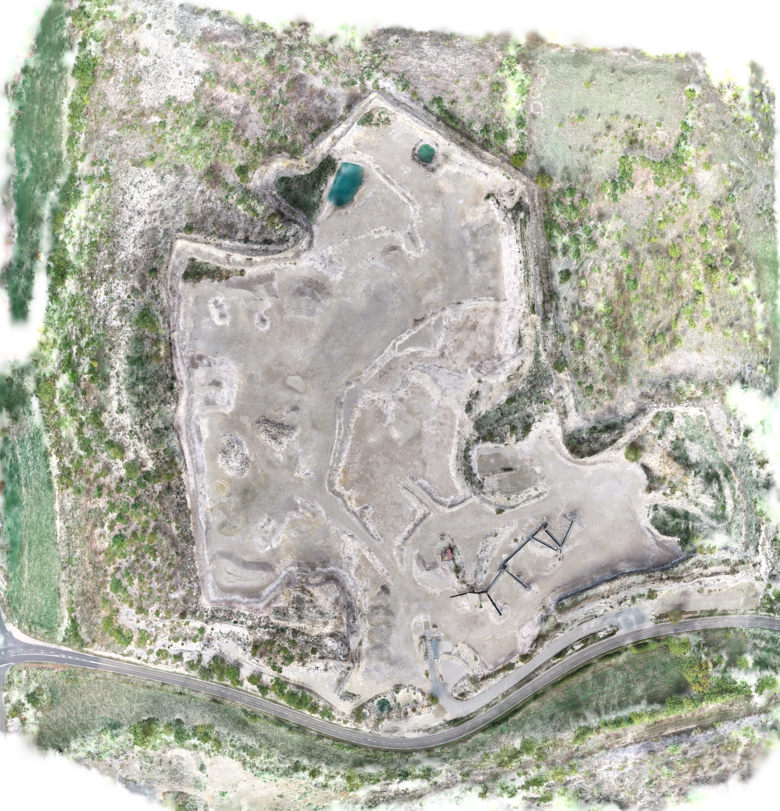

# Villesèque P4 High Quality v2 at 15 mm — 2026-08-11

## Verdict

The adaptive `high-quality-v2` DroneGS stage completed on BIGZEN at its full
12 M Gaussian ceiling and native 0.015 m/px output resolution. This qualifies
the profile's capacity, memory envelope, 30,000-iteration training path,
filtering and raw GeoTIFF rendering on a 24 GiB RTX 3090.

It does **not** qualify the result as survey-grade or the run as a new complete
five-Job E2E. The run deliberately reused the already-qualified Villesèque
COLMAP reconstruction, used consumer EXIF GPS without GCP observations, and
stopped before production COG publication and AI stages. Visual detail is
better than the 5 cm/5 M run, but low-texture quarry surfaces still contain
Gaussian smoothing and ghosting.



*2,309 x 2,400 WebP overview generated from the 32,283 x 33,543 raw RGB
GeoTIFF. The preview is visual evidence, not a measurement raster.*

## Reproducible scope

| Item | Value |
| --- | --- |
| Application commit | `8a08d16` (`main`, clean on local WSL and BIGZEN) |
| Execution host | BIGZEN, Ubuntu WSL2 on Windows 10 |
| GPU | NVIDIA GeForce RTX 3090, 24,576 MiB |
| NVIDIA driver | 591.74 |
| Container CUDA banner | 12.9.2 |
| Trainer CUDA runtime | 12.8 |
| WSL memory | 94 GiB, no swap |
| Trainer | `dronegs-native-mrnf-fastgs` 0.5.0-dev.47 |
| Trainer SHA-256 | `0114d49188624f7d15a56021b3d6f541a41de4e9874f2d9de40cb69fbf17876a` |
| Container image | `drone-colmap:63b4f8b86060ff0e4063c22606b2ebbf41af8315` |
| COLMAP dataset fingerprint | `droneai-colmap-dataset-v2:sha256:f5171e4ba39d7665ff78577eb265c8cefd7c81c3c1a8fd34db3d020ffca6a28d` |
| Registered images | 379; 331 training and 48 held out |
| Product CRS | `EPSG:3944` |
| Ground control | None; robust consumer EXIF GPS alignment |

The test reused the immutable `dense`, `sparse` and `sparse_geo` inputs from
the preceding Villesèque HQ v2 reconstruction through hard links. It did not
rerun SIFT, matching, mapping or undistortion.

```bash
DRONEAI_GAUSSIAN_IMAGE=drone-colmap:63b4f8b86060ff0e4063c22606b2ebbf41af8315 \
  tools/run_local_gaussian.sh \
  /home/olivier/bench-villeseque-hq-v2-15mm \
  --profile high-quality \
  --backend dronegs \
  --resolution 0.015
```

## Capacity and runtime

The robust reconstructed footprint was 209,414 m². At 0.015 m/px and the HQ
target spacing of eight output pixels, the surface request was 14.6 M
Gaussians. The device policy calculated a 13.7 M VRAM ceiling and the profile
operator ceiling selected an effective capacity of 12.0 M.

| Measurement | Result |
| --- | ---: |
| Iterations | 30,000 |
| Peak active Gaussians | 12,000,000 |
| Final trainer Gaussians | 10,282,571 |
| Filtered published Gaussians | 10,272,114 (99.9% retained) |
| Trainer wall time | 14,515.3 s (4 h 01 min 55 s) |
| Whole Gaussian command | 14,682.0 s (4 h 04 min 42 s) |
| GPU telemetry samples | 7,155 at two-second intervals |
| GPU utilization | 99% median, 83.82% mean, 100% maximum |
| VRAM | 18,279 MiB median, 18,290 MiB peak |
| Power | 315 W median, 334 W peak |
| Temperature | 75 °C median, 79 °C peak |

The measured peak leaves about 6.1 GiB below the physical capacity. This is
real full-scene evidence that the 12 M HQ ceiling fits on BIGZEN; the earlier
small allocation probe alone did not establish that.

## Quality and coverage

| Gate or metric | Result |
| --- | ---: |
| Held-out PSNR | 24.3634 dB (minimum 18.0) |
| Held-out SSIM | 0.6524 (minimum 0.25) |
| Final loss | 0.09690 |
| Valid raster pixels | 99.99995% |
| Covered expected cells | 100% |
| Worst expected cell | 99.99759% |
| Camera-cell p10 | 100% |
| Coverage policy | `GAUSSIAN_MAP_COVERAGE_V1`, accepted and enforced |

Compared with the same reconstruction rendered at 5 cm with the 5 M floor,
PSNR improved from 24.0520 to 24.3634 and SSIM from 0.6099 to 0.6524. The
larger representation resolves rock piles, berm edges, conveyor structures
and small equipment more clearly. It does not remove all smearing on broad,
weakly textured ground, so the existing held-out and coverage gates still do
not prove native-resolution sharpness.

| Villesèque run | GSD | Cap | Final Gaussians | PSNR | SSIM | Peak VRAM | Training |
| --- | ---: | ---: | ---: | ---: | ---: | ---: | ---: |
| 2026-08-09 fixed-cap HQ | 15 mm | 3.0 M | 2.707 M | 23.9233 | 0.5801 | ~7.1 GiB | 5,399.7 s |
| 2026-08-10 HQ v2 floor | 50 mm | 5.0 M | 4.431 M | 24.0520 | 0.6099 | 9,595 MiB | 7,560.4 s |
| 2026-08-10/11 HQ v2 native | 15 mm | 12.0 M | 10.283 M | 24.3634 | 0.6524 | 18,290 MiB | 14,401.0 s |

## Raster and artifact contracts

Both raw products open successfully through Rasterio 1.4.4 and share the same
32,283 x 33,543 grid, 0.015 m affine transform, extent and `EPSG:3944` CRS.
The RGB raster has three `uint8` bands; the height product has one `float32`
band with NaN NoData.

| Artifact | Bytes | SHA-256 |
| --- | ---: | --- |
| Raw RGB GeoTIFF | 2,865,029,971 | `b2c96d4ac33372f5d37b24d017c8dde34b8ddf4d6c150fe190943ca3d82963eb` |
| Raw height GeoTIFF | 3,581,660,680 | `0969e2b41ec77e12baf34113d8772412ca3cd8c693f21955d52ed00eee3f6c19` |
| Filtered Gaussian PLY | 2,424,220,383 | `a51d6f4d1a6d574bd2d9a02e2d7a7d75fe410dc880ee009e1ae32ac34ecabd94` |
| Documentation preview | 2,364,246 | `188a59429e3a32798d7ea18c9484e96ca8f943980359f2ccca56c3f2a5ef0cbd` |

The local runner writes LZW-compressed striped GeoTIFFs without overviews.
These are valid intermediate rasters, not production COGs. The production
publication stage must still tile them, add overviews and validate the COG
contract before object-store publication.

## Observed warning

After training, CuPy could not allocate 1,850,862,780 bytes of pinned host
memory while loading the full point cloud and fell back to a synchronous
transfer. The operation completed, all downstream stages passed, and the
process exited zero. This is a performance/robustness follow-up rather than a
failed qualification: chunked loading should remove the large pinned-memory
request before relying on the 12 M profile under concurrent GPU workloads.

## Qualification boundary

Accepted:

- adaptive scene calculation and 12 M operator ceiling on a real 24 GiB RTX 3090;
- 30,000-iteration DroneGS training, filtering and 15 mm raster rendering;
- held-out, retention and spatial coverage gates;
- measured memory and thermal envelope for this isolated workload.

Still unqualified:

- survey accuracy without GCP/checkpoint observations;
- a benchmark-backed native sharpness/ghosting release gate;
- concurrent 12 M workloads and the synchronous-transfer fallback;
- production COG publication and the complete five-Job workflow at this new capacity;
- OVHcloud GPU execution until quota and a real GPU SKU are available.

After the compact evidence and preview were staged, the two reproducible
BIGZEN workspaces, their telemetry/run logs and the temporary HTTP monitor were
removed. This recovered 28,693,704,704 bytes and left 94 GiB available on the
WSL filesystem (57% used). The source datasets, repository, immutable pipeline
images and benchmark/quality-gate tooling were retained so the run remains
reproducible.
